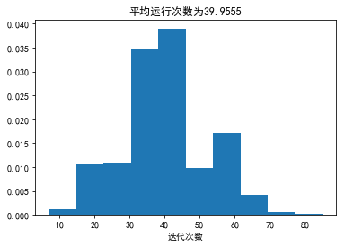
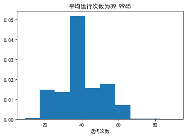
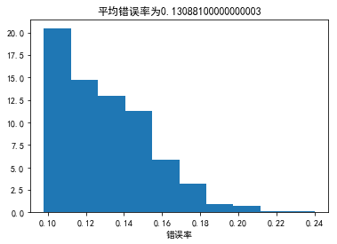
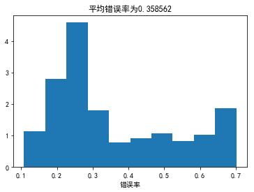
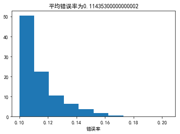

今年2月的时候开始学习台大林轩田老师的机器学习课程，感觉很好，这里记录一下作业详解，一来加深自己的理解，而来也可以给需要的小伙伴参考下,话不多说，进入正题。(其实这部分的资料和我之前整理的Learning from data差不多，更全面的部分可以参考Learning from data的习题整理。）

我的github地址：  
https://github.com/Doraemonzzz

个人主页：  
http://doraemonzzz.com/

作业地址:  
https://www.csie.ntu.edu.tw/~htlin/course/ml15fall/

参考资料:  
https://blog.csdn.net/a1015553840/article/details/51085129  
http://www.vynguyen.net/category/study/machine-learning/page/6/  
http://book.caltech.edu/bookforum/index.php  
http://beader.me/mlnotebook/


#### Problem 1
(ii) Detecting potential fraud in credit card charges  
(iv) Determining the optimal cycle for traffic lights in a busy intersection  
(v) Determining the age at which a particular medical test is recommended

质数和自由落体问题可以直接得出结果，所以使用design approach


#### Problem 2

这题在Learning from data上也有，当时是选择所有满足的学习种类，这里选择最适合的，应该选择reinforcement learning，因为训练下棋的过程每一步都会给以回馈，下的好给正回馈，下的不好给负回馈，类似训练小狗。


#### Problem 3

对没有标签的书分类，unsupervised learning。


#### Problem 4

有脸的图片和没脸的图片都标记出来，supervised learning。


#### Problem 5

这题我认为是active learning，因为人为设计了实验，更具体的有关active learning，可以参考
https://www.cnblogs.com/maybe2030/p/5515042.html


#### Problem 6

由题设知$E_{OTS} (g, f)=\frac 1 L\sum_{m=1}^L[\![(N+m)被2整除]\!]$  
我们知道$1$到$N$中被2整除的正整数有$[\frac N 2]$个，$[]$为高斯函数，意思为向下取整
因此
$$
E_{OTS} (g, f)=\frac1 L[(1到N+L中被2整除的数的个数)-(1到N中被2整除的数的个数)]
=\frac1 L([\frac {N+L}2]-[\frac {N}2])
$$


#### Problem 7

这题的意思是在训练集$D$上没有误差，在$\{x_{N+1} , . . . , x_{N+L}\}$上的取值就任意了，每个点有两种取值，所以一共有$2^L$种可以拟合的$f$


#### Problem 8

题目的假设意思应该是每个在训练集无噪声的$f$出现的概率是一样的，所以这些$f$在测试集上每个点出现错误的概率应该是一样的，$E_{OTS}(g,f)=\frac k L$相当于在$L$个点中挑$k$个，因此
$$
P(E_{OTS}(g,f)=\frac k L)=\frac {C_L^k} {2^L}
$$
$$
\begin{aligned}
\mathbb E_f[E_{OTS} (g, f)]&=\sum_{k=0}^L\frac k L \frac {C_L^k}{2^L}
\\&=\frac {\sum_{k=0}^LkC_L^k}{L2^L}
\\&=\frac {\sum_{k=1}^L LC_{L-1}^{k-1}}{L2^L}
\\&=\frac {2^{L-1}}{2^L}
\\&=\frac 1 2
\end{aligned}
$$
注意这里用到了$kC_n^k=nC_{n-1}^{k-1}$

所以
$$
\mathbb E_f[E_{OTS} (A_1(D), f)]=\mathbb E_f[E_{OTS} (A_2(D), f)]
$$


#### Problem 9

$P=C_{10}^5(\frac 1 2)^{10}\approx0.24609375$


```python
from scipy.special import comb
print(comb(10,5)/2**10)
```

    0.24609375


#### Problem 10

$P=C_{10}^9{(\frac 9{10})^{9}\frac 1 {10} }\approx0.387420489 $


```python
print(comb(10,9)*((0.9)**9)*0.1)
```

    0.387420489


#### Problem 11

$P=C_{10}^1{(\frac 9{10})^{1}{(\frac 1 {10})}^{9} }+C_{10}^0{{(\frac 1 {10})}^{10} }\approx 9\times 10^{-9}$


```python
print(comb(10,1)*((0.9)**1)*(0.1**9)+comb(10,0)*(0.1**10))
```

    9.1e-09


#### Problem 12

回顾下Hoeffding​不等式:
$$
\mathbb P[| \mu-v|>\epsilon]\le 2e^{-2\epsilon ^2N}
$$
因此
$$
\begin{aligned}
\mathbb P[v\le 0.1]
&=P[0.9-v\ge 0.8]\\
&=P[\mu-v\ge 0.8]\\
&\le P[|\mu-v|\ge 0.8]\\
&\le 2e^{-2\times 0.8^2\times 10}\\
&\approx5.5215451440744015\times 10^{-6}
\end{aligned}
$$


#### Problem 13

这题以及下面一题一定要注意这两句话：

They are just used to bind the six faces together. The probability below only refers to drawing from the bag.

所以考虑的时候只要看骰子属于哪个包即可。
全是orange 1，所以骰子属于B或者C，因此$P=(\frac 1 2)^5=\frac 1 {32}$


#### Problem 14

这题要计算某个数字全为orange的概率，取出为全orange 1的情况为从B,C中取出，取出为全orange 2的情况为从A,C中取出，取出为全orange 3的情况为从B,C中取出，取出为全orange 4的情况为从A,D中取出，取出为全orange 5的情况为从B,D中取出，取出为全orange 6的情况为从A,D中取出。所以一共有4种情形(A,C),(B,C),(A,D),(B,D)，注意全A,B,C,D的情形都被算了两次，所以一共有$4\times2^5-4=124$种情形，概率为
$$
P=\frac {124}{4^5}=\frac {31}{256}
$$


#### Problem 15

这题是使用最标准的PLA，由于Problem 15-17以及Problem 18-20有很多重复部分，所以这里写了个helper.py文件，此题用到的函数如下


```python
def Judge(X, y, w):
    """
    判别函数，判断所有数据是否分类完成
    """
    n = X.shape[0]
    #判断是否同号
    num = np.sum(X.dot(w) * y > 0)
    return num == n

def preprocess(data):
    """
    数据预处理
    """
    #获取维度
    n, d = data.shape
    #分离X
    X = data[:, :-1]
    #添加偏置项1
    X = np.c_[np.ones(n), X]
    #分离y
    y = data[:, -1]
    
    return X, y

def PLA(X, y, eta=1, max_step=np.inf):
    """
    PLA算法，X，y为输入数据，eta为步长，默认为1，max_step为最多迭代次数，默认为无穷
    """
    #获取维度
    n, d = X.shape
    #初始化
    w = np.zeros(d)
    #记录迭代次数
    t = 0
    #记录元素的下标
    i = 0
    #记录最后一个错误的下标
    last = 0
    while not(Judge(X, y, w)) and t < max_step:
        if np.sign(X[i, :].dot(w) * y[i]) <= 0:
            #迭代次数增加
            t += 1
            w += eta * y[i] * X[i, :]
            #更新最后一个错误
            last = i
        
        #移动到下一个元素
        i += 1
        #如果达到n，则重置为0
        if i == n:
            i = 0
    
    return t, last, w

def f1(g, X, y, n, eta=1, max_step=np.inf):
    """
    运行g算法n次，统计平均迭代次数，eta为步长，默认为1，max_step为最多迭代次数，默认为无穷
    """
    result = []
    data = np.c_[X, y]
    for i in range(n):
        np.random.shuffle(data)
        X = data[:, :-1]
        y = data[:, -1]
        result.append(g(X, y, eta=eta, max_step=max_step)[0])
        
    plt.hist(result, normed=True)
    plt.xlabel("迭代次数")
    plt.title("平均运行次数为"+str(np.mean(result)))
    plt.show()
```
运行代码如下
```python
import numpy as np
import matplotlib.pyplot as plt
import helper as hlp
plt.rcParams['font.sans-serif']=['SimHei'] #用来正常显示中文标签
plt.rcParams['axes.unicode_minus']=False #用来正常显示负号

#读取数据
data = np.genfromtxt("data.txt")
#获取维度
n, d = data.shape
#分离X
X = data[:, :-1]
#添加偏置项1
X = np.c_[np.ones(n), X]
#分离y
y = data[:, -1]

#problem 15    
print(hlp.PLA(X, y))
```

    (45, 135, array([-3.       ,  3.0841436, -1.583081 ,  2.391305 ,  4.5287635]))

所以这题答案为更新了45次，最后一个更新的元素索引为136(python中从0开始数)


#### Problem 16

打乱之后运行2000次，作出直方图

```python
#problem 16
hlp.f1(hlp.PLA, X, y, 2000, 1)
```




#### Problem 17

这里修改系数$\eta=0.5$,打乱之后运行2000次，作出直方图

```python
#problem 17
hlp.f1(hlp.PLA, X, y, 2000, 0.5)
```





#### Problem 18

此题用到的函数如下


```python
def count(X, y, w):
    """
    统计错误数量
    """
    #判断是否同号
    num = np.sum(X.dot(w) * y <= 0)
    return np.sum(num)

def Pocket_PLA(X, y, eta=1, max_step=np.inf):
    """
    Pocket_PLA算法，X，y为输入数据，eta为步长，默认为1，max_step为最多迭代次数，默认为无穷
    """
    #获得数据维度
    n, d = X.shape
    #初始化
    w = np.zeros(d)
    #记录最优向量
    w0 = np.zeros(d)
    #记录次数
    t = 0
    #记录最少错误数量
    error = count(X, y, w0)
    #记录元素的下标
    i = 0
    while (error != 0 and t < max_step):
        if np.sign(X[i, :].dot(w) * y[i]) <= 0:
            w += eta * y[i] * X[i, :]
            #迭代次数增加
            t += 1
            #记录当前错误
            error_now = count(X, y, w)
            if error_now < error:
                error = error_now
                w0 = np.copy(w)


        #移动到下一个元素
        i += 1
        #如果达到n，则重置为0
        if i == n:
            i = 0
    return error, w0

def f2(g, X1, y1, X2, y2, n, eta=1, max_step=np.inf):
    """
    训练n次，每次在(X1, y1)上利用g算法训练，在(X2, y2)上评估结果，
    eta为步长，默认为1，max_step为最多迭代次数，默认为无穷
    """
    result = []
    data = np.c_[X1, y1]
    m = X2.shape[0]
    for i in range(n):
        np.random.shuffle(data)
        X = data[:, :-1]
        y = data[:, -1]
        w = g(X, y, eta=eta, max_step=max_step)[-1]
        result.append(count(X2, y2, w) / m)

    plt.hist(result, normed=True)
    plt.xlabel("错误率")
    plt.title("平均错误率为"+str(np.mean(result)))
    plt.show()
```

代码如下

```python
import matplotlib.pyplot as plt
import numpy as np
import helper as hlp
plt.rcParams['font.sans-serif']=['SimHei'] #用来正常显示中文标签
plt.rcParams['axes.unicode_minus']=False #用来正常显示负号

data_train = np.genfromtxt("hw1_18_train.txt")
data_test = np.genfromtxt("hw1_18_test.txt")

X_train, y_train = hlp.preprocess(data_train)
X_test, y_test = hlp.preprocess(data_test)

#problem 18
hlp.f2(hlp.Pocket_PLA, X_train, y_train, X_test, y_test, 2000, max_step=50)
```





#### Problem 19

这题只使用普通的的PLA

```python
#problem 19
result = hlp.f2(hlp.PLA, X_train, y_train, X_test, y_test, 2000, 1, max_step=50)
```





#### Problem 20

```python
#problem 20
hlp.f2(hlp.Pocket_PLA, X_train, y_train, X_test, y_test, 2000, max_step=100)
```





#### Problem 21

回顾下结论，$ R^2 = {\max}_{1\le n\le N} ||x_n ||^2$,$\rho = {\min}_{1\le n\le N} \frac {y_n(w^{*T} x_n )} {||w^*||}$，那么运行时间$t\le \frac {R^2} {\rho^2}$，题目的意思是问如果所有的$||x_n||$缩短20倍，那么$t$是否也会缩短20倍？  

答案是否，如果所有$||x_n||$缩短20倍，那么$\rho$和$R$都缩短20倍，所以$\frac {R^2} {\rho^2}​$不变，所以时间上界不会改变。