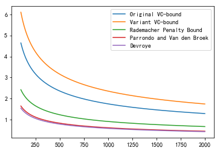
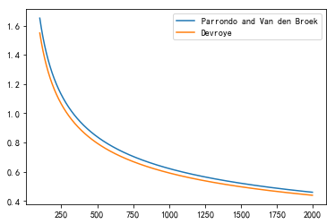
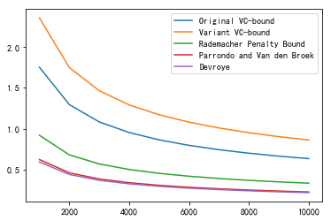
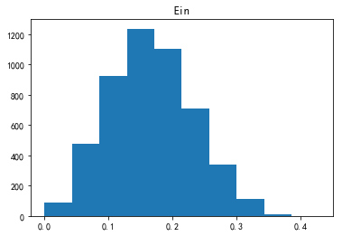
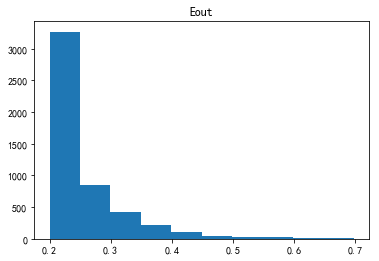

大家好，这篇是有关台大机器学习课程作业二的详解，题目同Coursera。

我的github地址：  
https://github.com/Doraemonzzz

个人主页：  
http://doraemonzzz.com/

作业地址:  
https://www.csie.ntu.edu.tw/~htlin/course/ml15fall/

参考资料:  
https://blog.csdn.net/a1015553840/article/details/51085129  
http://www.vynguyen.net/category/study/machine-learning/page/6/  
http://book.caltech.edu/bookforum/index.php  
http://beader.me/mlnotebook/
https://acecoooool.github.io/blog/


#### Problem 1

这一题和下一题就是learning from data第一章的Exercise 1.13

错误有两种，一种是“去真”:$\lambda\mu$，另一种是“取伪”：$(1-\lambda)(1-\mu)$，所以犯错的概率一共$\lambda\mu+(1-\lambda)(1-\mu)$  


#### Problem 2

$$
P=\lambda\mu+(1-\lambda)(1-\mu)=\lambda\mu+1-\mu-\lambda+\lambda\mu=1-\lambda+(2\lambda-1)\mu
$$
所以当$\lambda=\frac 1 2$时，$P=1-\lambda$，此时和$\mu$独立


#### Problem 3

这题就是learning from data第二章的Problem 2.12

在此回顾下公式
$$
E_{\text{out}}(g)\le E_{\text{in}}(g)+\sqrt {\frac 8 N \ln(\frac {4({(2N)}^{d_{vc}}+1)} \delta )}的概率大于等于1-\delta
$$
回到这题，题目中$\delta =0.05,\sqrt {\frac 8 N \ln(\frac {4({(2N)}^{d_{vc}}+1)} \delta )}=0.05$
这个方程直接解的话不好解，可以作图看一下


```python
# -*- coding: utf-8 -*-
"""
Created on Tue Feb 19 20:07:00 2019

@author: qinzhen
"""

import numpy as np

delta=0.05
dvc=10

def f(N):
    return (8 / N * np.log(4 * ((2 * N) ** dvc + 1) / delta)) ** 0.5 - 0.05

n = 1
while(True):
    if(f(n) <= 0):
        break
    else:
        n += 1

print(n)
```

    452957


#### Problem 4

这题和下面一题就是learning from data第二章的Problem 2.20，注意这里多了Variant VC bound

我们注意到(d),(e)左右两边都有$\epsilon​$，所以这里要处理一下。

先看(d)，令$a=\frac 1 N,b=\ln{\frac {6m_{\mathcal H}(2N)}\delta}​$，那么不等式可以化为
$$
\epsilon\le \sqrt{2a\epsilon+ab}
$$
两边平方可得
$$
\epsilon^2\le2a\epsilon+ab
\\(\epsilon-a)^2\le ab+a^2
\\ -\sqrt{ab+a^2}\le \epsilon-a\le\sqrt{ab+a^2}
\\a-\sqrt{ab+a^2}\le \epsilon\le a+\sqrt{ab+a^2}
$$
注意这里只要考虑上界，所以
$$
\epsilon\le a+\sqrt{ab+a^2}
$$
将$a=\frac 1 N,b=\ln {\frac {6m_{\mathcal H}(2N)}\delta}$带入可得
$$
\epsilon\le \frac1N+\sqrt{\frac{1}{N^2}+\frac{1}{N}\ln{\frac {6m_{\mathcal H}(2N)}\delta}}
$$
对于(e)，令$a=\frac 1 {2N},b=\ln{\frac {4m_{\mathcal H}(N^2)}\delta}$，那么不等式可以化为
$$
\epsilon\le \sqrt{a(4\epsilon(1+\epsilon)+b)}
$$
两边平方可得
$$
\epsilon^2\le4a\epsilon(1+\epsilon)+ab \\
(1-4a)\epsilon^2-4a\epsilon\le ab
$$
注意这里我们只要考虑$N$很大的情形，所以
$$
1-4a=1-\frac 2N>0
$$
从而
$$
(1-4a)(\epsilon-\frac {2a}{1-4a})^2\le ab+\frac{4a^2}{1-4a}
\\(\epsilon-\frac {2a}{1-4a})^2\le\frac{ab+\frac{4a^2}{1-4a}}{1-4a}
\\ -\sqrt{\frac{ab+\frac{4a^2}{1-4a}}{1-4a}}\le\epsilon-\frac {2a}{1-4a}\le\sqrt{\frac{ab+\frac{4a^2}{1-4a}}{1-4a}}
$$
这里只要考虑上界，因此
$$
\epsilon\le \sqrt{\frac{ab+\frac{4a^2}{1-4a}}{1-4a}}+\frac {2a}{1-4a}
=\sqrt{\frac{ab}{1-4a}+\frac{4a^2}{(1-4a)^2}}+\frac {2a}{1-4a}
$$
将$a=\frac 1 {2N},b=\ln{\frac {4m_{\mathcal H}(N^2)}\delta}$带入可得
$$
\ \epsilon\le \sqrt{\frac{\ln{\frac {4m_{\mathcal H}(N^2)}\delta}}{2(N-2)}+\frac{1}{(N-2)^2}}+\frac{1}{N-2}
$$

这里还有一个要注意的点，这里老师希望我们使用$m_\mathcal{H}(N)$的上界为$N^{d_{vc}}$，因此
$$
\ln(m_\mathcal{H}(N))\le d_{vc}\ln(N)
$$
后面我们作图处理下


```python
# -*- coding: utf-8 -*-
"""
Created on Tue Feb 19 20:12:42 2019

@author: qinzhen
"""

import numpy as np
import matplotlib.pyplot as plt
plt.rcParams['font.sans-serif']=['SimHei'] #用来正常显示中文标签
plt.rcParams['axes.unicode_minus']=False #用来正常显示负号

dvc = 50
delta = 0.05

#计算ln(m(N))
def lm(n):
    return dvc * np.log(n)

#Original VC-bound
def f1(n):
    result = (8 / n) * (np.log(4 / delta) + lm(2 * n))
    result = result ** 0.5
    return result

#Variant VC bound
def f2(n):
    result = (16 / n) * (np.log(2 / (delta ** 0.5)) + lm(n))
    result = result ** 0.5
    return result

#Rademacher Penalty Bound
def f3(n):
    k1 = 2 * (np.log(2 * n) + lm(n)) / n
    k2 = (2 / n) * np.log(1 / delta)
    k3 = 1 / n
    result = k1 ** 0.5 + k2 ** 0.5 + k3
    return result

#Parrondo and Van den Broek
def f4(n):
    k1 = 1 / n
    k2 = 1 / (n ** 2) + (1 / n) * (np.log(6 / delta) + lm(2 * n))
    k2 = k2 ** 0.5
    result = k1 + k2
    return result

#Devroye
def f5(n):
    k1 = 1 / (n - 2)
    k2 = (np.log(4 / delta) + lm(n * n)) / (2 * (n - 2)) + 1 / ((n - 2) ** 2)
    k2 = k2 ** 0.5
    result = k1 + k2
    return result
```


```python
#### Problem 4
#产生点集
x = np.arange(100, 2000)

y1 = [f1(i) for i in x]
y2 = [f2(i) for i in x]
y3 = [f3(i) for i in x]
y4 = [f4(i) for i in x]
y5 = [f5(i) for i in x]

plt.plot(x, y1, label="Original VC-bound")
plt.plot(x, y2, label="Variant VC-bound")
plt.plot(x, y3, label="Rademacher Penalty Bound")
plt.plot(x, y4, label="Parrondo and Van den Broek")
plt.plot(x, y5, label="Devroye")
plt.legend()
plt.show()
```





可以看到Parrondo and Van den Broek以及Devroye非常接近，我们再仔细看一下


```python
#比较y4, y5
plt.plot(x, y4, label="Parrondo and Van den Broek")
plt.plot(x, y5, label="Devroye")
plt.legend()
plt.show()
```




因此$n=10000​$时，Devroye给出的上界最小。


#### Problem 5
和上题一致，我们依旧作图看一下


```python
#产生点集
import numpy as np
x=np.arange(1,11)

y1=[f1(i) for i in x]
y2=[f2(i) for i in x]
y3=[f3(i) for i in x]
y4=[f4(i) for i in x]
y5=[f5(i) for i in x]

#作图
plt.plot(x,y1,label="Original VC-bound")
plt.plot(x,y2,label="Variant VC-bound")
plt.plot(x,y3,label="Rademacher Penalty Bound")
plt.plot(x,y4,label="Parrondo and Van den Broek")
plt.plot(x,y5,label="Devroye")
plt.legend()
plt.show()
```



可以看到$n=5$时，Parrando and Van den Broek给出的上界最小。  
这题以及上一题可以直接计算，不过我比较喜欢作图比较，感觉更清晰一些。


#### Problem 6

第一种情形为$-1,1-1$或者$1,-1,1$，即区间$[l,r]$内部有元素，且区间$[l,r]$两侧均有元素。这种情形只要在$N$个点之间的$N-1$个间隔中挑选出两个即可，所以这种情形共有$2C_{N-1}^2=(N-1)(N-2)$，乘以2是因为$[l,r]$内部可以为$-1$，也可以为$1$。

第二种情形为$-1,1$或者$1,-1$的，即区间$[l,r]$内部有元素，一侧没有元素。这种情形只要在$N$个点之间的$N-1$个间隔中挑选出一个即可，所以这种情形共有$2(N-1)=2N-2$，乘以$2$依旧是因为$\pm 1$的关系。

第三种情形为$1$或者$-1$，因此有$2​$种情形。

因此
$$
m_{\mathcal{H}}(N)=(N-1)(N-2)+2N-2+2=N^2-N+2
$$


#### Problem 7

接着上题，注意
$$
m_{\mathcal{H}}(3)=3^2-3+2=8=2^3
\\m_{\mathcal{H}}(4)=4^2-4+2=14<2^4
$$
因此$d_{vc}=3$


#### Problem 8

做映射$y=\sqrt {x_1^2+ x_2^2}$，所以这个问题可以化为类似Problem 6的问题，但用我之前的思路考虑比较麻烦，这里用另一种思路。注意这里两圆之间的部分为$+1$，因此问题为$N$个点之间以及两侧$N+1$个间隔中挑选2个，最后要需要考虑全$-1$的情形，因此
$$
m_H (N)=C_{N+1}^2+1
$$


#### Problem 9

这题就是learning from data第二章的Problem 2.16，结论为$d_{vc}=D+1$

这里分两步证明:

(a)存在$D+1$个点可以被shatter

(b)任意$D+2$个点无法被shatter

(a)记$y_j=\sum_{i=0}^Dc_ix_j^i$，现在取$D+1$个点，$x_1,x_2...x_{D+1},x_j=j$

那么
$$
\left(\begin{matrix}
y_1\\
y_2\\
...\\
y_{D+1}
\end{matrix}
\right)
=
\left(
\begin{matrix}
\sum_{i=0}^Dc_ix_1^i\\
\sum_{i=0}^Dc_ix_2^i\\
...\\
\sum_{i=0}^Dc_ix_{D+1}^i
\end{matrix}
\right)
=
\left(
\begin{matrix}
1&1&1&...&1\\
1&2&2^2&...&2^{D}\\
1&3&3^2&...&3^{D}\\
...&...&...&...&...&\\
1&(D+1)&(D+1)^2&...&(D+1)^D
\end{matrix}
\right)
\times
\left(
\begin{matrix}
c_0\\
c_1\\
...\\
c_D
\end{matrix}
\right)\\
$$
我们知道
$$
\left(
\begin{matrix}
1&1&1&...&1\\
1&2&2^2&...&2^{D}\\
1&3&3^2&...&3^{D}\\
...&...&...&...&...&\\
1&(D+1)&(D+1)^2&...&(D+1)^D
\end{matrix}
\right)对应的行列式为范德蒙行列式，不为0
$$
那么对任意的$y=(y_1,y_2,...,y_{D+1})^T$
$$
\left(
\begin{matrix}
1&1&1&...&1\\
1&2&2^2&...&2^{D}\\
1&3&3^2&...&3^{D}\\
...&...&...&...&...&\\
1&(D+1)&(D+1)^2&...&(D+1)^D
\end{matrix}
\right)
\times
\left(
\begin{matrix}
c_0\\
c_1\\
...\\
c_D
\end{matrix}
\right)
=
\left(\begin{matrix}
y_1\\
y_2\\
...\\
y_{D+1}
\end{matrix}
\right)
$$
关于$c=(c_0,c_1,...c_D)^T$有解，因此存在$D+1$个点可以被shatter

(b)记$z_j=(1,x_j,x_j^2...x_j^{D})\in R^{D+1}$，那么现在任取$D+2$个点$x_1,x_2...x_{D+2}$，对应可以得到$z_1,z_2...z_{D+2}$。$R^{D+1}$空间任意$D+2$个点必然线性相关，所以不妨设$z_{D+2}$可以被线性表出，注意$c=(c_0,c_1,...c_D)^T$
$$
z_{D+2}=\sum_{i=1}^{D+1}k_iz_i\\
c^Tz_{D+2}=\sum_{i=1}^{D+1}c^Tk_iz_i\\
\text{sign}(c^Tz_{D+2})=\text{sign}(\sum_{i=1}^{D+1}k_ic^Tz_i)
$$
也就是说$z_{D+2}$的分类被$z_1,z_2...z_{D+1}$确定，那么
$$
(\text{sign}(z_1),\text{sign}(z_2)...\text{sign}(z_{D+1}),-\text{sign}(z_{D+2}))
$$
这种情形必然无法被划分出来，因此$d_{vc}\le D+1​$

结合(a),(b)我们可得
$$
d_{vc}=D+1
$$


#### Problem 10

对于$d$维决策树，我们可以理解为将区域划分为$2^d$个互相独立的区域，每个区域可以表示$+1$或者$-1$，所以一共可以表示出$2^{2^d}$种，因此
$$
d_{vc}=2^d
$$


#### Problem 11

这题的答案是$+\infty$，题目挺有意思的，有一题类似的题目可以参考learning from data的Problem 2.18。

我们先看题目，乍一看挺复杂的，我们先考虑$h_{\alpha}(x)​$为$+1​$以及$-1​$的条件。

要使得$h_{\alpha}(x)$为$+1​$，那么
$$
|(αx)\text{ mod }4 − 2| − 1\ge 0\\ 
(αx)\text{ mod }4 − 2 \ge 1或(αx)\text{ mod }4 − 2 \le -1\\
(αx)\text{ mod }4\ge 3或0\le (αx)\text{ mod }4 \le 1
$$
要使得$h_{\alpha}(x)​$为$-1​$，那么
$$
|(αx)\text{ mod }4 − 2| − 1< 0\\ 
-1<(αx)\text{ mod }4 − 2 < 1\\
1<(αx)\text{ mod }4 <3
$$
简单来说，当$(αx)\text{ mod }4$处于$1$到$3$时，$h_{\alpha}(x)$为$-1$，否则为$+1$。

接下来，我们这样构造$\alpha$以及$x$:

任取$(y_1,...,y_N)\in \{-1,+1\}^N$，我们构造$z=(z_1,...,z_N)$，使得
$$
当y_i=+1时，z_i=0
\\ 当y_i=-1时，z_i=2
$$
现在取
$$
\alpha=0.z_1z_2...z_N\\
x=(x_1 , . . . , x_N), x_n =10^n
$$
那么
$$
x_1\times \alpha=z_1 .\ z_{2}...z_{N}
\\x_i\times \alpha=z_1z_2...z_{i-1}z_i\ .\ z_{i+1}...z_{N}(i\ge2)
$$
首先有一个很显然的结论
$$
z_1z_2...z_{i-1}z_i\text{ mod } 4= z_{i-1}z_i\text{ mod } 4
$$
这是因为$100$的倍数模$4$为$0$，但这里因为$z_i\in \{0,2\}​$，事实上有以下更强的结论
$$
z_1z_2...z_{i-1}z_i\text{ mod }4= z_{i-1}z_i\text{ mod }4=z_i\text{ mod }4
$$
这是因为
$$
z_{i-1}z_i\text{ mod }4=
 \begin{cases}
z_i\text{ mod }4&z_{i-1}=0
 \\(20+z_i)\text{ mod }4=z_i\text{ mod }4&z_{i-1}=2
 \end{cases}
$$
因此
$$
（x_1\times \alpha）\text{ mod }4=z_1 .\ z_{2}...z_{N}\text{ mod }4
\\(x_i\times \alpha)\text{ mod }4=z_1z_2...z_{i-1}z_i.z_{i+1}...z_{N}\text{ mod }4=z_i.z_{i+1}...z_{N}\text{ mod }4,(i\ge2)
$$
这两式可以统一为
$$
(x_i\times \alpha)\text{ mod }4=z_i.z_{i+1}...z_{N}\text{ mod }4
$$
进一步，我们有
$$
z_i\le (x_i\times \alpha)\text{ mod }4<z_i+1
$$
当$z_i=0$时，
$$
0\le (x_i\times \alpha)\text{ mod }4<1
$$
当$z_i=2$时，
$$
2\le (x_i\times \alpha)\text{ mod }4<3
$$
回忆我们之前的结论以及假设
$$
当(\alpha x)\text{ mod }4处于1到3时，h_{\alpha}(x)=-1，否则h_{\alpha}(x)=1
$$
所以当$y_i=+1$时，$z_i=0$，
$$
h_{\alpha}(x_i)=+1=y_i
$$
当$y_i=-1$时，$z_i=2$，
$$
h_{\alpha}(x_i)=-1=y_i
$$
因此总有
$$
h_{\alpha}(x_i)=y_i
$$
从而存在$N$个点可以被shatter，由$N$的任意性可知，
$$
d_{vc}=+\infty
$$


#### Problem 12

分两步考虑，第一步先考虑前$i$个点，这$i$个点最多可以区分出$2^i$种，对于剩下的$N-i$个点，最多可以被区分出$m_{\mathcal{H}}(N-i)$种。那么
$$
m_{\mathcal{H}}(N)\le2^im_{\mathcal{H}}(N-i)(i=1,2,...N-1)
$$
因此
$$
m_{\mathcal{H}}(N)\le \underset {1\le i\le N-1}{\min}2^im_{\mathcal{H}}(N-i)
$$
因此结论成立。


#### Problem 13

这题乍一看挺复杂的，其实想的简单一点就行。我们知道$m_{\mathcal H} (N)$要么等于$2^N$，要么有一个多项式的上界，根据这两点，除了$2^{\lfloor \sqrt N \rfloor}$不可能成为$m_{\mathcal H} (N)$


#### Problem 14

这一题以及下一题均可以参考learning from data的Problem 2.13 

首先有
$$
如果A\subseteq B,那么d_{vc}(A)\le d_{vc}(B)
$$
反证法，如果$d_{vc}(A)\ge d_{vc}(B)+1$，那么$A$可以shatter $d_{vc}(B)+1$个点，由$A\subseteq B$。那么$B$也可以shatter $d_{vc}(B)+1$个点，矛盾，因此该结论成立。

接下来利用上述结论证明题目中的结论。首先$0\le d_{vc} (\bigcap _{k=1}^KH_k)$是显然的，另一边注意到
$$
\bigcap _{k=1}^K \mathcal H_k \subset \mathcal H_k ,k=1,...,K
$$
所以
$$
d_{vc} (\bigcap _{k=1}^KH_k)\le d_{vc}(\mathcal H_k),k=1,...,K \\
d_{vc} (\bigcap _{k=1}^KH_k)\le {\min}\{(d_{vc}(\mathcal H_k))\}_{k=1}^K
$$


#### Problem 15

(c)这题参考了别人的笔记，[笔记地址](http://beader.me/mlnotebook/section2/vc-dimension-three.html)

左边比较简单，由之前的结论即可。

因为
$$
H_k \subseteq \bigcup _{k=1}^KH_k
$$
所以
$$
d_{vc}(\mathcal H_k)\le d_{vc} (\bigcup _{k=1}^K\mathcal H_k)(k=1...K)\\

{\max}\{d_{vc}(\mathcal H_k)\}_{k=1}^K\le d_{vc} (\bigcup _{k=1}^K\mathcal H_k)
$$
观察下右边的形式，其实只要证明$K=2$的情形然后使用数学归纳法即可，$K=2$时的结论为
$$
d_{vc}(\mathcal H_1 \bigcup \mathcal H_2)\le 1+d_{vc}(\mathcal H_1)+d_{vc}(\mathcal H_2)
$$
下面记$d_1=d_{vc}(\mathcal H_1),d_2=d_{vc}(\mathcal H_2)$，考虑成长函数$m_{\mathcal H}(N)$，首先
$$
m _ {\mathcal H_1\bigcup \mathcal H_2}(N) \le m_{\mathcal H_1}(N)+ m_{\mathcal H_2}(N)
$$
对于$N$个元素，$\mathcal H_1\bigcup \mathcal H_2$最多可以表示出$m _ {\mathcal H_1\bigcup \mathcal H_2}(N)$种分类，对于每种分类，或者由$\mathcal H_1$表示，或者由$\mathcal H_2$表示，所以$m _ {\mathcal H_1\bigcup \mathcal H_2}(N)$应该小于$\mathcal H_1$和$\mathcal H_2$表示出来的分类之和。而$\mathcal H_1$最多可以表示出$m_{\mathcal H_1}(N)$种分类，$\mathcal H_2$最多可以表示出$m_{\mathcal H_2}(N)$种分类，因此上述不等式成立。

回到原题，使用上述结论以及VC不等式，我们可得
$$
m _ {\mathcal H_1\bigcup \mathcal H_2}(N) \le m_{\mathcal H_1}(N)+ m_{\mathcal H_2}(N)\le\sum _ {i=0} ^ {d_1} \binom{N}{i} + \sum _ {i=0} ^ {d_2} \binom{N}{i}
$$
接着我们使用反证法证明
$$
d_{vc}(\mathcal H_1 \bigcup \mathcal H_2)\le 1+d_{vc}(\mathcal H_1)+d_{vc}(\mathcal H_2)
$$
如果
$$
d_{vc}(\mathcal H_1 \bigcup \mathcal H_2)\ge 2+d_{vc}(\mathcal H_1)+d_{vc}(\mathcal H_2)=d_1+d_2+2
$$
那么
$$
m _ {\mathcal H_1 \bigcup \mathcal H_2}(d_1+d_2+2)\ge 2^{d_1+d_2+2}
$$
把$N=d_1+d_2+2$带入$\sum _ {i=0} ^ {d_1} \binom{N}{i} + \sum _ {i=0} ^ {d_2} \binom{N}{i}$得
$$
\begin{aligned}
\sum _ {i=0} ^ {d_1} \binom{N}{i} + \sum _ {i=0} ^ {d_2} \binom{N}{i}&=\sum _ {i=0} ^ {d_1} \binom{d_1+d_2+2}{i} + \sum _ {i=0} ^ {d_2} \binom{d_1+d_2+2}{i}
\\&=\sum _ {i=0} ^ {d_1} \binom{d_1+d_2+2}{i} + \sum _ {i=0} ^ {d_2} \binom{d_1+d_2+2}{d_1+d_2+2-i}
\\&令j=d_1+d_2+2-i，那么j的范围从d_1+2到d_1+d_2+2
\\&=\sum _ {i=0} ^ {d_1} \binom{d_1+d_2+2}{i} + \sum _ {j=d_1+2} ^ {d_1+d_2+2} \binom{d_1+d_2+2}{j}
\\&=2^{d_1+d_2+2}-\binom{d_1+d_2+2}{d_1+1}
\\&<2^{d_1+d_2+2}
\end{aligned}
$$
所以
$$
m _ {\mathcal H_1 \bigcup \mathcal H_2}(d_1+d_2+2)\le\sum _ {i=0} ^ {d_1} \binom{d_1+d_2+2}{i} + \sum _ {i=0} ^ {d_2} \binom{d_1+d_2+2}{i}<2^{d_1+d_2+2}
$$
与之前所述矛盾。因此
$$
d_{vc}(\mathcal H_1 \bigcup \mathcal H_2)\le 1+d_{vc}(\mathcal H_1)+d_{vc}(\mathcal H_2)=d_1+d_2+1
$$
因此当$K=2​$时，结论成立。

假设$K=n$时不等式成立，$K=n+1$时
$$
\begin{aligned}
d_{vc} (\bigcup _{k=1}^{n+1}\mathcal H_k)&=d_{vc} ((\bigcup _{k=1}^{n}\mathcal H_k)\bigcup \mathcal H_{n+1})
\\&\le1+d_{vc} (\bigcup _{k=1}^{n}\mathcal H_k)+d_{vc}(\mathcal  H_{n+1})
\\&\le1+n-1+\sum_{k=1}^n d_{vc} (\mathcal H_k)+d_{vc}(\mathcal  H_{n+1})
\\&=n+\sum_{k=1}^{n+1} d_{vc} (\mathcal H_k)
\end{aligned}
$$
因此$K=n+1$时不等式也成立。


#### Problem 16

这题可以参考第一题，就是计算数据中带有偏差的$E_{\text{out}}(h_s;θ)$，我们取和第一题一致的符号，那么
$$
E_{\text{out}}(h_s;θ)=\lambda\mu+(1-\lambda)(1-\mu)
$$
此题中有20%的数据为噪声，因此$\lambda=0.8$，我们再来计算$\mu$，即错误率。先回顾题目
$$
h_{s;θ}(x) = s · \text{sign}(x − θ)
\\当s=1时，若x<\theta,h_{s;θ}(x)=-1;x\ge \theta,h_{s;θ}(x)=1
\\当s=-1时，若x<\theta,h_{s;θ}(x)=1;x\ge \theta,h_{s;θ}(x)=-1
$$
我们知道原始数据服从$[-1,1]$上的均匀分布，$\tilde{s }(x)=  \text{sign}(x)$。
$$
因此x<0时,\tilde{s }(x)=-1;x\ge 0,\tilde{s }(x)=1
$$
接下来计算$\mu$，当$s=1$时，
$$
\begin{aligned}
\mu &= \mathbb P(\tilde s(x) >0 ,h_{s;θ}(x) <0) +\mathbb P(\tilde s(x) <0 ,h_{s;θ}(x) >0) \\
&= \mathbb P(\tilde s(x) >0 ) \mathbb P(\text{sign}(x − θ) <0) +
\mathbb P(\tilde s(x)<0 ) \mathbb P(\text{sign}(x − θ) >0) \\
&=\frac 1 2 \times \theta \times 1\{\theta\ge 0\} + \frac 1 2  \times (-\theta) \times 1\{\theta< 0\} \\
&= \frac {|\theta|} 2
\end{aligned}
$$
此时
$$
\begin{aligned}
E_{\text{out}}(h_s;θ)&=\lambda\mu+(1-\lambda)(1-\mu)
\\&=0.8\times \frac{|\theta|}2+0.2\times\frac {2-|\theta|}2
\\&=0.2+0.3|\theta|
\end{aligned}
$$
当$s=-1$时，
$$
\begin{aligned}
\mu &= \mathbb P(\tilde s(x) >0 ,h_{s;θ}(x) <0) +\mathbb P(\tilde s(x) <0 ,h_{s;θ}(x) >0) \\
&= \mathbb P(\tilde s(x) >0 ) \mathbb P(\text{sign}(x − θ) >0) +
\mathbb P(\tilde s(x)<0 ) \mathbb P(\text{sign}(x − θ) <0) \\
&=\frac 1 2 \times (1-\theta) \times 1\{\theta\ge 0\} + \frac 1 2  \times (1+\theta) \times 1\{\theta< 0\} \\
&= \frac {2-|\theta|} 2
\end{aligned}
$$
此时
$$
\begin{aligned}
E_{\text{out}}(h_s;θ)&=\lambda\mu+(1-\lambda)(1-\mu)
\\&=0.8\times\frac {2-|\theta|}2+0.2\times \frac{|\theta|}2
\\&=0.8-0.3|\theta|
\end{aligned}
$$


我们将$s$和上述两种情况统一在一起可得
$$
E_{\text{out}}(h_s;θ)=0.5+0.3s(|\theta|-1)
$$

（上述两种情形可以结合画图理解。）


#### Problem 17

这题以及下一题就是编程模拟上面题目中的情况并计算$E_{\text{in}},E_{\text{out}}$


```python
# -*- coding: utf-8 -*-
"""
Created on Wed Feb 20 21:51:57 2019

@author: qinzhen
"""

import numpy as np
import matplotlib.pyplot as plt

def data(n, p=0.2):
    #产生20个随机数
    X = np.random.uniform(-1, 1, size=(n))
    #产生(X, y)，注意有p的误差
    y = np.sign(X)
    prob = np.random.uniform(0, 1, n)
    y[prob < p] *= -1
    return X, y

#产生theta，注意这里只要取n个点相邻两点间的点n-1个点以及两侧的两个点即可
def Theta(X):
    theta = (X[1:] + X[:-1]) / 2
    theta = np.r_[[X[0] - 1], theta]
    theta = np.r_[theta, [X[-1] + 1]]
    
    #修改维度后范围
    return theta.reshape(-1, 1)

def decision_stump(X, y):
    #排序
    X1 = np.sort(X)
    #计算theta
    theta = Theta(X1)
    #向量化执行计算
    n = theta.shape[0]
    m = X.shape[0]
    #将X复制按横轴n份
    X = np.tile(X, (n, 1))
    #s=1
    y1 = np.sign(X - theta)
    #s=-1
    y2 = np.sign(X - theta) * (-1)
    #统计错误
    error1 = np.sum(y1!=y, axis = 1)
    error2 = np.sum(y2!=y, axis = 1)
    #计算最小错误对应的下标
    i1 = np.argmin(error1)
    i2 = np.argmin(error2)
    #判断哪个误差更小
    if error1[i1] < error2[i2]:
        s = 1
        t = theta[i1][0]
        error = error1[i1] / m
    else:
        s = -1
        t = theta[i2][0]
        error = error2[i2] / m
    return s, t, error

Ein = []
Eout = []
n = 20
m = 5000
for i in range(m):
    X, y = data(n)
    s, t, ein = decision_stump(X, y)
    #计算eout
    eout = 0.5 + 0.3 * s * (np.abs(t) - 1)
    Ein.append(ein)
    Eout.append(eout)
```


```python
#Problem 17
plt.hist(Ein)
plt.title('Ein')
plt.show()

print(np.mean(Ein))
```





    0.16827999999999999


#### Problem 18

直接看刚刚计算的$E_{\text{out}}$即可


```python
#Problem 18
plt.hist(Eout)
plt.title('Eout')
plt.show()

print(np.mean(Eout))
```





    0.25585693682953115


#### Problem 19

这题就是上题多维度的情形，我们要对每个维度分别按上一题的方法计算出最佳的$s,\theta$，然后对每个维度的最佳解进行比较，求出全局最佳的$s,\theta$以及维度$\text{dim}$，然后按照这个$\text{dim}$以及$s,\theta$来预测我们的测试结果。


```python
def multi_decision_stump(X, y):
    """
    对每个维度使用decision_stump
    """
    n, m = X.shape
    #初始化s, theta, d，最小错误为error
    s = 1
    t = 0
    d = 0
    error = 1
    for i in range(m):
        X1 = X[:, i]
        s0, t0, error0 = decision_stump(X1, y)
        if error0 < error:
            error = error0
            d = i
            t = t0
            s = s0
    return s, t, d, error

def preprocess(data):
    X = data[:, :-1]
    y = data[:, -1]
    
    return X, y 
```


```python
#读取数据
data_train = np.genfromtxt("hw2_train.dat")
data_test = np.genfromtxt("hw2_test.dat")

#预处理数据
X_train, y_train = preprocess(data_train)
X_test, y_test = preprocess(data_test)

#Problem 19
s, theta, d, Ein = multi_decision_stump(X_train, y_train)
print(s, theta, d, Ein)
```

    -1 1.6175000000000002 3 0.24752475247524752


$E_{\text{in}}=0.25$，维度为第四个维度，$h_{s;i;θ}(x) = s·\text{sign}(x_i - θ)=-\text{sign}(x_i-1.6175)$


#### Problem 20

根据之前计算的$s,\theta,\text{dim}​$来预测结果并计算误差


```python
#Problem 20
n = X_test.shape[0]
Eout = np.sum(s * np.sign(X_test[:, d] - theta) != y_test) / n
print(Eout)
```

    0.355


#### Problem 21

考虑$N$个元素的点集，点集中最多有$k-1$个$-1$，那么这样的点集有$\sum_{i=0}^{k-1}\binom N i$种。考虑$k$个元素的子集，然么$(-1,-1...-1)$(全为$-1$的情形)必然无法被表出，这是因为最多有$k-1$个点为$-1$。那么由$B(N,k)$的定义知
$$
B(N, k) \ge\sum_{i=0}^{k-1}\binom N i
$$
