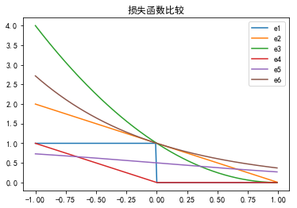
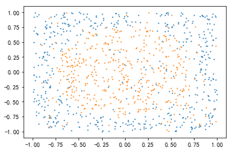
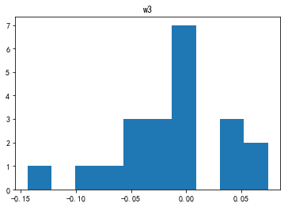
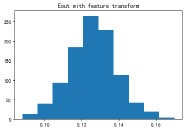

大家好，这篇是有关台大机器学习课程作业三的详解，题目同Coursera。

我的github地址：  
https://github.com/Doraemonzzz

个人主页：  
http://doraemonzzz.com/

作业地址:  
https://www.csie.ntu.edu.tw/~htlin/course/ml15fall/

参考资料:  
https://blog.csdn.net/a1015553840/article/details/51085129  
http://www.vynguyen.net/category/study/machine-learning/page/6/  
http://book.caltech.edu/bookforum/index.php  
http://beader.me/mlnotebook/


#### Problem 1

$$
\mathbb E_{\mathcal D}[E_{\text{in}}(w_{\text{lin}})] = \sigma^2(1-\frac{d+1}N)
$$

这个结论的理论推导可以参考我写的Learning from data习题Exercise 3.3,3.4。

对于此题来说，直接把$N$解出来即可
$$
N=\frac {d+1}{1-\frac{\mathbb E_{\mathcal D}[E_{\text{in}}(w_{\text{lin}})]}{\sigma^2}}
$$


```python
# -*- coding: utf-8 -*-
"""
Created on Wed Mar  6 16:15:13 2019

@author: qinzhen
"""

def f(d, delta, Ein):
    return (d + 1) / (1 - Ein / (delta ** 2))

print(f(8, 0.1, 0.008))
```

    44.99999999999996


所以$N\ge45​$即可。


#### Problem 2

这题实际上是Learning from data Exercise 3.3以及Problem 3.10的结论，这里一并给出。

(1)$H$是对称矩阵

(2)$H^K=H$ ($K$为任意正整数)

(3)$H$的特征值$\in\{0,1\}$

(4)$H$是半正定矩阵

(5)$\text{trace}(H) = d +1$

(6)$H$有$d+1$个特征值为$1$

(1)
$$
\begin{aligned}
H^T&=(X(X^TX)^{-1}X^T)^T
\\&=X((X^TX)^{-1})^TX^T
\\&=X((X^TX)^T)^{-1}X^T
\\&=X(X^TX)^{-1}X^T
\\&=H
\end{aligned}
$$
(2)直接验证即可，先来看$K=2$的情形
$$
\begin{aligned}
H^2&=X(X^TX)^{-1}X^TX(X^TX)^{-1}X^T
\\&=X(X^TX)^{-1}X^T
\\&=H
\end{aligned}
$$
那么对于任意$K$
$$
\begin{aligned}
H^K&=H^2H^{K-2}
\\&=HH^{K-2}
\\&=H^{K-1}
\\&=...
\\&=H
\end{aligned}
$$
(3)因为$H^K=H$，所以对于​$H$的任意特征值$\lambda$
$$
\lambda^K=\lambda 恒成立
\\\lambda=0或1
$$
(4)$H$为对称矩阵且特征值$\in\{0,1\}$，所以由线性代数知识可知$H$半正定

(5)利用迹(trace)的性质$$\text{trace}(AB) =\text{trace}(BA)$$
$$
\begin{aligned}
\text{trace}(H)&=\text{trace}(X(X^TX)^{-1}X^T)
\\&=\text{trace}(X^TX(X^TX)^{-1})
\\&=\text{trace}(I_{d+1})(注意H^TH为(d+1)\times (d+1)阶矩阵)
\\&=d+1
\end{aligned}
$$
(6)我们知道对称矩阵必然相似于对角阵，所以存在可逆矩阵$P$，使得$H=P^{-1}AP$，那么
$$
d+1=\text{trace}(H)=\text{trace}(P^{-1}AP)=\text{trace}(PP^{-1}A)=\text{trace}(A)
$$
而$A$为由$0,1$构成的对角阵（因为$A$和$H$相似且$H$的特征值$\in\{0,1\}$），所以$H$一共有$d+1$个特征值为$1$。

有了以上结论，看此题的选项就很轻松了。

(a),(d),(e)成立，(c)错误，稍微要看一下的是(b)，我们知道$H$的特征值$\in\{0,1\}$，所以$H$不一定可逆，因此(b)也错误。


#### Problem 3

先对原式进行变形
$$
[\![y\neq \text{sign}(w^Tx)]\!] \Longleftrightarrow[\![y^2\neq y\text{sign}(w^Tx)]\!]\Longleftrightarrow[\![1\neq\text{sign}(yw^Tx)]\!]
$$
令$s=yw^Tx​$，所以几个误差分别可以写成
$$
\begin{aligned}
err_1&=[\![sign(s) \neq 1]\!]
\\err_2&=\max(0,1-s)
\\err_3&=(\max(0,1-s))^2
\\err_4&=(\max(0,-s))
\\err_5&=\theta(-s)=\frac{e^{-s}}{1+e^{-s}}=\frac{1}{1+e^{s}}
\\err_6&=e^{-s}
\end{aligned}
$$
接着作图。


```python
# -*- coding: utf-8 -*-
"""
Created on Wed Mar  6 16:22:27 2019

@author: qinzhen
"""

import numpy as np
import matplotlib.pyplot as plt
plt.rcParams['font.sans-serif']=['SimHei'] #用来正常显示中文标签
plt.rcParams['axes.unicode_minus']=False #用来正常显示负号

#构造损失函数
def e1(s):
    if s > 0:
        return 0
    else:
        return 1

def e2(s):
    return max(0, 1 - s)

def e3(s):
    t = max(0, 1 - s)
    return t ** 2

def e4(s):
    return max(0, -s)

def e5(s):
    return 1 / (1 + np.exp(s))

def e6(s):
    return np.exp(-s)

x = np.arange(-1, 1, 0.01)

y1 = [e1(i) for i in x]
y2 = [e2(i) for i in x]
y3 = [e3(i) for i in x]
y4 = [e4(i) for i in x]
y5 = [e5(i) for i in x]
y6 = [e6(i) for i in x]

plt.plot(x, y1, label='e1')
plt.plot(x, y2, label='e2')
plt.plot(x, y3, label='e3')
plt.plot(x, y4, label='e4')
plt.plot(x, y5, label='e5')
plt.plot(x ,y6, label='e6')
plt.legend()
plt.title('损失函数比较')
plt.show()
```





因此e2，e3，e6，即(a)，(b)，(e)为$[\![y\neq \text{sign}(w^Tx)]\!]$的上界。


#### Problem 4

这题要找哪些函数不是处处可导，(d),(e)显然是处处可导的，因为$f(s)=\max(0,s)$在原点不可导，所以(a),(c)不可导，唯一有点疑问的是(b)，我们来看下$f(s)=(\max(0,s))^2$
$$
f(s)=\begin{cases}
s^2 &s\ge0
\\0&s<0
\end{cases}
$$
显然这个函数也是可导的，所以由复合函数的性质可知(b)也可导。因此这题选(a)(c)


#### Problem 5

$err(w) = \max(0, -y_nw^Tx_n)$的意思是对于分类正确的点$err(w)=0$，对于分类不正确的点$err(w)=-y_nw^Tx_n $，我们来求梯度(不考虑不可导点)
$$
\frac {\partial(-y_nw^Tx_n)}{\partial w_i}=-y_nx^{(i)}_n(x^{(i)}_n表示x_n的第i个分量)
\\\nabla(-y_nw^Tx_n)=-y_nx_n
$$
所以对于分类错误的点$(x_n,y_n)​$，根据SGD,更新规则为
$$
w(t+1)=w(t)-\eta\nabla E_t (w)=w(t)+\eta y(t)x(t)
$$
所以PLA可以被看成$err(w) = \max(0, -y_nw^Tx_n)$的SGD。


#### Problem 6

$$
\frac{\partial E(u,v)}{\partial u}|_{(u,v)=(0,0)}=e^u+ve^{uv}+2u-2v-3 |_{(u,v)=(0,0)}=-2
\\ \frac{\partial E(u,v)}{\partial v}|_{(u,v)=(0,0)}=2e^{2v}+ue^{uv}-2u+4v-2|_{(u,v)=(0,0)}=0
$$

所以
$$
\nabla E(u, v)=(-2,0)^T
$$


#### Problem 7

编程处理即可,需要利用刚刚的偏导数公式，答案为2.82500035668


```python
# -*- coding: utf-8 -*-
"""
Created on Wed Mar  6 16:51:10 2019

@author: qinzhen
"""

import numpy as np
from numpy.linalg import inv

def E(u,v):
    return np.exp(u) + np.exp(2 * v) + np.exp(u * v) + u * u - 2 * u * v + 2 * v * v - 3 * u - 2 * v

def partial(point):
    u = point[0]
    v = point[1]
    pu = np.exp(u) + v * np.exp(u * v) + 2 * u - 2 * v - 3
    pv = 2 * np.exp(2 * v) + u * np.exp(u * v) - 2 * u + 4 * v - 2
    return np.array([pu, pv])

####Problem 7
point = np.zeros(2)
eta = 0.01

for i in range(5):
    point -= eta * partial(point)
    
print(point)
print(E(point[0], point[1]))
```

    [0.09413996 0.00178911]
    2.8250003566832635


#### Problem 8

这题需要用到多元泰勒公式，可以参考[维基百科](https://zh.wikipedia.org/wiki/%E6%B3%B0%E5%8B%92%E5%85%AC%E5%BC%8F#%E5%A4%9A%E5%85%83%E6%B3%B0%E5%8B%92%E5%85%AC%E5%BC%8F)
$$
b_{uu} =\frac 1 2\frac{\partial^2 E(u,v)}{\partial u^2}=\frac 1 2\frac{\partial}{\partial u}\frac{\partial E(u,v)}{\partial u}=\frac 1 2\frac{\partial (e^u+ve^{uv}+2u-2v-3) } {\partial u}=\frac 1 2(e^u+v^2e^{uv}+2)
\\b_{vv}=\frac 1 2\frac{\partial^2 E(u,v)}{\partial v^2}=\frac 1 2\frac{\partial}{\partial v}\frac{\partial E(u,v)}{\partial v}=\frac 1 2\frac{\partial{(2e^{2v}+ue^{uv}-2u+4v-2)}}{\partial v}=\frac 12 (4e^{2v}+u^2e^{uv}+4)
\\ b_{uv}=\frac{\partial^2 E(u,v)}{\partial u \partial v}=\frac{\partial(e^u+ve^{uv}+2u-2v-3)}{\partial v}=(e^{uv}+uve^{uv}-2)
\\b_{u} =\frac{\partial E(u,v)}{\partial u}=e^u+ve^{uv}+2u-2v-3
\\b_{v}=\frac{\partial E(u,v)}{\partial v}=2e^{2v}+ue^{uv}-2u+4v-2
\\b=E(u,v)
$$
将$u=v=0$带入可得
$$
\begin{aligned}
b_{uu}&=\frac 3 2
\\b_{vv}&=4
\\b_{uv}&=-1
\\b_u&=-2
\\b_v&=0
\\b&=3
\end{aligned}
$$


#### Problem 9

由题设我们知道Hessian矩阵正定，此处的Hessian矩阵为
$$
\nabla^2 E(u, v)=
\left[
 \begin{matrix}
 \frac{\partial^2 E(u,v)}{\partial u^2} &   \frac{\partial^2 E(u,v)}{\partial u \partial v}  \\
   \frac{\partial^2 E(u,v)}{\partial u \partial v} &  \frac{\partial^2 E(u,v)}{\partial v^2}
  \end{matrix}
  \right]
$$
那么最优方向为
$$
\left[\begin{matrix} 
\Delta u^*
\\ \Delta v^*
\end{matrix}\right] 
=- (\nabla^2 E(u, v))^{-1}\nabla E(u, v)
$$
一般性的结论可以参考凸优化的课本，关于这题可以简单证明下。

现在要对$\hat E_2(\Delta u, \Delta v)=b_{uu}(\Delta u)^2+b_{vv}(\Delta v)^2+b_{uv}(\Delta u)(\Delta v)+b_u\Delta u + b_v\Delta v + b$求最小值，令$\Delta u =t,\Delta v=s$
$$
\begin{aligned}
\hat E_2(\Delta u, \Delta v)&=b_{uu}(\Delta u)^2+b_{vv}(\Delta v)^2+b_{uv}(\Delta u)(\Delta v)+b_u\Delta u + b_v\Delta v + b
\\&=b_{uu} t^2+b_{vv}(s^2)+b_{uv}st+b_ut+b_vs+b
\end{aligned}
$$
由Hessian矩阵的正定性我们知道
$$
2b_{uu}= \frac{\partial^2 E(u,v)}{\partial u^2}>0
\\ 2b_{vv}= \frac{\partial^2 E(u,v)}{\partial v^2}>0
\\ \frac{\partial^2 E(u,v)}{\partial u^2} \frac{\partial^2 E(u,v)}{\partial u^2}-  (\frac{\partial^2 E(u,v)}{\partial u \partial v})^2=4b_{uu}b_{uv}-b_{uv}^2>0
$$
所以可以对$\hat E_2(\Delta u, \Delta v)$进行配方(二次项系数不为$0$)，配方得
$$
\begin{aligned}
\hat E_2(\Delta u, \Delta v)&=b_{uu} t^2+b_{vv}(s^2)+b_{uv}st+b_ut+b_vs+b
\\&=b_{uu}(t-a)^2+b_{vv}(s-b)^2+b_{uv}(s-a)(t-b)+C
\end{aligned}
$$
其中$a,b,C$均为常数，后续会求解出来，令$t_1=t-a,s_1=s-b$
$$
\begin{aligned}
\hat E_2(\Delta u, \Delta v)&=b_{uu}t_1^2+b_{vv}s_1^2+b_{uv}t_1s_1+C
\\&=b_{uu}(t_1+\frac{b_{uv}}{2b_{uu}}s_1)^2+(b_{vv}-\frac{b_{uv}^2}{4b_{uu}})s_1^2+C
\end{aligned}
$$
之前已经有$b_{uu}>0,b_{vv}>0,4b_{uu}b_{uv}-b_{uv}^2>0$，所以
$$
b_{vv}-\frac{b_{uv}^2}{4b_{uu}}=\frac{4b_{uu}b_{vv}-b_{uv}^2}{4b_{uu}}>0
$$
从而
$$
\hat E_2(\Delta u, \Delta v)\ge C
\\当且仅当t_1+\frac{b_{uv}}{2b_{uu}}s_1=0,s_1=0时等号成立
\\即t_1=s_1=0时等号成立
$$
因为$t_1=t-a,s_1=s-b,\Delta u =t,\Delta v=s​$，所以等号成立条件为
$$
\Delta u= t=a,\Delta v=s=b
$$
接下来求解$a,b$
$$
\begin{aligned}
b_{uu}(t-a)^2+b_{vv}(s-b)^2+b_{uv}(t-a)(s-b)+C&=b_{uu}(t^2-2at+a^2)+b_{vv}(s^2-2sb+b^2)+b_{uv}(st-as-bt+ab)+C
\\&=b_{uu}t^2+b_{vv}s^2+b_{uv}st-(2ab_{uu}+bb_{uv})t-(2bb_{vv}+ab_{uv})s+C^{'}
\\&=b_{uu} t^2+b_{vv}s^2+b_{uv}st+b_ut+b_vs+b
\end{aligned}
$$
那么
$$
\begin{cases}
-2b_{uu}a-b_{uv}b=b_u
\\-b_{uv}a-2b_{vv}b=b_v
\end{cases}
\\
\left[
\begin{matrix}
-2b_{uu} &   -b_{uv}  \\
-b_{uv}  &   -2b_{vv} 
\end{matrix}
\right]
\left[\begin{matrix} 
a
\\ b
\end{matrix}\right]
=
\left[\begin{matrix} 
b_u\\b_v
\end{matrix}\right]
\\
$$
回顾之前的等式
$$
2b_{uu}= \frac{\partial^2 E(u,v)}{\partial u^2}, 2b_{vv}= \frac{\partial^2 E(u,v)}{\partial v^2},b_{uv}=\frac{\partial^2 E(u,v)}{\partial u \partial v}
\\b_{u} =\frac{\partial E(u,v)}{\partial u},b_{v}=\frac{\partial E(u,v)}{\partial v}
\\
\nabla^2 E(u, v)=
\left[
 \begin{matrix}
 \frac{\partial^2 E(u,v)}{\partial u^2} &   \frac{\partial^2 E(u,v)}{\partial u \partial v}  \\
   \frac{\partial^2 E(u,v)}{\partial u \partial v} &  \frac{\partial^2 E(u,v)}{\partial v^2}
  \end{matrix}
  \right]
  \\
  \nabla E(u, v)=
\left[
 \begin{matrix}
 \frac{\partial E(u,v)}{\partial u}  \\
\frac{\partial E(u,v)}{\partial v}
  \end{matrix}
  \right]
$$
原方程可化为
$$
-\left[
\begin{matrix}
\frac{\partial^2 E(u,v)}{\partial u^2}&   \frac{\partial^2 E(u,v)}{\partial u \partial v} \\
\frac{\partial^2 E(u,v)}{\partial u \partial v}  &    \frac{\partial^2 E(u,v)}{\partial v^2}
\end{matrix}
\right]
\left[\begin{matrix} 
a \\
 b
\end{matrix}\right]
=
\left[\begin{matrix} 
\frac{\partial E(u,v)}{\partial u} \\\frac{\partial E(u,v)}{\partial v}
\end{matrix}\right]
\\   
\left[\begin{matrix} 
\Delta u^*
\\ \Delta v^*
\end{matrix}\right] =
\left[\begin{matrix} 
a \\ b
\end{matrix}\right]
=- (\nabla^2 E(u, v))^{-1}\nabla E(u, v)
$$
这样就验证了牛顿法的正确性。


#### Problem 10

有了公式之后编程实现即可

```python
def dpartial(point):
    u = point[0]
    v = point[1]
    puu = np.exp(u) + np.exp(u * v) * (v ** 2) + 2
    pvv = 4 * np.exp(2 * v) + np.exp(u * v) * (u ** 2) + 4
    puv = np.exp(u * v) * (1 + u * v) - 2
    return np.array([[puu, puv], [puv, pvv]])

####Problem 10
point = np.zeros(2)
eta = 0.01

for i in range(5):
    point -= inv(dpartial(point)).dot(partial(point))

print(point)
print(E(point[0], point[1]))
```

    [0.61181172 0.07049955]
    2.360823345643139


#### Problem 11

一般形式的二次转换为
$$
(x_1, x_2)\to (1, x_1,x_2, x_1^2,x_1x_2, x_2^2)
$$
这两个点转换后构成的矩阵为
$$
X = \left[
 \begin{matrix}
   1 & 1 & 1& 1 & 1 &1 \\
   1 & 1 & -1& 1 & -1 &1 \\
   1 & -1 & -1& 1 & 1 &1 \\
   1 & -1 & 1& 1 & -1 &1 \\
   1 & 0 & 0& 0 & 0 &0 \\
   1 & 1 & 0& 1 & 0 &0
  \end{matrix}
  \right] 
$$
假设对应标签为$y$，那么此题的问题是：对于任意$y$，是否存在$w$，使得
$$
\text{sign}(Xw) = y
$$
计算$X$的行列式可得$|X|\neq 0$，所以$X$可逆，因此对任意$y$，我们可以找到$w$，使得
$$
w= X^{-1} y \\
Xw = y 
$$
因此我们更有
$$
\text{sign}(Xw) = y
$$
所以这六个点可以被shatter。

计算行列式的代码：

```python
# -*- coding: utf-8 -*-
"""
Created on Wed Mar  6 17:05:13 2019

@author: qinzhen
"""

import numpy as np

X = np.array(
        [[1, 1, 1, 1, 1, 1],
         [1, 1, -1, 1, -1, 1],
         [1, -1, -1, 1, 1, 1],
         [1, -1, 1, 1, -1, 1],
         [1, 0, 0, 0, 0, 0],
         [1, 1, 0, 1, 0, 0]]
        )
print(np.linalg.det(X))
```

```
-15.999999999999998
```


#### Problem 12

先回顾题意，假设有$N$个点$x_1,...x_N,x\in \mathbb R^d$，现在构造这样一个$\mathbb R^d$到$\mathbb R^N$的映射
$$
(Φ(x))_n = z_n = [\![x = x_n]\!]
$$
这题有点抽象，我们举$N=3$的例子看一下
$$
\begin{aligned}
Φ(x_1)&=((Φ(x_1))_1,(Φ(x_1))_2,(Φ(x_1))_3)
\\&=([\![x_1 = x_1]\!],[\![x_1 = x_2]\!],[\![x_1 = x_3]\!])
\\&=(1,0,0)
\end{aligned}
$$
所以其实这题很简单，只是将$ N$个$\mathbb R^d$空间上的点映射到$\mathbb R^N$上，计算后我们可以发现，转换后的特征构成的矩阵为
$$
X = I_N
$$
所以对任意$y$，取$w= y$可得
$$
X w = y \\
\text{sign}(Xw)= y
$$
因此$N$个点可以shatter，由$N$的任意性可知
$$
d_{vc}(H_Φ)=+\infty
$$


#### Problem 13

这里先根据题意产生一组点，作图看一下

```python
# -*- coding: utf-8 -*-
"""
Created on Wed Mar  6 17:28:37 2019

@author: qinzhen
"""

import numpy as np
import matplotlib.pyplot as plt
from numpy.linalg import inv
from sklearn.preprocessing import PolynomialFeatures
plt.rcParams['font.sans-serif']=['SimHei'] #用来正常显示中文标签
plt.rcParams['axes.unicode_minus']=False #用来正常显示负号

#产生n组点
def generate(n, p=0.1):
    X = np.random.uniform(-1, 1, size=(n, 2))
    y = np.sign(np.sum(X ** 2, axis=1) - 0.6)
    #翻转
    P = np.random.uniform(0, 1, n)
    y[P < p] *= -1
    #产生数据
    return X, y

#数据数量
n = 1000
#实验次数
m = 1000     
X, y = generate(n)

plt.scatter(X[y>0][:, 0], X[y>0][:, 1], s=1)
plt.scatter(X[y<0][:, 0], X[y<0][:, 1], s=1)
plt.show()
```



这题直接对数据做回归，需要模拟1000次。这里利用了如下公式来求回归的结果
$$
w=(X^TX)^{-1}X^Ty
$$


```python
#Problem 13
Ein = np.array([])
for i in range(m):
    X, y = generate(n)
    X = np.c_[np.ones(n), X]

    w = inv(X.T.dot(X)).dot(X.T).dot(y)

    ein = np.mean(np.sign(X.dot(w) * y) < 0 )
    Ein = np.append(Ein, ein)

print(np.average(Ein))
plt.hist(Ein)
plt.title('Ein without feature transform')
plt.show()
```

    0.505447


所以$E_{\text{in}}$的均值约为$0.5$。


#### Problem 14

先做特征转换，再重复上题的步骤，画出$\tilde w_3​$的直方图，这里把15题的任务一起做了。

（备注，sklearn的PolynomialFeatures(2)转换结果如下：
$$
(x_1 ,x_2 )\to (1,x_1, x_2, x_1^2 ,x_1 x_2 ,x_2^2)
$$
所以$\tilde w_3$对应于第$4$个分量（$0$为第一个分量）。


```python
#Problem 14
#多项式转换器
poly = PolynomialFeatures(2)
W = []
Eout = np.array([])
Ein = np.array([])
for i in range(m):
    X, y = generate(n)
    X_poly = poly.fit_transform(X)
    
    w_poly = inv(X_poly.T.dot(X_poly)).dot(X_poly.T).dot(y)

    ein = np.mean(np.sign(X_poly.dot(w_poly) * y) < 0)
    Ein = np.append(Ein, ein)
    #测试数据
    X_test, y_test = generate(n)
    X_test_poly = poly.fit_transform(X_test)
    eout = np.mean(np.sign(X_test_poly.dot(w_poly) * y_test) < 0)
    Eout  = np.append(Eout, eout)
    
    #记录w
    W.append(w_poly)

W = np.array(W)
w3 = W[:, 4]
plt.hist(w3)
plt.title('w3')
plt.show()
print("w3的均值{}".format(w3.mean()))
print("w的均值" + str(np.mean(W, axis=0)))
```





    w3的均值-0.011925513186691142
    w的均值[-0.99853694  0.00427153  0.00298056  1.55328108 -0.01192551  1.5622585 ]


#### Problem 15

做出$E_{\text{out}}$的直方图


```python
#Problem 15
plt.hist(Eout)
plt.title('Eout with feature transform')
plt.show()
print(Eout.mean())
```





    0.125842


所以$E_{\text{out}}$的平均值为0.126左右。


#### Problem 16

这题实际上是多元Logistic回归，同课件里的例子，我们要最大化似然函数，这等价于题目中所说的最小化负的对数似然函数，先把似然函数求解出来
$$
L=\prod_{j=1}^{N}\frac{\exp(w_{y_j}^T x_j)}{\sum_{i=1}^K \exp(w_i^T x_j)}\\
\ln(L)=\sum_{j=1}^{N}[\ln(\exp(w_{y_j}^T x_j))-\ln(\sum_{i=1}^K \exp(w_i^T x_j))]=\sum_{j=1}^{N}[w_{y_j}^T x_j-\ln(\sum_{i=1}^K \exp(w_i^T x_j))]
$$
所以只要最小化
$$
E_{\text{in}}=-\frac{\ln(L)}{N}=\frac 1 N\sum_{j=1}^{N}[\ln(\sum_{i=1}^K \exp(w_i^T x_j))-w_{y_j}^T x_j]
$$
即可。


#### Problem 17

求偏导可得（注意这里$w_n$为向量）
$$
\begin{aligned}
\frac {\partial E_{\text{in}}}{\partial w_n}&=\frac  {\partial (\frac 1 N\sum_{j=1}^{N}[\ln(\sum_{i=1}^K \exp(w_i^T x_j))-w_{y_j}^T x_j])}{\partial w_n}
\\&=\frac 1N\sum_{j=1}^{N}\Big( \frac{\exp(w_n^Tx_j) x_j}{\sum_{i=1}^K \exp(w_i^T x_j)}-[\![y_j=n]\!]x_j\Big)
\\&=\frac 1N \sum_{j=1}^{N}\Big( ( h_n(x_j) -[\![y_j=n]\!])x_j \Big)
\end{aligned}
$$


#### Problem 18

使用梯度下降公式
$$
\begin{aligned}
\nabla E_{\text{in}}(w)
&=-\frac 1N \sum_{n=1}^N\frac{y_nx_n}{1+e^{y_nw^Tx_n}}
\\&=\frac 1N \sum_{n=1}^N-{y_nx_n}\theta(-y_nw^Tx_n)
\end{aligned}
$$
为了提升计算速度，对上述式子向量化，假设$x_i \in \mathbb R^d$
$$
X= \left[
 \begin{matrix}
x_1 ^T \\
\vdots \\
x_N ^T
  \end{matrix}
  \right] \in \mathbb R^{N\times d} , y = \left[
 \begin{matrix}
y_1\\
\vdots \\
y_N
  \end{matrix}
  \right]\in \mathbb R^{N} , w\in \mathbb R^d
$$


$$
Xw = \left[
 \begin{matrix}
x_1 ^Tw \\
\vdots \\
x_N ^Tw
  \end{matrix}
  \right]
$$
所以我们可以先计算$Xw$，然后和$-y$进行“元素相乘”，得到
$$
(-y).Xw = \left[
 \begin{matrix}
-y_1x_1 ^Tw \\
\vdots \\
-y_Nx_N ^Tw
  \end{matrix}
  \right] \in \mathbb R^{N}
$$
然后将上式喂入sigmoid函数。这两步对应代码如下

```python
def sigmoid(s):
    return 1 / (np.exp(-s) + 1)

temp1 = - X.dot(w) * y
temp2 = sigmoid(temp1)
```

接着将$X$与$-y$进行“元素相乘”，得到
$$
(-y).X= \left[
 \begin{matrix}
-y_1x_1 ^T \\
\vdots \\
-y_Nx_N ^T
  \end{matrix}
  \right] \in \mathbb R^{N\times d}
$$
对应代码如下

```python
temp3 = - X * y
```

最后将temp2和temp3进行“元素相乘”，得到
$$
\left[
 \begin{matrix}
-y_1x_1 ^T \theta(-y_1x_1 ^Tw) \\
\vdots \\
-y_Nx_N ^T\theta(-y_Nx_N ^Tw) 
  \end{matrix}
  \right] \in \mathbb R^{N\times d}
$$
对这个矩阵按行求和取平均值即可得到
$$
\frac 1N \sum_{n=1}^N-{y_nx_n}\theta(-y_nw^Tx_n)
$$
对应代码如下

```python
grad = np.mean(temp3 * temp2, axis=0).reshape(-1, 1)
```

全部代码如下


```python
# -*- coding: utf-8 -*-
"""
Created on Wed Mar  6 18:14:03 2019

@author: qinzhen
"""

import numpy as np

def preprocess(X):
    """
    添加偏置项
    """
    n = X.shape[0]
    return np.c_[np.ones(n), X]

#数据读入
data_train = np.genfromtxt("hw3_train.dat")
X_train = data_train[:, :-1]
y_train = data_train[:, -1].reshape(-1, 1)
X_train = preprocess(X_train)
data_test = np.genfromtxt("hw3_test.dat")
X_test = data_test[:, :-1]
y_test = data_test[:, -1].reshape(-1, 1)
X_test = preprocess(X_test)

#定义函数
def sigmoid(s):
    return 1 / (np.exp(-s) + 1)

def gradient(X, w, y):
    temp1 = - X.dot(w) * y
    temp2 = sigmoid(temp1)
    temp3 = - X * y
    grad = np.mean(temp3 * temp2, axis=0).reshape(-1, 1)

    return grad

#数据组数和维度
n, m = X_train.shape

#Problem 18
w = np.zeros((m, 1))
k = 0.001

for i in range(2000):
    grad = gradient(X_train, w, y_train)
    w -= k * grad

#计算标签
y_test_pred = X_test.dot(w)
y_test_pred[y_test_pred > 0] = 1
y_test_pred[y_test_pred <= 0] = -1
#计算Eout
Eout = np.mean(y_test_pred != y_test)
#求出误差
print(Eout)
print(w)
```

    0.475
    [[ 0.01878417]
     [-0.01260595]
     [ 0.04084862]
     [-0.03266317]
     [ 0.01502334]
     [-0.03667437]
     [ 0.01255934]
     [ 0.04815065]
     [-0.02206419]
     [ 0.02479605]
     [ 0.06899284]
     [ 0.0193719 ]
     [-0.01988549]
     [-0.0087049 ]
     [ 0.04605863]
     [ 0.05793382]
     [ 0.061218  ]
     [-0.04720391]
     [ 0.06070375]
     [-0.01610907]
     [-0.03484607]]


所以$E_{\text{out}}​$为0.475。


#### Problem 19

取$\eta=0.01$


```python
#Problem 19
w = np.zeros((m, 1))
k = 0.01

for i in range(2000):
    grad = gradient(X_train, w, y_train)
    w -= k * grad

#计算标签
y_test_pred = X_test.dot(w)
y_test_pred[y_test_pred > 0] = 1
y_test_pred[y_test_pred <= 0] = -1
#计算Eout
Eout = np.mean(y_test_pred != y_test)
#求出误差
print(Eout)
print(w)
```

    0.22
    [[-0.00385379]
     [-0.18914564]
     [ 0.26625908]
     [-0.35356593]
     [ 0.04088776]
     [-0.3794296 ]
     [ 0.01982783]
     [ 0.33391527]
     [-0.26386754]
     [ 0.13489328]
     [ 0.4914191 ]
     [ 0.08726107]
     [-0.25537728]
     [-0.16291797]
     [ 0.30073678]
     [ 0.40014954]
     [ 0.43218808]
     [-0.46227968]
     [ 0.43230193]
     [-0.20786372]
     [-0.36936337]]


所以$E_{\text{out}}​$为0.22。


#### Problem 20

使用随机梯度下降，只要对之前的式子稍作修改即可。


```python
#Problem 20
w = np.zeros((m, 1))
k = 0.001

#计数器
j = 0
for i in range(2000):
    x = X_train[j, :].reshape(1, -1)
    s = gradient(x, w, y_train[j])
    w -= k * s
    #更新下标
    j += 1
    j = j % n

#计算标签
y_test_pred = X_test.dot(w)
y_test_pred[y_test_pred > 0] = 1
y_test_pred[y_test_pred <= 0] = -1
#计算sign(Xw)
Eout = np.mean(y_test_pred != y_test)
#求出误差
print(Eout)
print(w)
```

    0.473
    [[ 0.01826899]
     [-0.01308051]
     [ 0.04072894]
     [-0.03295698]
     [ 0.01498363]
     [-0.03691042]
     [ 0.01232819]
     [ 0.04791334]
     [-0.02244958]
     [ 0.02470544]
     [ 0.06878235]
     [ 0.01897378]
     [-0.02032107]
     [-0.00901469]
     [ 0.04589259]
     [ 0.05776824]
     [ 0.06102487]
     [-0.04756147]
     [ 0.06035018]
     [-0.01660574]
     [-0.03509342]]


所以$E_{\text{out}}$为0.473。


以下两题为附加题。

#### Problem 21

先回顾题目，注意题目中是行向量，为了叙述一致，这里均改为列向量：
$$
\begin{aligned}
h &= (h(x_1), h(x_2),... , h(x_N))^T\in \mathbb R^N \\
y &= (y_1,y_2, ... , y_N)^T\in \mathbb R^N \\
\text{RMSE}(h) &=\sqrt{\frac 1N \sum_{i=1}^{N}(y_n − h(x_n))^2}
\end{aligned}
$$
题目问的是要计算$h^Ty$，至少需要调用几次$\text{RMSE}(h) $，注意这里只知道$h$。首先感觉要求出$y$，因为有$N$个未知数，所以第一感觉是要调用$N$次，但是$N=1$时就不成立，因为有平方项。所以推测调用$N$次不行，接下来证明至少需要调用$N+1$次。

对$\text{RMSE}(h) ​$进行改写
$$
\begin{aligned}
\text{RMSE}(h) &=\sqrt{\frac 1N \sum_{i=1}^{N}(y_n − h(x_n))^2}
\\&=\sqrt{\frac 1N ||h-y||^2}
\\&=\sqrt{\frac 1N (h-y)^T(h-y)}
\\&=\sqrt{\frac 1N (y^Ty-2h^Ty+h^Th)}
\end{aligned}
$$
两边平方移项可得
$$
y^Ty-2h^Ty+h^Th=N\times (\text{RMSE}(h))^2
$$
现在对两个不同的$h_1,h_2​$调用$\text{RMSE}(h) ​$
$$
y^Ty-2h_1^Ty+h_1^Th_1=N\times (\text{RMSE}(h_1))^2\\
y^Ty-2h_2^Ty+h_2^Th_2=N\times (\text{RMSE}(h_2))^2\\
$$
两式相减可得
$$
2(h_2^T-h_1^T)y=N\times (\text{RMSE}(h_1))^2-N\times (\text{RMSE}(h_2))^2 -
(h_1 ^Th_1-h_2^T h_2 )
$$
这样就得到了一个线性方程。现在对$h_1,h_2,...,h_{k}​$分别调用$\text{RMSE}(h) ​$，计算$\text{RMSE}(h_i)-\text{RMSE}(h_1)​$，其中$(i=2,...k)​$，根据之前所述可以得到$k-1​$个线性方程组，有如下形式
$$
M_1y=M_2\\
M_1\in \mathbb R^{(k-1)\times N},y\in \mathbb  R^N,M_2\in\mathbb  R^{k-1}
$$
由线性代数知识我们知道，当$k-1 =N$，即$k=N+1$时，上式可能有唯一解，当$k\le N$时，上式有无穷多组解，因此至少需要调用$N+1$次$\text{RMSE}(h) $。


#### Problem 22

为方便叙述，这里做以下记号，注意这里为列向量，和上题有所不同
$$
h= \left(
 \begin{matrix}
   h_1(x_1) & h_2(x_1) & ... & h_K(x_1)\\
   h_1(x_2) & h_2(x_2) & ... & h_K(x_2) \\
     ...  &  ...  & ... &  ...  \\
 h_1(x_N) & h_2(x_N) & ... & h_K(x_N)
  \end{matrix}
  \right) \in \mathbb R^{N\times K}\\
  w=(w_1,w_2,...,w_K)^T\in \mathbb R^{ K}\\
  y= (y_1,y_2, ... , y_N)^T\in \mathbb R^{N}
$$
那么$\text{RMSE}(H) $可以表示为
$$
\text{RMSE}(H) =\sqrt{\frac 1N ||y-hw||^2}=\sqrt{\frac 1N (y-hw)^T(y-hw)}
$$
由线性回归的推导我们知道最小化$\text{RMSE}(H)​$的$w​$满足以下条件
$$
X^TXw=X^Ty
$$
$X$已知，$y$未知，所以求出$y$即可，由上一题我们知道至少调用$N+1$次$\text{RMSE}(H)$就可以求出$y$，所以这题也至少需要调用$N+1$次。
