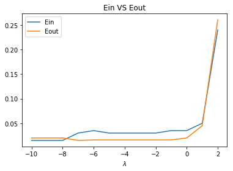
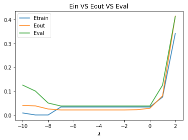
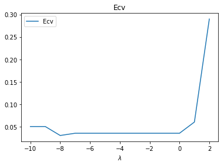

大家好，这篇是有关台大机器学习课程作业四的详解，题目同Coursera。

我的github地址：  
https://github.com/Doraemonzzz

个人主页：  
http://doraemonzzz.com/

作业地址:  
https://www.csie.ntu.edu.tw/~htlin/course/ml15fall/

参考资料:  
https://blog.csdn.net/a1015553840/article/details/51085129  
http://www.vynguyen.net/category/study/machine-learning/page/6/  
http://book.caltech.edu/bookforum/index.php  
http://beader.me/mlnotebook/


#### Problem 1

我的理解是deterministic noise是由$\mathcal{H}$和$f$“复杂度之差”产生的，所以如果选择使用$\mathcal{H}^{'}$，那么"复杂度之差"会增加，所以deterministic noise会增加。


####Problem 2

这题比较简单，$\mathcal{H}(Q,0,Q_0)=\sum_{q=0}^{Q_0-1}w_qL_q(x)=\mathcal{H}(Q_0-1)$，所以
$$
\mathcal{H}(10,0,3) \cap \mathcal{H}(10,0,4)=\mathcal{H}(2)\cap \mathcal{H}(3)=\mathcal{H}(2)
$$


#### Problem 3

首先计算$E_in(w),E_{aug}(w)$
$$
\begin{aligned}
E_{in}(w)&=||Xw-y||^2\\
&=(Xw-y)^T(Xw-y)\\
&=w^TX^TXw-2y^TXw+y^Ty
\end{aligned}
$$

$$
\begin{aligned}
E_{aug}(w)&=E_{in}(w)+\frac {\lambda}{N}w^Tw\\
&=w^TX^TXw-2y^TXw+y^Ty+\frac {\lambda}{N}w^Tw
\end{aligned}
$$

接着关于$w$求梯度
$$
\nabla E_{in}(w) =2X^TXw-2X^Ty\\
\nabla  E_{aug}(w)=\nabla E_{in}(w)+2\frac {\lambda}{N}w=2X^TXw-2X^Ty+2\frac {\lambda}{N}w
$$
由梯度下降法可知更新规则为
$$
\begin{aligned}
w(t+1)&=w(t)-\eta \nabla  E_{aug}(w)\\
&=w(t)-\eta(\nabla E_{in}(w)+2\frac {\lambda}{N}w)\\
&=(1-2\eta\frac {\lambda}{N})w-\eta \nabla E_{in}(w)
\end{aligned}
$$
所以
$$
\alpha=1-2\eta\frac {\lambda}{N},\beta=-\eta
$$


#### Problem 4

首先回顾$w_{reg}$的公式，记$u=Z^Ty$
$$
w_{reg}=(Z^TZ+\lambda I)^{-1}Z^Ty=(Z^TZ+\lambda I)^{-1}u
$$
假设$Z\in R^{N\times M}$，所以$Z^TZ\in R^{M\times M}$。

由于$Z^TZ$为半正定对称矩阵， 所以$Z^TZ$正交相似于对角阵，且特征值非负，令记$P$为正交相似矩阵，$Z^TZ$的特征值为$k_1,...,k_M(k_i\ge0)$，所以
$$
P^{T}Z^TZP= diag\{k _1,k _2..k _M\}
$$
从而
$$
P^{T}(Z^TZ+\lambda I)P= diag\{k _1+\lambda,k _2+\lambda,...,k _M+\lambda\}\\
(Z^TZ+\lambda I)=Pdiag\{k _1+\lambda,k _2+\lambda,...,k _M+\lambda\}P^{T}\\
(Z^TZ+\lambda I)^{-1}=P^{T}diag\{(k _1+\lambda)^{-1},(k _2+\lambda)^{-1},...,(k _M+\lambda)^{-1}\}P\\
(Z^TZ+\lambda I)^{-2}=P^{T}diag\{(k _1+\lambda)^{-2},(k _2+\lambda)^{-2},...,(k _M+\lambda)^{-2}\}P\\
$$
带入$w_{reg}^Tw_{reg}$的定义可得
$$
w_{reg}^Tw_{reg}=u^TP^{T}diag\{(k _1+\lambda)^{-2},(k _2+\lambda)^{-2},...,(k _M+\lambda)^{-2}\}Pu\\
$$
记$v=Pu=(v_1,...,v_M)$，注意$P,u$为常量，所以$v$也为常量，从而
$$
w_{reg}^Tw_{reg}=v^{T}diag\{(k _1+\lambda)^{-2},(k _2+\lambda)^{-2},...,(k _M+\lambda)^{-2}\}v=\sum_{i=1}^{M} (k _i+\lambda)^{-2} v_i^2
$$
因为$k_i\ge0$，所以$w_{reg}^Tw_{reg}=||w_{reg}||^2$关于$\lambda(\lambda\ge0)$递减，从而$|w_{reg}||$关于关于$\lambda(\lambda\ge0)$递减。


#### Problem 5

题目的意思是利用平方误差计算leave-one-out cross-validation，对于此题来说，有三个点$(x_1,y_1),(x_2,y_2),(x_3,y_3)$，首先根据其中两个点（不妨设为$(x_1,y_1),(x_2,y_2)$）训练模型$h(x)$，然后计算$(h(x_3)-y_3)^2$，下面具体看下题目。

首先看$h_{0}(x)=b_0$，如果有两个点$(x_1,y_1),(x_2,y_2)$，那么
$$
E_{in}=(b_{0}-y_1)^2+(b_{0}-y_2)^2=2b_{0}^2-2(y_1+y_2)b_0+(y_1^2+y_2^2)
$$
由二次函数性质可知，当$b_{0}=\frac {y_1+y_2}{2}​$时，$E_{in}​$最小。

所以如果点为$(-1,0),(\rho,1)$，那么$b_{0}=\frac 1 2$，从而误差为$(\frac 1 2 -0)^2=\frac 1 4$；如果点为$(-1,0),(1,0)$，那么$b_{0}=0$，从而误差为$(1 -0)^2=1$；如果点为$(\rho,1),(1,0)$，那么$b_{0}=\frac 1 2$，从而误差为$(\frac 1 2 -0)^2=\frac 1 4$。因此总误差为
$$
\frac 1 3(1+\frac 1 4 +\frac 1 4)
$$
再来看下$h_{1}(x)=a_1x+b_1$，如果有两个点$(x_1,y_1),(x_2,y_2)$，显然直线过这两点时$E_{in}$最小，从而
$$
a_1x_1+b_1=y_1\\
a_1x_2+b_1=y_2
$$
解得
$$
a_1=\frac{y_1-y_2}{x_1-x_2},b_1=\frac{x_1y_2-x_2y_1}{x_1-x_2}
$$
所以如果点为$(-1,0),(\rho,1)$，那么$a_{1}=\frac 1 {1+\rho},b_{1}=\frac 1 {1+\rho}$，从而误差为$(\frac 1 {1+\rho}+\frac 1 {1+\rho}-0)^2=\frac 4{(1+\rho)^2}$；如果点为$(-1,0),(1,0)$，那么$a_{1}=0,b_{1}=0$，从而误差为$(0-1)^2=1$；如果点为$(\rho,1),(1,0)$，那么$a_{1}=\frac {1}{\rho-1},b_{1}=-\frac {1}{\rho-1}$，从而误差为$(-\frac 1 {\rho-1}-\frac 1 {\rho-1}-0)^2=\frac 4{(1-\rho)^2}$。因此总误差为
$$
\frac 1 3(\frac 4{(1+\rho)^2}+1+\frac 4{(1-\rho)^2})
$$
由题设可知
$$
\frac 1 3(\frac 4{(1+\rho)^2}+1+\frac 4{(1-\rho)^2})=\frac 1 3(1+\frac 1 4 +\frac 1 4)\\
\frac 4{(1+\rho)^2}+\frac 4{(1-\rho)^2}=\frac 1 2\\
8[(1-\rho)^2+(1+\rho)^2]=(1-\rho)^2(1+\rho)^2\\
8(2+2\rho^2)=(1-\rho^2)^2\\
16+16\rho^2=\rho^4-2\rho^2+1\\
\rho^4-18\rho^2-15=0\\
\rho^2=9+4\sqrt{6}\\
\rho=\sqrt{9+4\sqrt{6}}
$$


#### Problem 6

要使得至少有一个人收到的5次预测都是正确的，需要给$2^5=32$个人写信，方法如下，第一天告诉一半的人A队胜利，告诉另一半人B队胜利，那么第一天必然有16封信是正确的，对这16个人重复此操作，到第五天肯定有人收到的5封信都是正确的。从这个过程中可以看出在第五场比赛之前，一共需要寄送的数量为
$$
2^5+2^4+2^3+2^2=4(2^4-1)=60
$$


#### Problem 7

由上题可知，加上第五场以及第六场，一共要寄送
$$
2^5+2^4+2^3+2^2+2+1=2^6-1=63
$$
所以一共要花费$63\times 10=630$，如果别人花了$1000$元，那么一共可以赚$1000-630=370$


#### Problem 8

因为这题$a(x) $是确定的，所以此处只有一个模型，$M=1$


#### Problem 9

回顾公式可知
$$
P(|E_{in}(g)-E_{out}(g)|>\epsilon)\le 2Me^{-2\epsilon^2N}
$$
这里$\epsilon=0.01,M=1,N=10000$，带入可得
$$
P\le 0.271
$$


#### Problem 10

我们获得$g(x)$的过程中实际上参考了$a(x)$，这是一种data snooping，所以为了好的效果，应该同时使用$g(x),a(x)$，根据两个判别函数来做决定。


#### Problem 11

只要代公式即可，首先做以下记号
$$
X=[x_1,...,x_N]^T,y=[y_1,...,y_N]^T
$$
所以
$$
X^{'}=[x_1,...,x_N,\tilde x_{1},...,\tilde x_{K}]^T
= \left[
 \begin{matrix}
  X \\
  \tilde X\\
  \end{matrix}
  \right]\\
  y^{'}=[y_1,...,y_N,\tilde y_{1},...,\tilde y_{K}]^T
  = \left[
 \begin{matrix}
 y \\
  \tilde y\\
  \end{matrix}
  \right]
$$
所以原问题可化为
$$
\underset{w} {min} \frac 1 {N+K}||X^{'}w-y||^2
$$
所以最优解为
$$
\begin{aligned}
w&=((X^{'})^TX^{'})^{-1}(X^{'})^Ty\\
&= (\left[
 \begin{matrix}
  X \\
  \tilde X\\
  \end{matrix}
  \right]^T
   \left[
 \begin{matrix}
  X \\
  \tilde X\\
  \end{matrix}
  \right])^{-1}
   \left[
 \begin{matrix}
  X \\
  \tilde X\\
  \end{matrix}
  \right]^T
  \left[
 \begin{matrix}
 y \\
  \tilde y\\
  \end{matrix}
  \right]\\
 &=(X^TX+ \tilde X^T \tilde X)^{-1}(X^Ty+ \tilde X^T  \tilde y)
\end{aligned}
$$


#### Problem 12

这题的目地是为了把岭回归转换成一般的线性回归，回顾岭回归的公式
$$
w_{reg}=(X^TX+\lambda I)^{-1}X^Ty
$$
对比上题的公式，我们令
$$
\tilde X=\sqrt{\lambda }I,y=0
$$
即可


#### Problem 13
这部分只要根据公式计算即可，注意这里是0-1误差


```python
import numpy as np
from numpy.linalg import inv

#读取数据
def read_data(file):
    x=[]
    y=[]
    with open(file) as f:
        for i in f.readlines():
            i=list(map(float,i.strip().split(' ')))
            temp=[1]
            temp+=i[:2]
            x.append(temp)
            y.append(i[-1])
    return np.array(x),np.array(y)

#计算w
def w(X,Y,k):
    N=X.shape[1]
    w=inv(X.T.dot(X)+k*np.eye(N)).dot(X.T).dot(Y)
    return w

#计算误差
def E(X,Y,w):
    N=X.shape[0]
    return np.sum(np.sign(X.dot(w))!=Y)/N

Xtrain,Ytrain=read_data('hw4_train.dat')
Xtest,Ytest=read_data('hw4_test.dat')

w1=w(Xtrain,Ytrain,11.26)
Ein=E(Xtrain,Ytrain,w1)
Eout=E(Xtest,Ytest,w1)
print("Ein="+str(Ein))
print("Eout="+str(Eout))
```

    Ein=0.055
    Eout=0.052


#### Problem 14

这题和下题是一致的，首先作图。


```python
import matplotlib.pyplot as plt

K=range(-10,3)
Ein=[]
Eout=[]
for k in K:
    l=10**(k)
    w1=w(Xtrain,Ytrain,l)
    ein=E(Xtrain,Ytrain,w1)
    eout=E(Xtest,Ytest,w1)
    Ein.append(ein)
    Eout.append(eout)
    
plt.plot(K,Ein,label='Ein')
plt.plot(K,Eout,label='Eout')
plt.xlabel('$\lambda$')
plt.title('Ein VS Eout')
plt.legend()
plt.show()
```





从图像中可以看出当$log_{10}(\lambda)=-10,-9,-8$时，$E_{in}$最小，根据题目的要求，这里选择最大的$\lambda$，
所以$log_{10}(\lambda=-8)$，接着查看对应的$E_{in},E_{out}$


```python
print("Ein="+str(Ein[2]))
print("Eout="+str(Eout[2]))
```

    Ein=0.015
    Eout=0.02


#### Problem 15

这里图像没那么明显，看一下$E_{out}$的大小


```python
Eout
```


    [0.02,
     0.02,
     0.02,
     0.014999999999999999,
     0.016,
     0.016,
     0.016,
     0.016,
     0.016,
     0.016,
     0.02,
     0.044999999999999998,
     0.26100000000000001]

所以$log_{10}(\lambda=-7)$时，$E_{out}$最小，的$E_{in},E_{out}$为


```python
print("Ein="+str(Ein[3]))
print("Eout="+str(Eout[3]))
```

    Ein=0.03
    Eout=0.015


#### Problem 16

这题是将数据拆成训练集和验证集，步骤和上题基本一致，选择$E_{in}$最小的$\lambda$。


```python
X1=Xtrain[:120,:]
Y1=Ytrain[:120]
Xval=Xtrain[120:,:]
Yval=Ytrain[120:]

Ein=[]
Eout=[]
Eval=[]
for k in K:
    l=10**(k)
    w1=w(X1,Y1,l)
    ein=E(X1,Y1,w1)
    eout=E(Xtest,Ytest,w1)
    eva=E(Xval,Yval,w1)
    Ein.append(ein)
    Eout.append(eout)
    Eval.append(eva)
    
plt.plot(K,Ein,label='Etrain')
plt.plot(K,Eout,label='Eout')
plt.plot(K,Eval,label='Eval')
plt.xlabel('$\lambda$')
plt.title('Ein VS Eout VS Eval')
plt.legend()
plt.show()
```





所以$log_{10}(\lambda)=-8$时，$E_{train}$最小，对应的$E_{train},E_{out},E_{val}$为


```python
print("Etrain="+str(Ein[2]))
print("Eout="+str(Eout[2]))
print("Eval="+str(Eval[2]))
```

    Etrain=0.0
    Eout=0.025
    Eval=0.05


#### Problem 17

选择$E_{val}$最小的$\lambda$，可以看出$log_{10}(\lambda)=0$，对应的$E_{train},E_{out},E_{val}$为


```python
print("Etrain="+str(Ein[-3]))
print("Eout="+str(Eout[-3]))
print("Eval="+str(Eval[-3]))
```

    Etrain=0.0333333333333
    Eout=0.028
    Eval=0.0375


#### Problem 18

选择最优的$\lambda$，根据上题可得$log_{10}(\lambda)=0,\lambda=1$


```python
w1=w(Xtrain,Ytrain,1)
Ein=E(Xtrain,Ytrain,w1)
Eout=E(Xtest,Ytest,w1)
print("Ein="+str(Ein))
print("Eout="+str(Eout))
```

    Ein=0.035
    Eout=0.02


#### Problem 19

将数据拆成5各部分，计算$E_{cv}$


```python
#准备数据
N=Xtrain.shape[0]//5
data=[]
for i in range(5):
    xtrain=np.concatenate((Xtrain[:i*N],Xtrain[(i+1)*N:]))
    ytrain=np.concatenate((Ytrain[:i*N],Ytrain[(i+1)*N:]))
    xval=Xtrain[i*N:(i+1)*N]
    yval=Ytrain[i*N:(i+1)*N]
    data.append([xtrain,ytrain,xval,yval])

Ecv=[]
K=range(-10,3)
for k in K:
    l=10**(k)
    ecv=0
    for i in data:
        xtrain=i[0]
        ytrain=i[1]
        xval=i[2]
        yval=i[3]
        w1=w(xtrain,ytrain,l)
        ecv+=E(xval,yval,w1)
    ecv/=5
    Ecv.append(ecv)
    
plt.plot(K,Ecv,label='Ecv')
plt.xlabel('$\lambda$')
plt.title('Ecv')
plt.legend()
plt.show()
```





可以看到$log_{10}(\lambda)=-8$时，$E_{cv}$最小


```python
print("Ecv="+str(Ecv[2]))
```

    Ecv=0.03


#### Problem 20

计算$log_{10}(\lambda)=-8$时的$E_{in},E_{out}$


```python
k=10**(-8)
w1=w(Xtrain,Ytrain,k)
Ein=E(Xtrain,Ytrain,w1)
Eout=E(Xtest,Ytest,w1)
print("Ein="+str(Ein))
print("Eout="+str(Eout))
```

    Ein=0.015
    Eout=0.02


以下两题为附加题

#### Problem 21

这题是需要最小化
$$
E(w)=||Xw-y||^2+\lambda w^T\Gamma^T\Gamma w=w^TX^TXw-2y^TXw+y^Ty+\lambda w^T\Gamma^T\Gamma w
$$
求梯度可得
$$
\nabla  E(w)=2X^TXw-2X^Ty+2\lambda\Gamma^T\Gamma w
$$
令梯度为0，解得
$$
w=(X^TX+\lambda\Gamma^T\Gamma)^{-1}X^Ty
$$
对比11题的公式
$$
w=(X^TX+ \tilde X^T \tilde X)^{-1}(X^Ty+ \tilde X^T  \tilde y)
$$
比较可得
$$
\tilde X=\sqrt{\lambda} \Gamma,\tilde y=0
$$


#### Problem 22

这题是需要最小化
$$
\begin{aligned}
E(w)
&=||Xw-y||^2+\lambda ||w-w_{hint}||^2\\
&=w^TX^TXw-2y^TXw+y^Ty+\lambda (w-w_{hint})^T(w-w_{hint})\\
&=w^TX^TXw-2y^TXw+y^Ty+\lambda (w^Tw-2w_{hint}^Tw+w_{hint}^Tw_{hint})
\end{aligned}
$$
求梯度可得
$$
\nabla  E(w)=2X^TXw-2X^Ty+2\lambda w-2\lambda w_{hint}
$$
令梯度为0，解得
$$
w=(X^TX+\lambda I)^{-1}(X^Ty+\lambda w_{hint})
$$
对比11题的公式
$$
w=(X^TX+ \tilde X^T \tilde X)^{-1}(X^Ty+ \tilde X^T  \tilde y)
$$
比较可得
$$
\tilde X=\sqrt{\lambda}I,\tilde y=\sqrt{\lambda} w_{hint}
$$
