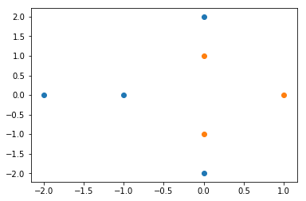
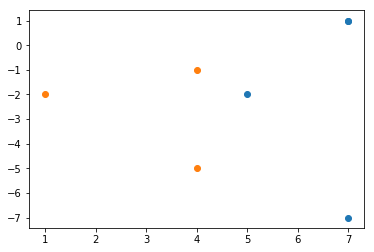
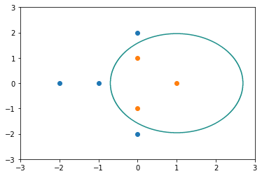
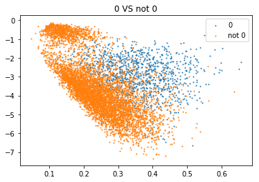
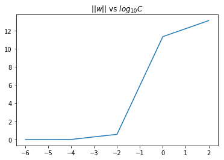
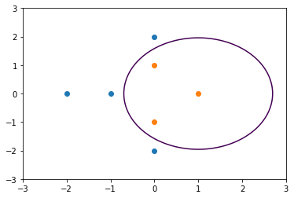
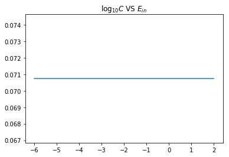
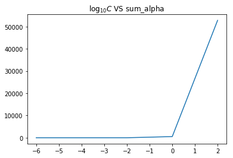
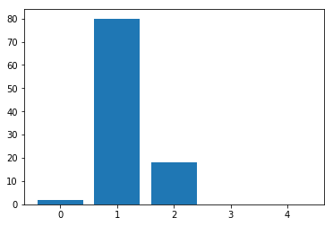

大家好，这篇是有关台大机器学习课程作业五的详解。

我的github地址：  
https://github.com/Doraemonzzz

个人主页：  
http://doraemonzzz.com/

作业地址:  
https://www.csie.ntu.edu.tw/~htlin/course/ml15fall/

参考资料:  
https://blog.csdn.net/a1015553840/article/details/51085129  
http://www.vynguyen.net/category/study/machine-learning/page/6/  
http://book.caltech.edu/bookforum/index.php  
http://beader.me/mlnotebook/   
https://blog.csdn.net/qian1122221/article/details/50130093


#### Problem 1

回顾下问题的形式
$$
\begin{aligned}
\min_{w,b,\xi}:& \ \frac 1 2 w^Tw+C\sum_{n=1}^{N}\xi_n \\
\text{subject to}:& \ y_n (w^Tx_n+b) \ge1-\xi_n
\\ & \ \xi_n\ge0  (n=1,...,N)
\end{aligned}
$$
$x_n,y_n$为变量，$C$为人为设定的超参数，其余量均为参数，注意$w\in \mathbb R^{d}$，所以我们的参数有
$$
w=(w_1,...,w_d),\xi_1,...,\xi_N,d
$$
一共$d+N+1$个。限制条件为
$$
 \quad y_n (w^Tx_n+b) \ge1-\xi_n
\\\xi_n\ge0  (n=1,...,N)
$$
一共有$2N​$个。


#### Problem 2

首先作图看下


```python
# -*- coding: utf-8 -*-
"""
Created on Sat Mar 23 13:11:34 2019

@author: qinzhen
"""

import numpy as np
import matplotlib.pyplot as plt
from sklearn import svm

####Problem 2

#原始图
x = np.array([[1, 0],[0, 1],[0, -1],[-1, 0],[0, 2],[0, -2],[-2, 0]])
z = np.array([-1, -1, -1, +1, +1, +1, +1])

x1 = x[z>0][:, 0]
y1 = x[z>0][:, 1]
x2 = x[z<0][:, 0]
y2 = x[z<0][:, 1]

plt.scatter(x1,y1)
plt.scatter(x2,y2)
plt.show()
```




可以看到，如果用二次曲线的话，应该可以分类，现在做特征转换之后的图像。


转换之后的标记为$+1$的点为
$$
z_4=(5,-2),z_5=(7,-7),z_6=(7,1),z_7=(7,1)
$$
转换之后的标记为$+1$的点为
$$
z_1=(1,-2),z_2=(4,-5),z_3=(4,-1)
$$

```python
#特征转换之后的图
def phi_1(x):
    return x[1] ** 2 - 2 * x[0] + 3

def phi_2(x):
    return x[0] ** 2 - 2 * x[1] - 3

X = []
for i in x:
    X.append([phi_1(i), phi_2(i)])
X = np.array(X)
    
X1 = X[z>0][:, 0]
Y1 = X[z>0][:, 1]
X2 = X[z<0][:, 0]
Y2 = X[z<0][:, 1]

plt.scatter(X1,Y1)
plt.scatter(X2,Y2)
plt.show()
```





从这个图像中可以看出，最大间隔分类器为$\phi_1(x)=4.5$，将$\phi_1(x)=x_2^2-2x_1+3$带入可得最大间隔分类器为
$$
x_2^2-2x_1+3=4.5\\
x_1=\frac{x_2^2-1.5}{2}
$$
最后看下曲线的图。


```python
#曲线图
y3 = np.arange(-2, 2, 0.01)
x3 = np.array([(i * i - 1.5) / 2 for i in y3])

plt.scatter(x1, y1)
plt.scatter(x2, y2)
plt.scatter(x3, y3, s=1)
plt.show()
```


#### Problem 3

利用sklearn处理即可，这里设置参数shrinking=False，参数含义如下：

https://stats.stackexchange.com/questions/24414/svm-options-in-scikit-learn


```python
clf = svm.SVC(kernel='poly', degree=2, coef0=1, gamma=1, C=1e10, shrinking=False)
clf.fit(x, z)
```


    SVC(C=10000000000.0, cache_size=200, class_weight=None, coef0=1,
      decision_function_shape='ovr', degree=2, gamma=1, kernel='poly',
      max_iter=-1, probability=False, random_state=None, shrinking=False,
      tol=0.001, verbose=False)

看下哪几个向量为支持向量。


```python
clf.support_
```


    array([1, 2, 3, 4, 5])

这说明第2到6个向量均为支持向量，再来看下对偶问题的系数。


```python
clf.dual_coef_
```


    array([[-0.64491963, -0.76220325,  0.88870349,  0.22988879,  0.2885306 ]])

这些系数分别支持向量对应的系数，非支持向量对应的系数为$0$，这里还要注意一点，对偶问题的系数为$y_n\alpha_n$，所以如果我们要得到原系数，就要乘以$y_n$


```python
z[clf.support_] * clf.dual_coef_[0]
```


    array([0.64491963, 0.76220325, 0.88870349, 0.22988879, 0.2885306 ])

所以
$$
(\alpha_1,\alpha_2,\alpha_3,\alpha_4,\alpha_5,\alpha_6,\alpha_7)=(0, 0.64491963, 0.76220325, 0.88870349, 0.22988879, 0.2885306,0)
$$
支持向量为
$$
x_2,x_3,x_4,x_5,x_6
$$


#### Problem 4

为了求得曲线方程，我们需要利用以下几个式子
$$
\begin{aligned}
w &=\sum_{α^∗_n>0} y_nα^∗_nz^T_n \\
b &= y_s −w^T z_s\\
g(x) &= \text{sign}\Big(\sum_{α^∗_n>0} y_nα^∗_nK(x_n,x) + b \Big)
\end{aligned}
$$
注意
$$
K(x_n,x)=(1+x_n^Tx)^2
$$
首先计算$b$，可以直接获得：

```python
b = clf.intercept_[0]
b
```

```
-1.6663314053609206
```

接着计算$K(x_n,x)=(1+x_n^Tx)^2$，首先找出支持向量：

```python
x[clf.support_]
```

```python
array([[ 0,  1],
       [ 0, -1],
       [-1,  0],
       [ 0,  2],
       [ 0, -2]])
```

然后计算上式，记
$$
x=(x^{(1)},x^{(2)})
$$
那么每一项分别为：
$$
\begin{aligned}
(1+x^{(2)})^2 \\
(1-x^{(2)})^2\\
(1-x^{(1)})^2 \\
(1+2x^{(2)})^2\\
(1-2x^{(2)})^2 
\end{aligned}
$$
最后计算$\alpha_n y_n$，直接调用即可：

```python
clf.dual_coef_[0]
```

```
array([-0.64491963, -0.76220325,  0.88870349,  0.22988879,  0.2885306 ])
```

所以曲线方程为：
$$
-0.64491963(1+x^{(2)})^2-0.76220325
(1-x^{(2)})^2+0.88870349
(1-x^{(1)})^2 + 0.22988879
(1+2x^{(2)})^2+0.2885306
(1-2x^{(2)})^2-1.6663314053609206=0
$$


#### Problem 5

这里作图来看：


```python
#点的数量
n = 1000
r = 3

#作点
a = np.linspace(-r, r, n)
b = np.linspace(-r, r, n)

#构造网格
A, B = np.meshgrid(a, b)
X = np.c_[A.reshape(-1, 1), B.reshape(-1, 1)]
label = np.reshape(clf.predict(X), A.shape)

#绘制等高线
plt.contour(A, B, label, 0)

plt.scatter(x1, y1)
plt.scatter(x2, y2)
plt.show()
```





可以看到，图像和之前的抛物线是不一样的。


#### Problem 6

结合课件的推导，我们可知
$$
L(R, c,λ)=R^2+\sum_{n=1}^N\lambda_n(||x_n − c||^2 -R^2)\\
\lambda_n\ge 0
$$
所以在$||x_n − c||^2 \le R^2$条件下
$$
\sum_{n=1}^N\lambda_n(||x_n − c||^2 -R^2)\le0\\
\text{max}\{\sum_{n=1}^N\lambda_n(||x_n − c||^2 -R^2)\}=0
$$
从而
$$
\underset {R\in \mathbb R,c\in \mathbb R^d} {\text{min}}
\underset {λ_n≥0} {\text{max }}L(R, c,λ)=
\underset {R\in \mathbb R,c\in \mathbb R^d} {\text{min}} R^2
$$


#### Problem 7

将上述问题转化为对偶问题
$$
\underset {R\in \mathbb R,c\in \mathbb R^d} {\text{min}}
\underset {λ_n≥0} {\text{max }}L(R, c,λ)=
\underset {λ_n≥0} {\text{max}}\underset {R\in \mathbb R,c\in \mathbb R^d} {\text{min }}L(R, c,λ)
$$
所以现在可以对$L(R, c,λ)$求无条件极值，分别求偏导可得
$$
\begin{aligned}
\frac{\partial L(R, c,λ)}{\partial c} 
&=\frac{\partial [R^2+\sum_{n=1}^N\lambda_n(||x_n − c||^2 -R^2)]}{\partial c}\\
&=\frac{\partial [R^2+\sum_{n=1}^N\lambda_n(x_n^Tx_n -2x_n^Tc+ c^Tc -R^2)]}{\partial c}\\
&=\frac{\partial [R^2+\sum_{n=1}^N\lambda_n(x_n^Tx_n -2x_n^Tc+ c^Tc -R^2)]}{\partial c}\\
&=\sum_{n=1}^N\lambda_n \frac{\partial (x_n^Tx_n -2x_n^Tc+ c^Tc -R^2)}{\partial c}\\
&=\sum_{n=1}^N\lambda_n (2c-2x_n)\\
&=2(c\sum_{n=1}^N\lambda_n-\sum_{n=1}^N\lambda_nx_n)
\end{aligned}
$$
令$\frac{\partial L(R, c,λ)}{\partial c} =0$可得
$$
c\sum_{n=1}^N\lambda_n-\sum_{n=1}^N\lambda_nx_n=0
$$
如果
$$
\sum_{n=1}^N\lambda_n\neq  0
$$
那么
$$
c=\frac{\sum_{n=1}^N\lambda_nx_n}{\sum_{n=1}^N\lambda_n}
$$
接着关于$R$求偏导
$$
\begin{aligned}
\frac{\partial L(R, c,λ)}{\partial R} 
&=\frac{\partial [R^2+\sum_{n=1}^N\lambda_n(||x_n − c||^2 -R^2)]}{\partial R}\\
&=2R-2\sum_{n=1}^{N}\lambda_nR\\
\end{aligned}
$$

令$\frac{\partial L(R, c,λ)}{\partial R} =0​$可得
$$
\sum_{n=1}^{N}\lambda_n=1
$$
结合这个条件，关于$c$的条件可以简化
$$
c=\frac{\sum_{n=1}^N\lambda_nx_n}{\sum_{n=1}^N\lambda_n}=\sum_{n=1}^N\lambda_nx_n
$$


#### Problem 8

将$\sum_{n=1}^{N}\lambda_n=1,c=\sum_{n=1}^N\lambda_nx_n$这两个条件带入$L(R, c,λ)$，先带入$\sum_{n=1}^{N}\lambda_n=1$
$$
\begin{aligned}
L(R, c,λ)
&=R^2+\sum_{n=1}^N\lambda_n(||x_n − c||^2 -R^2)\\
&=\sum_{n=1}^N\lambda_n||x_n − c||^2+R^2-R^2\sum_{n=1}^{N}\lambda_n\\
&=\sum_{n=1}^N\lambda_n||x_n − c||^2
\end{aligned}
$$
再对$\sum_{n=1}^N\lambda_n||x_n − c||^2$进行处理可得
$$
\begin{aligned}
L(R, c,λ)
&=\sum_{n=1}^N\lambda_n||x_n − c||^2\\
&=\sum_{n=1}^N\lambda_n(x_n^Tx_n -2x_n^Tc+ c^Tc )\\
&=\sum_{n=1}^N\lambda_nx_n^Tx_n-2(\sum_{n=1}^N\lambda_nx_n^T)c+c^Tc \sum_{n=1}^N\lambda_n\\
&=\sum_{n=1}^N\lambda_nx_n^Tx_n-2(\sum_{n=1}^N\lambda_nx_n^T)c+c^Tc 
\end{aligned}
$$
再带入$c={\sum_{n=1}^N\lambda_nx_n}$
$$
\begin{aligned}
L(R, c,λ)
&=\sum_{n=1}^N\lambda_nx_n^Tx_n-2c\sum_{n=1}^N\lambda_nx_n^T+c^Tc \\
&=\sum_{n=1}^N\lambda_nx_n^Tx_n-2(\sum_{n=1}^N\lambda_nx_n^T)({\sum_{n=1}^N\lambda_nx_n})+
(\sum_{n=1}^N\lambda_nx_n^T)({\sum_{n=1}^N\lambda_nx_n})\\
&=\sum_{n=1}^N\lambda_nx_n^Tx_n-(\sum_{n=1}^N\lambda_nx_n^T)({\sum_{n=1}^N\lambda_nx_n})
\end{aligned}
$$
所以问题转换为
$$
在条件\sum_{n=1}^{N}\lambda_n=1,\lambda_n\ge0下，\\
最小化f(\lambda)=\sum_{n=1}^N\lambda_nx_n^Tx_n-(\sum_{n=1}^N\lambda_nx_n^T)({\sum_{n=1}^N\lambda_nx_n})
$$


#### Problem 9

这题是要利用$z_n = \phi(x_n) $以及$K(x_n,x_m) $来简化问题，先对$f(\lambda)$进行处理
$$
\begin{aligned}
f(\lambda)
&=\sum_{n=1}^N\lambda_nx_n^Tx_n-(\sum_{n=1}^N\lambda_nx_n^T)({\sum_{n=1}^N\lambda_nx_n})\\
&=\sum_{n=1}^N\lambda_nx_n^Tx_n-
\sum_{n=1}^N\sum_{m=1}^N \lambda_n\lambda_m x_n^Tx_m
\end{aligned}
$$
将$x_n​$替换为$z_n = \phi(x_n) ​$，然后代入$K(x_n,x_m) =z_n^Tz_m​$可得
$$
\begin{aligned}
f(\lambda)
&=\sum_{n=1}^N\lambda_nz_n^Tz_n-\sum_{n=1}^N\sum_{m=1}^N \lambda_n\lambda_m z_n^Tz_m\\
&=\sum_{n=1}^N\lambda_nK(x_n,x_n) -\sum_{n=1}^N\sum_{m=1}^N \lambda_n\lambda_m K(x_n,x_m) 
\end{aligned}
$$


#### Problem 10

由Problem 6的推导过程我们可知，
$$
\lambda_n(||x_n − c||^2 -R^2)=0\\
n=1,...,N
$$
这里讨论的是特征转换之后的问题，所以上述问题可以修改为
$$
\lambda_n(||z_n − c||^2 -R^2)=0\\
n=1,...,N
$$
所以如果存在$\lambda_i\ne0$，那么
$$
||z_i − c||^2 -R^2=0
$$
结合$c={\sum_{n=1}^N\lambda_nz_n}​$，可得
$$
\begin{aligned}
R^2 &=  ||z_i − c||^2\\
&= (z_i -{\sum_{n=1}^N\lambda_nz_n})^T (z_i -{\sum_{n=1}^N\lambda_nz_n})\\
&=z_i^T z_i -2{\sum_{n=1}^N\lambda_nz_n^T }z_i + \sum_{n=1}^N\sum_{m=1}^N \lambda_n\lambda_m z_n^Tz_m \\
&=K(x_i, x_i)- 2 \sum_{n=1}^N\lambda_n K(x_n,x_i)+\sum_{n=1}^N\sum_{m=1}^N \lambda_n\lambda_m K(x_n,x_m)
\end{aligned}
$$


#### Problem 11

首先看下现在的问题，假设假设$x_n\in \mathbb R^k$
$$
\begin{aligned}
\min_{w,b,\xi}\ & \frac 1 2 w^Tw+C\sum_{n=1}^{N}\xi_n^2 \\
\text{subject to} \ & y_n (w^Tx_n+b) \ge1-\xi_n
\end{aligned}
$$
转换成hard-margin的关键问题在于把$\frac 1 2 w^Tw+C\sum_{n=1}^{N}\xi_n^2$写成$ \frac 1 2 \tilde w^T\tilde w$
$$
\frac 1 2 w^Tw+C\sum_{n=1}^{N}\xi_n^2=\frac 1 2(w^Tw+2C\sum_{n=1}^{N}\xi_n^2)\\
$$
从这点可以想到
$$
\tilde w = \left[
 \begin{matrix}
   w \\
   \sqrt{2C}\xi_1\\
  ...\\
     \sqrt{2C}\xi_N
  \end{matrix}
  \right]
$$
从而
$$
\tilde w^T \tilde w=w^Tw+2C\sum_{n=1}^N\xi_n^2
$$
这样变换之后也要对条件进行变换，将条件化为$y_n (w^T\tilde x_n+b) \ge1$的形式
$$
y_n (w^Tx_n+b) \ge1-\xi_n\Leftrightarrow \\
y_n (w^Tx_n+b+y_n\xi_n) \ge1 \Leftrightarrow \\
y_n (w^Tx_n+\sqrt{2C}\xi_n (\frac{1}{\sqrt{2C}}y_n)+b) \ge1
$$
结合$\tilde w$的式子，我们可以定义$\tilde x_n$，注意$x_n\in \mathbb R^k$
$$
\tilde x_n = \left[
 \begin{matrix}
   x_n \\
   0\\
   ...\\
\frac{1}{\sqrt{2C}}y_n\\
   ...\\
    0\\
  \end{matrix}
  \right]\in \mathbb R^{k+N}
$$
其中$\tilde x_n$的第$k+1$到$k+N$的分量中，除了第$k+n$个为$\frac{1}{\sqrt{2C}}y_n$，其余均为$0$，这样就把问题转化为
$$
\begin{aligned}
\min_{w,b,\xi}\ & \frac 1 2 \tilde w^T \tilde w \\
\text{subject to} \ &  y_n ( \tilde w^Tx_n+b) \ge1
\end{aligned}
$$
如果已经计算出了$\tilde w​$，那么由于
$$
\tilde w = \left[
 \begin{matrix}
   w \\
   \sqrt{2C}\xi_1\\
  ...\\
     \sqrt{2C}\xi_N
  \end{matrix}
  \right]
$$
所以取$\tilde w$的前$k$个分量即可得到$w$。


#### Problem 12

只要看这些映射对应的Gram矩阵是否半正定即可，设$K,K_1,K_2$对应的Gram矩阵为$M,M_1,M_2$

(a)$K(x,x^{'}) = K_1(x,x^{'}) + K_2(x,x^{'})$可得$M=M_1+M_2$
$$
y^TMy=y^T(M_1+M_2)y=y^TM_1y+y^TM_2y\ge 0
$$
所以$K(x,x^{'}) = K_1(x,x^{'}) + K_2(x,x^{'})​$为kernerl

(b)$K(x,x^{'}) = K_1(x,x^{'}) - K_2(x,x^{'})$可得$M=M_1-M_2$

这个一看就不是kernel，反例也很好构造
$$
M_1= \left[
 \begin{matrix}
   1 & 0 \\
   0&1 
  \end{matrix}
  \right],
  M_2=\left[
 \begin{matrix}
   2 & 0 \\
   0&2
  \end{matrix}
  \right],
 M=M_1-M_2=
  \left[
 \begin{matrix}
   -1 & 0 \\
   0&-1
  \end{matrix}
  \right]
$$
显然$M​$不是半正定的，所以$K(x,x^{'}) = K_1(x,x^{'}) - K_2(x,x^{'})​$不是kernel

(c)首先计算下式子的形式。
$$
\begin{aligned}
K(x,x^{'}) = K_1(x,x^{'})  K_2(x,x^{'})
&=\phi_1(x)^T \phi_1(x^{'})\phi_2(x)^T \phi_2(x^{'})\\
&=\sum_{i=1}^n\phi_1^{i}(x) \phi_1^{i}(x^{'})\sum_{j=1}^n\phi_2^{j}(x) \phi_2^{j}(x^{'})\\
&=\sum_{i=1}^n\sum_{j=1}^n\phi_1^{i}(x) \phi_1^{i}(x^{'})\phi_2^{j}(x) \phi_2^{j}(x^{'})\\
&=\sum_{i=1}^n\sum_{j=1}^n(\phi_1^{i}(x)\phi_2^{j}(x))(\phi_1^{i}(x^{'})\phi_2^{j}(x^{'}))
\end{aligned}
$$
根据这个形式，可以做以下定义
$$
\Phi^i(x)=\phi_1^i(x)(\phi_2^1(x),...,\phi_2^n(x))\\
\Phi(x)=(\Phi^1(x),...,\Phi^n(x))^T
$$
我们来计算下这个式子
$$
(\Phi^i(x))^T(\Phi^i(x^{'}))=\sum_{j=1}^n(\phi_1^{i}(x)\phi_2^{j}(x))(\phi_1^{i}(x^{'})\phi_2^{j}(x^{'}))\\
(\Phi(x))^T\Phi(x^{'})=\sum_{i=1}^{n}(\Phi^i(x))^T(\Phi^i(x^{'}))=\sum_{i=1}^n\sum_{j=1}^n(\phi_1^{i}(x)\phi_2^{j}(x))(\phi_1^{i}(x^{'})\phi_2^{j}(x^{'}))=K(x,x^{'})
$$
根据核函数的定义可知，$K(x,x^{'}) = K_1(x,x^{'})K_2(x,x^{'})​$为kernel

(d)$K(x,x^{'}) = K_1(x,x^{'}) /K_2(x,x^{'})$

这个也不是kernel，反例如下
$$
M_1= \left[
 \begin{matrix}
   1 & 2 \\
   2&3
  \end{matrix}
  \right],
  M_2=\left[
 \begin{matrix}
   2 & 1 \\
   1&1
  \end{matrix}
  \right],
  M=M_1/M_2=
  \left[
 \begin{matrix}
   \frac 1 2 & 2 \\
   2&3
  \end{matrix}
  \right]
$$
$M$行列式小于$0$，所以必然不是半正定的，所以$K(x,x^{'}) = K_1(x,x^{'}) /K_2(x,x^{'})$不是kernel

所以这题答案为(a)(c)。


#### Problem 13

设$K,K_1$对应的Gram矩阵为$M,M_1$

(a)
$$
M_1= \left[
 \begin{matrix}
   1 & 0 \\
   0&1 
  \end{matrix}
  \right],
 M=
  \left[
 \begin{matrix}
   (1-1)^2 & (1-0)^2 \\
   (1-0)^2&(1-1)^2
  \end{matrix}
  \right]=
  \left[
 \begin{matrix}
  0 & 1 \\
 1&0
  \end{matrix}
  \right]
$$
$M$的行列式小于$0$，所以$K(x,x^{'}) = (1-K_1(x,x^{'}))^2 $不是kernel

(b)
$$
M=1126M_1
$$
因为$M_1$半正定，所以$M$半正定，从而$K(x,x^{'}) = 1126K_1(x,x^{'}) $是kernel

(c)
$$
M_1= \left[
 \begin{matrix}
   1 & 0 \\
   0&1 
  \end{matrix}
  \right],
 M=
  \left[
 \begin{matrix}
  e^{-1} & 1 \\
  1& e^{-1} 
  \end{matrix}
  \right]
$$
$M$的行列式小于$0$，所以$K(x,x^{'}) = \text{exp}(-K_1(x,x^{'})) $不是kernel

(d)利用$f(x)=\frac 1 {1-x}$在$(0,1)$区间的泰勒展开可得
$$
\begin{aligned}
K(x,x^{'}) 
&= (1-K_1(x,x^{'}))^{-1}\\
&=\sum_{i=0}^{+\infty}(K_1(x,x^{'}))^i
\end{aligned}
$$
由上题的(b)我们知道$K_1(x,x^{'})^i$为kernel，再有上题的(a)我们知道kernel的和也为kernel，所以
$$
K(x,x^{'}) =\sum_{i=0}^{+\infty}(K_1(x,x^{'}))^i
$$
也为kernel


#### Problem 14

首先回顾下对偶问题对应的QP问题
$$
\begin{aligned}
\underset{\alpha∈R^N} {\text{minimize}} :&\ \frac 1 2\alpha^TQ_D\alpha-1_N^T\alpha\\
\text{subject to}:&\ A_D\alpha\ge u \\
\end{aligned}\\
Q_D=\left[
 \begin{matrix}
  y_1y_1K_{11} & ... &   y_1y_NK_{1N} \\
    y_2y_1K_{12} & ... &   y_2y_NK_{2N} \\
   ... & ... & ...  \\
  y_Ny_1K_{N1} & ... &   y_Ny_NK_{NN}
  \end{matrix}
  \right]
  ,
  A_D=\left[
 \begin{matrix}
  y^T \\
-  y^T\\
I_{N\times N} \\
-I_{N\times N} 
  \end{matrix}
  \right],
  u=\left[
 \begin{matrix}
 0 \\
0\\
0_{N\times N} \\
C\times I_{N\times N} 
  \end{matrix}
  \right]
$$
我们来看如果用新的kernel，$\tilde K(x,x^{'})=pK(x,x^{'})+q$，并且$\tilde C=\frac C p$会产生什么情况：
$$
\begin{aligned}
\tilde Q_D
&=\left[
 \begin{matrix}
  y_1y_1\tilde K_{11} & ... &   y_1y_N\tilde K_{1N} \\
    y_2y_1\tilde K_{12} & ... &   y_2y_N\tilde K_{2N} \\
   ... & ... & ...  \\
  y_Ny_1\tilde K_{N1} & ... &   y_Ny_N\tilde K_{NN}
  \end{matrix}
  \right]\\
  &= \left[
 \begin{matrix}
  y_1y_1(pK_{11}+q) & ... &   y_1y_N(pK_{1N}+q) \\
    y_2y_1(pK_{12}+q) & ... &   y_2y_N(pK_{2N}+q) \\
   ... & ... & ...  \\
  y_Ny_1(pK_{N1}+q) & ... &   y_Ny_N(pK_{NN}+q)
  \end{matrix}
  \right]\\
  &=pQ_D+q (y_1,...,y_N)^T(y_1,...,y_N)
  \end{aligned}\\
  \tilde A_D=A_D\\
  

    \tilde u=\left[
 \begin{matrix}
 0 \\
0\\
0_{N\times N} \\
\tilde C\times I_{N\times N} 
  \end{matrix}
  \right]
=\left[
 \begin{matrix}
 0 \\
0\\
0_{N\times N} \\
\frac C p\times I_{N\times N} 
  \end{matrix}
  \right]=\frac 1 p u
$$
接着我们来计算$\alpha^T \tilde Q_D\alpha$，注意
$$
(y_1,...,y_N).\alpha=0
$$
所以
$$
\alpha^T \tilde Q_D\alpha =\alpha^TpQ_D\alpha+\alpha^T q (y_1,...,y_N)^T(y_1,...,y_N)\alpha=p\alpha^T Q_D\alpha
$$
所以我们的目标函数为
$$
\frac 1 2 \alpha^T \tilde Q_D\alpha -1_N^T\alpha=\frac 1 2p\alpha^T \tilde Q_D\alpha-1_N^T\alpha
=\frac 1 p[\frac 1 2(p\alpha)^T Q_D(p\alpha)-1_N^T(p\alpha)]
$$
由于$p$为常数，所以目标函数可以简化为
$$
\frac 1 2(p\alpha)^T Q_D(p\alpha)-1_N^T(p\alpha)
$$
再看下限制条件
$$
\tilde A_D\alpha\ge \tilde u\Leftrightarrow 
 A_D\alpha\ge \frac 1 p u\Leftrightarrow A_D(p\alpha)\ge u
$$
我们令$ \overline \alpha=p\alpha$，那么问题可以转换为
$$
\begin{aligned}
\underset{\alpha∈R^N} {\text{minimize}} :&\ \frac 1 2\overline \alpha^TQ_D\overline\alpha-1_N^T\overline\alpha\\
\text{subject to}:&\ A_D\overline\alpha\ge u
\end{aligned}\\
Q_D=\left[
 \begin{matrix}
  y_1y_1K_{11} & ... &   y_1y_NK_{1N} \\
    y_2y_1K_{12} & ... &   y_2y_NK_{2N} \\
   ... & ... & ...  \\
  y_Ny_1K_{N1} & ... &   y_Ny_NK_{NN}
  \end{matrix}
  \right]
  ,
  A_D=\left[
 \begin{matrix}
  y^T \\
-  y^T\\
I_{N\times N} \\
-I_{N\times N} 
  \end{matrix}
  \right],
  u=\left[
 \begin{matrix}
 0 \\
0\\
0_{N\times N} \\
C\times I_{N\times N} 
  \end{matrix}
  \right]
$$
可以看出，这个问题和原问题是一致的，记原问题的最优解为$\alpha^*$，那么该问题的最优解$\tilde \alpha^*$满足以下条件
$$
\alpha^*=p \tilde \alpha^*
$$
我们根据这个条件开始讨论问题。

回顾下soft-margin得到的计算公式
$$
w^*=\sum_{n=1}^N\alpha_n^*y_nz_n\\
\beta_n^*=C-\alpha_n^*(n=1,...,N)\\
b^*=y_m-w^{*T}z_m=y_m-(\sum_{n=1}^N\alpha_n^*y_nz_n)^Tz_m=y_m-\sum_{n=1}^N\alpha_n^*y_nK(x_n,x_m)\\
其中z_m对应的\alpha^*_m\ne0\\
g(x)=\text{sign}(w^{*T}z+b)=\text{sign}((\sum_{n=1}^N\alpha_n^*y_nz_n)^Tz+b)
=\text{sign}(\sum_{n=1}^N\alpha_n^*y_nK(x_n,x)+b^*)
$$
如果我们将kernel换成
$$
\tilde K(x,x^{'})=pK(x,x^{'})+q
$$
利用之前的条件$\alpha^*=p \tilde \alpha^*$以及$\tilde C=\frac C p,\sum_{n=1}^N\alpha_n^*y_n=0$，可以对变换kernel之后的问题求解
$$
\tilde w^*=\sum_{n=1}^N\tilde \alpha_n^*y_nz_n=\frac 1 p(\sum_{n=1}^N \alpha_n^*y_nz_n)=\frac {w^*} p\\
\tilde \beta_n^*=\tilde C-\tilde \alpha_n^*=\frac C p -\frac {\alpha_n^*} p=\frac 1 p(C-\alpha_n^*)=\frac{\beta_n} p(n=1,...,N)\\
$$

$$
\begin{aligned}
\tilde b^*
&=y_m-\sum_{n=1}^N\tilde \alpha_n^*y_n\tilde K(x_n,x_m)\\
&=y_m-\sum_{n=1}^N\frac{\alpha_n^*}{p}y_n(pK(x_n,x_m)+q)\\
&=y_m-\sum_{n=1}^N{\alpha_n^*}y_nK(x_n,x_m)-\frac qp\sum_{n=1}^N\alpha_n^*y_n\\
&=y_m-\sum_{n=1}^N{\alpha_n^*}y_nK(x_n,x_m)\\
&=b^*
\end{aligned}\\
$$

$$
\begin{aligned}
\tilde g(x)
&=\text{sign}(\sum_{n=1}^N\tilde \alpha_n^*y_n\tilde K(x_n,x)+\tilde b^*)\\
&=\text{sign}[\sum_{n=1}^N\frac {\alpha_n^*}py_n(pK(x_n,x)+q)+b^*]\\
&=\text{sign}[\sum_{n=1}^N {\alpha_n^*}y_nK(x_n,x)+\frac qp\sum_{n=1}^N\alpha_n^*y_n+b^*]\\
&=\text{sign}(\sum_{n=1}^N {\alpha_n^*}y_nK(x_n,x)+b^*)\\
&=g(x)
\end{aligned}
$$

这说明这样变换之后我们的分类器没有变。


#### Problem 15
首先读取数据并作图


```python
# -*- coding: utf-8 -*-
"""
Created on Wed Mar 27 13:42:18 2019

@author: qinzhen
"""

####Problem 15
import matplotlib.pyplot as plt
import numpy as np
from sklearn import svm

def transformdata(file):
    data = np.genfromtxt(file)
    y, X = data[:, 0], data[:, 1:]
    return X, y

train = "featurestrain.txt"
X_train, y_train = transformdata(train)
test = "featurestest.txt"
X_test,y_test = transformdata(test)

#作图
plt.scatter(X_train[y_train == 0][:, 0], X_train[y_train == 0][:, 1], s=1, label='0')
plt.scatter(X_train[y_train != 0][:, 0], X_train[y_train != 0][:, 1], s=1, label='not 0')
plt.title('0 VS not 0')
plt.legend()
plt.show()
```





接着训练模型并作图：


```python
#训练模型并作图
y_train_1 = (y_train==0).astype("int")
C = [-6, -4, -2, 0, 2]
W = []

for i in C:
    c = 10 ** i
    clf = svm.SVC(kernel="linear", C=c)
    clf.fit(X_train, y_train_1)
    w = clf.coef_
    W.append(np.linalg.norm(w))

plt.plot(C, W)
plt.title("$||w||$ vs $log_{10}C$")
plt.show()
```





#### Problem 16

注意这题是$8$和not $8$，首先作图


```python
####Problem 16
plt.scatter(X_train[y_train == 8][:, 0], X_train[y_train == 8][:, 1], s=1, label='8')
plt.scatter(X_train[y_train != 8][:, 0], X_train[y_train != 8][:, 1], s=1, label='not 8')
plt.title('8 VS not 8')
plt.legend()
plt.show()
```





注意17题要计算$\sum_{n=1}^N\alpha_n$，所以我们这题把系数也算出来，由于sklearn只能计算对偶系数$y_n\alpha_n$，所以这里要把标签转换为$+1,-1$，方便计算。


```python
#训练
y_train_8 = 2 * (y_train==8).astype("int") - 1
C = [-6, -4, -2, 0, 2]
Ein = []
alpha = []
for i in C:
    c = 10 ** i
    clf = svm.SVC(kernel='poly', degree=2, coef0=1, gamma=1, C=c)
    clf.fit(X_train, y_train_8)
    e = np.mean(clf.predict(X_train) != y_train_8)
    #支持向量的索引
    support = clf.support_
    #计算系数
    coef = np.sum(clf.dual_coef_[0] * y_train_8[support])
    alpha.append(coef)
    Ein.append(e)

#作图
plt.plot(C,Ein)
plt.show()
```




比较神奇的是这题的$E_{\text{in}}$都一样。


#### Problem 17

利用上题的数据作图即可。


```python
####Problem 17
plt.plot(C, alpha)
plt.title("$\log_{10}C$ VS sum_alpha")
plt.show()
```




可以看到尽管上题的$E_{\text{in}}$一致，但是这里$\sum_{n=1}^N\alpha_n$会增加。


#### Problem 18

这题需要计算权重$w​$，因为涉及到高斯核，无法直接计算。

现在假设有$n$个样本，那么：
$$
\begin{aligned}
w&=\sum_{i=1}^n  \alpha_{i} y_{i} z_{i}, z_{i}=\Phi\left(x_{i}\right)\\
\|w\|^{2}&=\sum_{i=1}^n  \sum_{j=1}^n  \alpha_{i} y_{i}\alpha_{j}  y_{j} z_{i}^T z_{j}=\sum_{i=1}^n  \sum_{j=1}^n\alpha_{i} y_{i}\alpha_{j}  y_{j} z_{i}^T z_{j} K\left(x_{i}, x_{j}\right)
\end{aligned}
$$
其中
$$
K(x_i, x_j) =\exp \left ( -\gamma||x_{i} -x_{j} ||^2\right)
$$
记
$$
\bar y =  \left[
 \begin{matrix}
  \alpha_1 y_1 \\
 \vdots\\
  \alpha_n y_n
  \end{matrix}
  \right]\in \mathbb R^n , D \in \mathbb R^{n\times n},D_{ij}=||x_{i} -x_{j} ||^2
$$
那么
$$
K=\exp \left ( -\gamma D\right)
$$
并且
$$
\|w\|^{2} = \bar y^T K \bar y
$$
注意只有支持向量部分的系数非零，所以上述计算步骤只要对支持向量进行即可（clf.support_为支持向量的索引），所以只要计算出$D$即可，这里介绍向量化的计算方法，考虑更一般的问题：

假设
$$
X = \left[
 \begin{matrix}
  — (x^{(1)})^T— \\
— (x^{(2)})^T— \\
\vdots\\
— (x^{(m)})^T— 
  \end{matrix}
  \right] \in \mathbb R^{m \times d}, Y =  \left[
 \begin{matrix}
  — (y^{(1)})^T— \\
— (y^{(2)})^T— \\
\vdots\\
— (y^{(n)})^T— 
  \end{matrix}
  \right] \in \mathbb R^{n \times d}
$$
其中$x^{(i)} ,y^{(i)} \in \mathbb R^d$，现在的问题是如何高效计算矩阵$D \in \mathbb R^{m\times n}$，其中
$$
D_{i,j} = ||x^{(i)} -y^{(j)} ||^2
$$
首先对$D_{i,j}$进行处理
$$
\begin{aligned}
D_{i,j} &= ||x^{(i)} -y^{(j)} ||^2 \\
&= (x^{(i)} -y^{(j)})^T (x^{(i)} -y^{(j)})\\
&=(x^{(i)})^T x^{(i)} -2(x^{(i)})^Ty^{(j)} +(y^{(j)})^T y^{(j)}
\end{aligned}
$$
那么
$$
\begin{aligned}
D &=  \left[
 \begin{matrix}
   D_{1,1} & ... & D_{1,n} \\
  ... &  ... &  ... \\
   D_{m,1} &  ... & D_{m,n} 
  \end{matrix}
  \right]  \\
  &= \left[
 \begin{matrix}
   (x^{(1)})^T x^{(1)} -2(x^{(1)})^Ty^{(1)} +(y^{(1)})^T y^{(1)} & ... & 
     (x^{(1)})^T x^{(1)} -2(x^{(1)})^Ty^{(n)} +(y^{(n)})^T y^{(n)}\\
  ... &  ... &  ... \\
   (x^{(m)})^T x^{(m)} -2(x^{(m)})^Ty^{(1)} +(y^{(1)})^T y^{(1)}  &  ... & 
    (x^{(m)})^T x^{(m)} -2(x^{(m)})^Ty^{(n)} +(y^{(n)})^T y^{(n)} 
  \end{matrix}
  \right] \\
  &= \left[
 \begin{matrix}
   (x^{(1)})^T x^{(1)} & ... & 
     (x^{(1)})^T x^{(1)} \\
  ... &  ... &  ... \\
   (x^{(m)})^T x^{(m)}  &  ... & 
    (x^{(m)})^T x^{(m)} 
  \end{matrix}
  \right] +\left[
 \begin{matrix}
   (y^{(1)})^T y^{(1)} & ... & 
     (y^{(n)})^T y^{(n)} \\
  ... &  ... &  ... \\
  (y^{(1)})^T y^{(1)} & ... & 
     (y^{(n)})^T y^{(n)}
  \end{matrix}
  \right]-
  2\left[
 \begin{matrix}
   (x^{(1)})^T y^{(1)} & ... & 
     (x^{(1)})^T y^{(n)} \\
  ... &  ... &  ... \\
  (x^{(m)})^T y^{(1)} & ... & 
     (x^{(m)})^T y^{(n)}
  \end{matrix}
  \right]\\
  &=\left[
 \begin{matrix}
   (x^{(1)})^T x^{(1)} \\
  ...  \\
   (x^{(m)})^T x^{(m)}  
  \end{matrix}
  \right]\underbrace{\left[
 \begin{matrix}
1&...&1
  \end{matrix}
  \right]}_{1\times n矩阵}  +\underbrace{\left[
 \begin{matrix}
1\\ 
\vdots \\
1
  \end{matrix}
  \right]}_{m\times 1矩阵} \left[
 \begin{matrix}
   (y^{(1)})^T y^{(1)}  &
  \ldots  &
  (y^{(n)})^T y^{(n)} 
  \end{matrix}
  \right] -2XY^T
\end{aligned}
$$
利用numpy的广播机制上式可以简写如下：

```python
#计算距离矩阵
d1 = np.sum(X ** 2, axis=1).reshape(-1, 1)
d2 = np.sum(Y ** 2, axis=1).reshape(1, -1)
dist = d1 + d2 - 2 * X.dot(Y.T)
```

利用上述方法计算$\|w\|^{2}$即可，最后注意距离为$\frac {1}{||w||}$：


```python
####Problem 18
C = [-3, -2, -1, 0, 1]
Distance = []
#将标签修改为-1, 1
y = 2 * y_train_1 - 1

for i in C:
    c = 10**i
    clf = svm.SVC(kernel='rbf', gamma=1, C=c)
    clf.fit(X_train, y)
    X = X_train[clf.support_]
    #距离矩阵
    d1 = np.sum(X ** 2, axis=1).reshape(-1, 1)
    d2 = np.sum(X ** 2, axis=1).reshape(1, -1)
    dist = d1 + d2 - 2 * X.dot(X.T)
    #Kernel矩阵
    K = np.exp(- c * dist)
    #计算anyn
    y1 = clf.dual_coef_[0] * y[clf.support_]
    w2 = y1.dot(K).dot(y1.T)
    #计算距离
    distance = 1 / np.sqrt(w2)
    Distance.append(distance)
    
plt.plot(C, Distance)
plt.title("$\log_{10}C$ VS distance")
plt.show()
```


随着$C​$增加，距离在减少。


#### Problem 19


```python
####Problem 19
y_test_1 = (y_test == 0)

Gamma = range(5)
Eout = []

for i in Gamma:
    gamma = 10**i
    clf = svm.SVC(kernel='rbf', gamma=gamma, C=0.1)
    clf.fit(X_train, y_train_1)
    e = np.mean(clf.predict(X_test) != y_test_1)
    Eout.append(e)
    
plt.plot(Gamma, Eout)
plt.title("$\log_{10}\gamma$ VS $E_{out}$")
plt.show()
```


可以看到，$\text{log}_{10}\gamma=1$时，$E_{\text{out}}$最小，说明$C$不能太大，也不能太小。


#### Problem 20

这题要构造交叉验证集，多次实验，做直方图，先做一些预处理。


```python
####Problem 20
from sklearn.model_selection import train_test_split

#对数据合并，方便调用train_test_split函数
Data = np.c_[X_train, y_train]
N = 100
#记录最小Eval对应的gamma的索引的次数
Cnt = np.zeros(5)
Gamma = range(5)

for _ in range(N):
    #划分数据
    train_set, val_set = train_test_split(Data, test_size=0.2)
    #取特征
    X_train = train_set[:, :2]
    #取标签
    y_train = train_set[:, 2]
    X_val = val_set[:, :2]
    y_val = val_set[:, 2]
    Eval = []

    for i in Gamma:
        gamma = 10 ** i
        clf = svm.SVC(kernel='rbf', gamma=gamma, C=0.1)
        clf.fit(X_train, y_train)
        e = np.mean(clf.predict(X_val) != y_val)
        Eval.append(e)
    #找到最小Eval对应的索引
    index = np.argmin(Eval)
    #对应索引次数加1
    Cnt[index] += 1
    
plt.bar(Gamma, Cnt)
plt.show()
```




可以看到大部分最优解对应的$\text{log}_{10}\gamma$都为$1$，和上一题说明同一个道理，说明$\gamma$不能太大，也不能太小。


附加题

#### Problem 21

这题的问题是求hard-margin SVM对偶问题的对偶问题，我们来看一下。

首先回顾下hard-margin SVM对偶问题。
$$
\begin{aligned}
\underset{\alpha∈\mathbb R^N} {\text{minimize}} :&\ \frac 1 2\sum_{m=1}^{N}\sum_{n=1}^{N}y_ny_m\alpha_n\alpha_mx_n^Tx_m-\sum_{n=1}^{N}\alpha_n\\
\text{subject to}:&\ \sum_{n=1}^N y_n\alpha_n=0,\alpha_n\ge0(n=1,...,N)
\end{aligned}
$$
根据拉格朗日乘子法，我们将上述问题转化为
$$
\underset{\alpha∈\mathbb R^N} {\text{min}}  \underset{\lambda_i\ge0} {\text{max}} :
\frac 1 2\sum_{m=1}^{N}\sum_{n=1}^{N}y_ny_m\alpha_n\alpha_mx_n^Tx_m-\sum_{n=1}^{N}\alpha_n
+\lambda_0(\sum_{n=1}^N y_n\alpha_n)-\sum_{n=1}^N\lambda_n\alpha_n
$$
注意这里如下事实成立：
$$
\min \max = \max \min
$$
所以上述问题可以转化为
$$
\underset{\lambda_i\ge0} {\text{max}} \underset{\alpha∈\mathbb R^N} {\text{min}} :
\frac 1 2\sum_{m=1}^{N}\sum_{n=1}^{N}y_ny_m\alpha_n\alpha_mx_n^Tx_m-\sum_{n=1}^{N}\alpha_n
+\lambda_0(\sum_{n=1}^N y_n\alpha_n)-\sum_{n=1}^N\lambda_n\alpha_n
$$
这个最小值问题转化为为一个无条件极值，现在做以下记号
$$
f(\lambda,\alpha)=\frac 1 2\sum_{m=1}^{N}\sum_{n=1}^{N}y_ny_m\alpha_n\alpha_mx_n^Tx_m-\sum_{n=1}^{N}\alpha_n
+\lambda_0(\sum_{n=1}^N y_n\alpha_n)-\sum_{n=1}^N\lambda_n\alpha_n
$$
关于$\alpha_i$求偏导可得
$$
\begin{aligned}
\frac{\partial f}{\partial \alpha_i}
&=\frac 1 2\sum_{n=1}^{N}y_ny_i\alpha_nx_n^Tx_i+\frac 1 2\sum_{m=1}^{N}y_iy_m\alpha_mx_i^Tx_m-1
+\lambda_0y_i-\lambda_i\\
&=\sum_{n=1}^{N}y_ny_i\alpha_nx_i^Tx_n-1+\lambda_0y_i-\lambda_i
\end{aligned}
$$
令偏导为$0$可得
$$
\sum_{n=1}^{N}y_ny_i\alpha_nx_i^Tx_n=1-\lambda_0y_i+\lambda_i
$$
对这个式子作以下变形可得
$$
\left[
 \begin{matrix}
  y_iy_1x^T_ix_1 & ... &   y_iy_Nx^T_ix_N \\
  \end{matrix}
  \right]
  \left[
 \begin{matrix}
  \alpha_1 \\
    ... \\
      \alpha_N
  \end{matrix}
  \right]=1-\lambda_0y_i+\lambda_i\tag{1}
$$
这个形式是见过的，我们回顾下Learning from data第八章的28页，我们知道hard-margin SVM对偶问题也可以写成如下的形式
$$
\begin{aligned}

\underset{\alpha∈\mathbb R^N} {\text{minimize}} :&\ \frac 1 2\alpha^TQ_D\alpha-1_N^T\alpha\\
\text{subject to}:&\  A_D\alpha\ge 0_{N+2}\\
\end{aligned}\\
Q_D=\left[
 \begin{matrix}
  y_1y_1x^T_1x_1 & ... &   y_1y_Nx^T_1x_N \\
    y_2y_1x^T_2x_1 & ... &   y_2y_Nx^T_2x_N \\
   ... & ... & ...  \\
  y_Ny_1x^T_Nx_1 & ... &   y_Ny_Nx^T_Nx_N 
  \end{matrix}
  \right]
  \text{ and }
  A_D=\left[
 \begin{matrix}
  y^T \\
-  y^T\\
I_{N\times N} 
  \end{matrix}
  \right]
$$
(1)的等式左边的第一个向量对应着$Q_D​$的每一行，所以如果我们对(1)式中$i​$从$1​$取到$N​$，可以把(1)的条件转化为
$$
Q_D\alpha = 1_N-\lambda_0y+\lambda\\
\alpha=\left[
 \begin{matrix}
  \alpha_1 \\
    ... \\
      \alpha_N
  \end{matrix}
  \right],
  y=\left[
 \begin{matrix}
y_1 \\
    ... \\
    y_N
  \end{matrix}
  \right],
  \lambda = \left[
 \begin{matrix}
  \lambda_1 \\
    ... \\
      \lambda_N
  \end{matrix}
  \right]
$$

在这个记号下，对原问题进行处理
$$
\begin{aligned}
\sum_{m=1}^{N}\sum_{n=1}^{N}y_ny_m\alpha_n\alpha_mx_n^Tx_m&=\alpha^TQ_D\alpha\\
\sum_{n=1}^{N}\alpha_n&=1_N^T\alpha\\
\lambda_0(\sum_{n=1}^N y_n\alpha_n)&=\lambda_0 \alpha^Ty\\
\sum_{n=1}^N\lambda_n\alpha_n&=\alpha^T\lambda
\end{aligned}
$$
所以
$$
f(\lambda,\alpha)= \frac 1 2\alpha^TQ_D\alpha-1_N^T\alpha+\lambda_0 \alpha^Ty-\alpha^T\lambda
$$
将$Q_D\alpha = 1_N-\lambda_0y+\lambda$带入可得
$$
\begin{aligned}
f(\lambda,\alpha)
&= \frac 1 2\alpha^TQ_D\alpha-1_N^T\alpha+\lambda_0 \alpha^Ty-\alpha^T\lambda\\
&=\frac 1 2\alpha^T(1_N-\lambda_0y+\lambda)-1_N^T\alpha+\lambda_0 \alpha^Ty-\alpha^T\lambda\\
&=-\frac 1 2 \alpha^T1_N+\frac 1 2\lambda_0 \alpha^Ty-\frac 1 2\alpha^T\lambda\\
&=-\frac 1 2  \alpha^T(1_N-\lambda_0y+\lambda)
\end{aligned}
$$
如果$Q_D$可逆，那么
$$
\alpha =Q_D^{-1}( 1_N-\lambda_0y+\lambda)
$$
代入可得
$$
-\frac 1 2  \alpha^T(1_N-\lambda_0y+\lambda)=-\frac 1 2 [Q_D^{-1}( 1_N-\lambda_0y+\lambda)]^T(1_N-\lambda_0y+\lambda)\\
=-\frac 1 2(1_N-\lambda_0y+\lambda)^TQ_D^{-1}(1_N-\lambda_0y+\lambda)
$$
所以问题转化为
$$
\begin{aligned}

\underset{\lambda_i \ge0} {\text{maxmize}} :&\ -\frac 1 2(1_N-\lambda_0y+\lambda)^TQ_D^{-1}(1_N-\lambda_0y+\lambda)\\
\text{subject to}:&\  \lambda_i\ge0(n=0,1,...,N)
\end{aligned}
$$
把负号提出来，可以转化为标准的$QP​$问题
$$
\begin{aligned}
\underset{\lambda_i \ge0} {\text{minmize}}:&\ \frac 1 2(1_N-\lambda_0y+\lambda)^TQ_D^{-1}(1_N-\lambda_0y+\lambda)\\
\text{subject to}:&\  \lambda_i\ge0(n=0,1,...,N)
\end{aligned}
$$
可以看到，这和最开始的问题是非常类似的。

