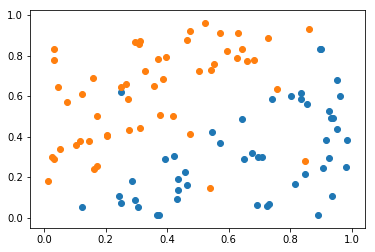
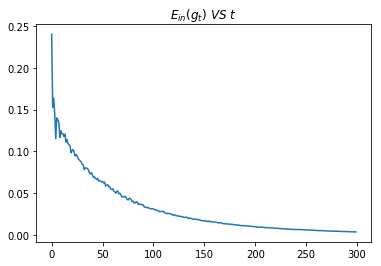
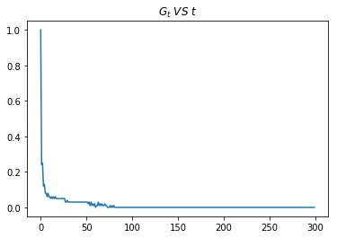
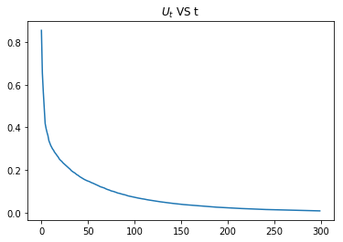
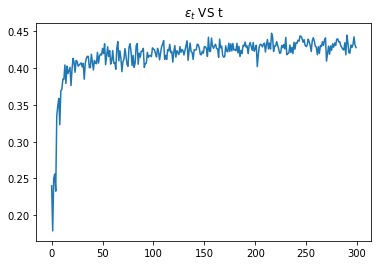
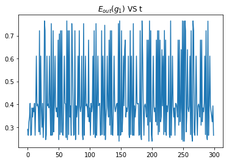
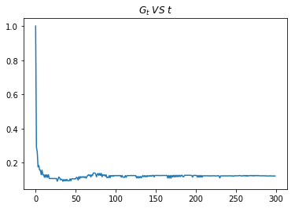

大家好，这篇是有关台大机器学习课程作业六的详解。

我的github地址：  
https://github.com/Doraemonzzz

个人主页：  
http://doraemonzzz.com/

作业地址:  
https://www.csie.ntu.edu.tw/~htlin/course/ml15fall/

参考资料:  
https://blog.csdn.net/a1015553840/article/details/51085129  
http://www.vynguyen.net/category/study/machine-learning/page/6/  
http://book.caltech.edu/bookforum/index.php  
http://beader.me/mlnotebook/   
https://blog.csdn.net/qian1122221/article/details/50130093   
https://acecoooool.github.io/blog/


#### Problem 1

首先计算$p_n$
$$
\begin{aligned}
p_n
&=θ(−y_n(Az_n + B))\\
&=\frac{\text{exp}(−y_n(Az_n + B))}{1+\text{exp}(−y_n(Az_n + B))}\\
&=\frac{1}{1+\text{exp}(y_n(Az_n + B))}
\end{aligned}
$$
现在对式子进行化简
$$
\begin{aligned}
F(A,B) 
&= \frac 1 N \sum_{n=1}^N \text{ln}\Big(1+\text{exp}\Big(-y_n\Big(Az_n+B\Big)\Big)\Big)\\
&= \frac 1 N \sum_{n=1}^N \text{ln}\Big(\frac{1+\text{exp}\Big(y_n\Big(Az_n+B\Big)\Big)}{\text{exp}\Big(y_n\Big(Az_n+B\Big)\Big)}\Big)\\
&=- \frac 1 N\sum_{n=1}^N \text{ln}\Big(\frac {\text{exp}\Big(y_n\Big(Az_n+B\Big)\Big)}{1+\text{exp}\Big(y_n\Big(Az_n+B\Big)\Big)}\Big)\\
&=-\frac 1N\sum_{n=1}^N \text{ln}\Big(1-p_n\Big)
\end{aligned}
$$
现在计算梯度
$$
\begin{aligned}
\nabla F(A,B)
&=-\frac 1 N\sum_{n=1}^N \frac{1}{1-p_n}(-1) p_n(1-p_n)(-y_n) \left( \begin{matrix}z_n \\ 1 \\ \end{matrix}\right)\\
&=-\frac 1 N\sum_{n=1}^Ny_np_n \left( \begin{matrix}z_n \\ 1 \\ \end{matrix}\right)
\end{aligned}
$$


#### Problem 2

现在要计算Hessian矩阵，由上一题可知
$$
\frac{\partial F(A,B)}{\partial A}=-\frac 1 N\sum_{n=1}^Ny_nz_np_n\\
\frac{\partial F(A,B)}{\partial B}=-\frac 1 N\sum_{n=1}^Ny_np_n
$$
在计算$\frac{\partial^2 F(A,B)}{\partial A^2},\frac{\partial^2 F(A,B)}{\partial B^2},\frac{\partial^2 F(A,B)}{\partial A\partial B}$之前，先计算$\frac{\partial p_n}{\partial A},\frac{\partial p_n}{\partial B}$
$$
\frac{\partial p_n}{\partial A}= p_n(1-p_n)(-y_n)z_n\\
\frac{\partial p_n}{\partial B}=p_n(1-p_n)(-y_n)
$$
接下来分别计算上述三个式子，注意$y_n^2=1$
$$
\begin{aligned}
\frac{\partial^2 F(A,B)}{\partial A^2}
&=-\frac 1 N\sum_{n=1}^Ny_nz_n\frac{\partial p_n}{\partial A}\\
&=-\frac 1 N\sum_{n=1}^Ny_nz_np_n(1-p_n)(-y_n)z_n\\
&=\frac 1 N\sum_{n=1}^Ny_n^2z_n^2p_n(1-p_n)\\
&=\frac 1 N\sum_{n=1}^Nz_n^2p_n(1-p_n)
\end{aligned}
$$
$$
\begin{aligned}
\frac{\partial^2 F(A,B)}{\partial B^2}
&=-\frac 1 N\sum_{n=1}^Ny_n\frac{\partial p_n}{\partial A}\\
&=-\frac 1 N\sum_{n=1}^Ny_np_n(1-p_n)(-y_n)\\
&=\frac 1 N\sum_{n=1}^Ny_n^2p_n(1-p_n)\\
&=\frac 1 N\sum_{n=1}^Np_n(1-p_n)
\end{aligned}
$$

$$
\begin{aligned}
\frac{\partial^2 F(A,B)}{{\partial A\partial B}}
&=-\frac 1 N\sum_{n=1}^Ny_nz_n\frac{\partial p_n}{\partial B}\\
&=-\frac 1 N\sum_{n=1}^Ny_nz_np_n(1-p_n)(-y_n)\\
&=\frac 1 N\sum_{n=1}^Ny_n^2z_np_n(1-p_n)\\
&=\frac 1 N\sum_{n=1}^Nz_np_n(1-p_n)
\end{aligned}
$$

结合这几个式子，我们可知
$$
H(F)=
 \left(
 \begin{matrix}
   \frac 1 N\sum_{n=1}^Nz_n^2p_n(1-p_n) & \frac 1 N\sum_{n=1}^Nz_np_n(1-p_n)  \\
  \frac 1 N\sum_{n=1}^Nz_np_n(1-p_n) &\frac 1 N\sum_{n=1}^Np_n(1-p_n)
  \end{matrix}
  \right)
$$


#### Problem 3

首先回顾下Gaussian kernel的形式
$$
K (x, x^{'}) = \text {exp}( −γ||x − x^{'}||^2)
$$
所以如果$\gamma \to \infty$，那么$K (x, x^{'}) \to 0$，从而kernel matrix $K\to 0$ ，注意最后的$0$是零矩阵的意思。现在回顾讲义上$\beta$的式子
$$
\beta = (\lambda I+K)^{-1}y
$$
现在$K\to \infty$，那么   
$$
\beta \to \lambda^{-1}y
$$


#### Problem 4

本题的目的是将条件极值改写为无条件极值，先看下本题的条件。
$$
−\epsilon − ξ_n^{\vee} ≤ y_n − w^T \phi(x_n) − b ≤\epsilon + ξ_n^{\land}
$$
由几何意义可知，
$$
当y_n − w^T \phi(x_n) − b \ge 0时，ξ_n^{\vee}=0，ξ_n^{\land}=\text{max}\Big(0,|w^Tz_n + b - y_n| -\epsilon \Big)\\
当y_n − w^T \phi(x_n) − b < 0时，ξ_n^{\land}=0，ξ_n^{\vee}=\text{max}\Big(0,|w^Tz_n + b - y_n| -\epsilon \Big)
$$
所以
$$
{(ξ_n^{\vee})}^2+{(ξ_n^{\land})}^2 =\Big( \text{max}\Big(0,|w^Tz_n + b - y_n|-\epsilon  \Big) \Big)^2
$$
所以原问题可以转化为以下问题
$$
\underset{b,w}{\text {min    }}  \frac 1 2 w^Tw+C \sum_{n=1}^N\Big( \text{max}\Big(0,|w^Tz_n + b - y_n|-\epsilon  \Big) \Big)^2
$$


#### Problem 5

对Problem 4最后的结果进行改写
$$
\underset{b}{\text {min    }} \underset{w}{\text {min    }}  \frac 1 2 w^Tw+C \sum_{n=1}^N\Big( \text{max}\Big(0,|w^Tz_n + b - y_n|-\epsilon  \Big) \Big)^2
$$
对于第一个最小化问题$ \underset{w}{\text {min    }}  \frac 1 2 w^Tw+C \sum_{n=1}^N\Big( \text{max}\Big(0,|w^Tz_n + b - y_n|-\epsilon  \Big) \Big)^2$，由Representer Theorem可知，该问题的最优解为
$$
w_∗ = \sum_{m=1}^N β_mz_m
$$
带入上式可得，现在问题转化为
$$
\underset{b}{\text {min    }}  \frac 1 2 w_*^Tw_*+C \sum_{n=1}^N\Big( \text{max}\Big(0,|w_*^Tz_n + b - y_n|-\epsilon  \Big) \Big)^2
$$
将$\beta_1,...,\beta_N​$视为参数，结合$K(x_n,x_m) = (φ(x_n))^T (φ(x_m))​$，该问题转化为
$$
\underset{b,β}{\text {min  }}F(b,β) 
= \frac 1 2 \sum_{m=1}^N \sum_{n=1}^N
β_nβ_mK(x_n, x_m) + C \sum_{n=1}^N\Big( \text{max}\Big(0,|\sum_{m=1}^N\beta_m K(x_n, x_m)  + b - y_n|-\epsilon \Big) \Big)^2
$$
题目中记$s_n=\sum_{m=1}^N\beta_m K(x_n, x_m)  + b​$，所以上式可以变形为
$$
\underset{b,β}{\text {min  }}F(b,β) 
= \frac 1 2 \sum_{m=1}^N \sum_{n=1}^N
β_nβ_mK(x_n, x_m) + C \sum_{n=1}^N\Big( \text{max}\Big(0,|s_n - y_n|-\epsilon \Big) \Big)^2
$$
现在计算$\frac{\partial F(b,β) }{\partial \beta_m}​$，分两种情形讨论

当$|s_n - y_n|-\epsilon\le 0$时，$C \sum_{n=1}^N\Big( \text{max}\Big(0,|s_n - y_n|-\epsilon \Big) \Big)^2=0$
$$
\begin{aligned}
\frac{\partial F(b,β) }{\partial \beta_i}
&= \sum_{n=1}^N β_nK(x_n, x_i)\\
&= \sum_{n=1}^N β_nK(x_n, x_i)
\end{aligned}
$$
当$|s_n - y_n|-\epsilon>0$时，$C \sum_{n=1}^N\Big( \text{max}\Big(0,|s_n - y_n|-\epsilon \Big) \Big)^2=C \sum_{n=1}^N\Big(|s_n - y_n|-\epsilon\Big)^2$
$$
\begin{aligned}
\frac{\partial F(b,β) }{\partial \beta_i}
&= \sum_{n=1}^N β_nK(x_n, x_i)+ 2C \sum_{n=1}^N(|s_n - y_n|-\epsilon)\frac{\partial s_n}{\partial \beta_i}\\
&= \sum_{n=1}^N β_nK(x_n, x_i)+ 2C \sum_{n=1}^N(|s_n - y_n|-\epsilon)K(x_n,x_i)\\
&= \sum_{n=1}^N (β_n+2C(|s_n - y_n|-\epsilon))K(x_n, x_i)
\end{aligned}
$$
如果统一起来，可以写成
$$
\frac{\partial F(b,β) }{\partial \beta_i}
= \sum_{n=1}^N \Big(β_n+2C[\![|s_n - y_n|-\epsilon]\!]\Big)K(x_n, x_i)
$$


#### Problem 6

我们把$E_{\text{test}}(g_t)=\frac 1 M \sum_{m=1}^M(g_t(\tilde x_m) - \tilde y_m)^2 = e_t(t = 0,1,2,...,T    )$这个式子打开，记$z_t=\frac 2 M\sum_{m=1}^Mg_t(\tilde x_m) \tilde y_m$，注意$\frac 1 M \sum_{m=1}^M(g_t(\tilde x_m) )^2=s_t$
$$
\frac 1 M \sum_{m=1}^M(g_t(\tilde x_m) - \tilde y_m)^2 = e_t\\
\frac 1 M \sum_{m=1}^M(g_t(\tilde x_m) )^2-\frac 2 M \sum_{m=1}^Mg_t(\tilde x_m) \tilde y_m+ \sum_{m=1}^My_m^2=e_t\\
s_t-z_t+\sum_{m=1}^My_m^2=e_t(t = 0,1,2,...,T    )
$$
我们要求的量是$z_t$，已知的量是$s_t,e_t$，还有两个条件为$g_0(x)=0,s_0=\frac 1M \sum_{m=1}^M(g_0(\tilde x_m))^2=0$，所以
$$
z_0=0\\
s_0-z_0+ \sum_{m=1}^My_m^2=e_0\\
\sum_{m=1}^My_m^2=e_0-s_0=e_0
$$
所以
$$
z_t=s_t+\sum_{m=1}^My_m^2-e_t=s_t+e_0+e_t\\
\sum_{m=1}^Mg_t(\tilde x_m) \tilde y_m=\frac M2z_t=\frac M 2(s_t+e_0+e_t)
$$


#### Problem 7

设两个点的坐标为$(x_1,y_1),(x_2,y_2),y_1=x_1^2,y_2=x_2^2$，由公式可知，最小二乘解为
$$
w=\frac{x_1y_1+x_2y_2-2\frac{x_1+x_2}{2}\frac{y_1+y_2}{2}}{(x_1-\frac {x_1+x_2}{2})^2+(x_2-\frac {x_1+x_2}{2})^2}
=\frac {(x_1-x_2)(y_1-y_2)}{(x_1-x_2)^2}=\frac{y_1-y_2}{x_1-x_2}=\frac{x_1^2-x_2^2}{x_1-x_2}=x_1+x_2,\\
b=\frac{y_1+y_2}{2}-w\frac{x_1+x_2}{2}=\frac{x_1^2+x_2^2}{2}-(x_1+x_2)\frac{x_1+x_2}{2}=-x_1x_2
$$
因为$x_1,x_2$服从$[0,1]$上的均匀分布，所以
$$
\mathbb Ew=\mathbb E(x_1+x_2)=\mathbb E(x_1)+\mathbb E(x_2)=1\\
\mathbb Eb=\mathbb E(-x_1x_2)=-\mathbb E(x_1)\mathbb E(x_2)=-\frac{1}{2}\times \frac{1}{2}=-\frac{1}{4}\\
\overline g(x)=x-\frac{1}{4}
$$


#### Problem 8

$$
\underset w {\text{min }}
E^u_{in}(w) = \frac 1 N \sum_{n=1}^N
u_n(y_n − w^T x_n)^2
$$

由于$u_n\ge0$，所以可以对$E^u_{in}(w) $进行如下处理
$$
E^u_{in}(w) = \frac 1 N \sum_{n=1}^N
u_n(y_n − w^T x_n)^2= \frac 1 N \sum_{n=1}^N
(\sqrt{u_n}y_n − w^T \sqrt{u_n}x_n)^2
$$
现在记$(\tilde x_n,\tilde y_n)=\sqrt{u_n}(x_n,y_n)​$，那么$E^u_{in}(w) ​$可以转化为
$$
E^u_{in}(w) =\frac 1 N \sum_{n=1}^N
(\tilde y_n − w^T \tilde x_n)^2
$$
这样就转化为常规形式。


#### Problem 9

我们知道$g_1(x)$的正确率为$99\%$，只在negative example上预测错误，根据讲义8第11到13页可知
$$
\frac{u_+^{(2)}}{u_-^{(2)}}=\frac 1{99}
$$


#### Problem 10

首先回顾假设的形式
$$
g_{s,i,θ}(x) = s · \text{sign}(x_i − θ) (i \in \{1, 2, ... , d\})
$$
首先考虑两种最极端的情况，$\theta< L,\theta\ge R$，在这两种情形下，$\text{sign}(x_i − θ)$或者都为$1$，或者全为$-1$，所以在这两种条件下一共有两个$g(x) $，注意这种情形是和$i$无关，最后计算的时候要注意这点。

现在考虑$L\le \theta <R$，根据题目中的定义，决定$\text{sign}(x_i − θ)$只是$\theta$相对于$x_i$的位置，所以对于
$$
\theta \in [k,k+1),k\in \{L,L+1,...,R-1\}
$$
$\text{sign}(x_i − θ)$表示的都是同一个函数，因此一共有$R-L$种$\text{sign}(x_i − θ)$，

由于$s \in\{+1,-1\}$，所以$g_{s,i,θ}(x) = s · \text{sign}(x_i − θ)$一共有$2(R-L)$种。我们现在考虑的是一个维度上的，因为一共有$d$个维度，每个维度代表一种分类器，最后加上最开始讨论的全$1$或者全$-1$的情况，所以一共有
$$
2d(R-L)+2
$$
此题将$d=2,L=1,R=6​$带入可得
$$
2\times 2\times 5+2=22
$$


#### Problem 11

先计算$g_t(x)g_t(x^{'})$
$$
\begin{aligned}
g_t(x)g_t(x^{'})
&=(s_t .\text{sign}(x_i-\theta_t))(s_t .\text{sign}(x_i^{'}-\theta_t))\\
&=\text{sign}(x_{t_i}-\theta_t)\text{sign}(x_{t_i}^{'}-\theta_t)
\end{aligned}\\
t_i的含义为g_t(x)对应的i
$$
所以
$$
\begin{aligned}
K_{ds}(x,x^{'})
&=(\phi _{ds}(x))^T \phi _{ds}(x^{'})\\
&=\sum_{t=1}^{|\mathcal G|}g_t(x)g_t(x^{'})\\
&=\sum_{t=1}^{|\mathcal G|}\text{sign}(x_{t_i}-\theta_t)\text{sign}(x_{t_i}^{'}-\theta_t)\\
\end{aligned}\\
t_i的含义为g_t(x)对应的i
$$
现在考虑$\text{sign}(x_{t_i}-\theta_t)\text{sign}(x_{t_i}^{'}-\theta_t)​$，分两种情况考虑，如果$\theta_t\in [\text{min}(x_i,x_i^{'}),\text{max}(x_i,x_i^{'}))​$，那么$\text{sign}(x_{t_i}-\theta_t)\text{sign}(x_{t_i}^{'}-\theta_t)​$异号，其余情况$\text{sign}(x_{t_i}-\theta_t)\text{sign}(x_{t_i}^{'}-\theta_t)​$同号，总结如下
$$
\text{sign}(x_{t_i}-\theta_t)\text{sign}(x_{t_i}^{'}-\theta_t)=\begin{cases}
-1, & \theta_t\in [\text{min}(x_{t_i},x_{t_i}^{'}),\text{max}(x_{t_i},x_{t_i}^{'}))\\
1, &其他
\end{cases}
$$
所以上述求和式中$\sum_{t=1}^{|\mathcal G|}\text{sign}(x_{t_i}-\theta_{i})\text{sign}(x_{t_i}^{'}-\theta_t)$中$+1,-1$的数量取决于$x_{t_i},x_{t_i}^{'}$，在$[\text{min}(x_{t_i},x_{t_i}^{'}),\text{max}(x_{t_i},x_{t_i}^{'}))$中，一共有$|x_{t_i}-x_{t_i}^{'}|$个整数，所以使得$\text{sign}(x_{t_i}-\theta_t)\text{sign}(x_{t_i}^{'}-\theta_t)=-1$的分类器一共有$2\sum_{j=1}^{d}|x_j-x_j^{'}|=2||x-x^{'}||_1$，这里乘以$2$是因为还要考虑$s$有两种可能，从而使得$\text{sign}(x_{t_i}-\theta_t)\text{sign}(x_{t_i}^{'}-\theta_t)=1$的数量一共有$|\mathcal G|-2||x-x^{'}||_1$，所以
$$
\begin{aligned}
K_{ds}(x,x^{'})
&=\sum_{t=1}^{|\mathcal G|}\text{sign}(x_{t_i}-\theta_t)\text{sign}(x_{t_i}^{'}-\theta_t)\\
&=|\mathcal G|-2||x-x^{'}||_1-2||x-x^{'}||_1\\
&=|\mathcal G|-4||x-x^{'}||_1\\
&=2d(R-L)-4||x-x^{'}||_1+2
\end{aligned}
$$


#### Problem 12

题目的思路是这样的，利用decision stump来产生原始模型，然后用Adaptive Boosting算法得到最终结果，先作图看下。


```python
import numpy as np
import matplotlib.pyplot as plt

train = np.genfromtxt('hw2_adaboost_train.dat')
test = np.genfromtxt('hw2_adaboost_test.dat')
plt.scatter(train[:, 0][train[:, 2] == 1], train[:, 1][train[:, 2] == 1])
plt.scatter(train[:, 0][train[:, 2] == -1], train[:, 1][train[:, 2] == -1])
plt.show()
```




```python
#按第一个下标排序
train1 = np.array(sorted(train, key=lambda x:x[0]))

#按第二个下标排序
train2 = np.array(sorted(train, key=lambda x:x[1]))

#获得临界点
x1 = train1[:, 0]
threshold1 = np.append(np.array(x1[0]-0.1), (x1[:-1] + x1[1:])/2)
threshold1 = np.append(threshold1, x1[-1]+0.1)

x2 = train1[:, 1]
threshold2 = np.append(np.array(x2[0]-0.1), (x2[:-1] + x2[1:])/2)
threshold2 = np.append(threshold2, x2[-1]+0.1)

threshold = [threshold1, threshold2]

y = train1[:, 2 ]

n = len(train)

def decision_stump(X, U, threshold):
    #获得数据
    x1 = X[:, 0]
    x2 = X[:, 1]
    y = X[:, 2]
    
    #获得数据数量
    n = len(x1)

    #记录维度
    d = 0
    #记录索引
    index = 0
    #记录Ein
    Ein = 1
    #记录s
    s = 1

    for i in range(n+1):
        t1 = threshold[0][i]
        #计算第一个维度的Ein
        E11 = (np.sign(x1 - t1) != y).dot(U)
        E12 = (np.sign(t1 - x1) != y).dot(U)
        if(E11 < Ein):
            d = 0
            index = i
            Ein = E11
            s = 1
        if(E12 < Ein):
            d = 0
            index = i
            Ein = E12
            s = -1
        #计算第二个维度的Ein
        t2 = threshold[1][i]
        E21 = (np.sign(x2 - t2) != y).dot(U)
        E22 = (np.sign(t2 - x2) != y).dot(U)
        if(E21 < Ein):
            d = 1
            index = i
            Ein = E21
            s = 1
        if(E22 < Ein):
            d = 1
            index = i
            Ein = E22
            s = -1
    return Ein,s,d,index

def Adaptive_Boosting(X,  threshold, T = 300):
    n = len(X)
    u = np.ones(n)/n

    #记录需要的数据
    Alpha = np.array([])
    U = np.array([])
    Epsilon = np.array([])
    Ein = np.array([])
    G = np.array([])

    #准备数据
    x1 = X[:, 0]
    x2 = X[:, 1]
    x = [x1, x2]
    y = X[:, 2]

    for t in range(T):
        ein,s,d,index = decision_stump(X, u, threshold)
        epsilon = u.dot((s*np.sign(x[d] - threshold[d][index])) != y)/np.sum(u)
        k = np.sqrt((1 - epsilon)/epsilon)
        #找到错误的点
        i1 = s*np.sign(x[d] - threshold[d][index]) != y
        #更新权重
        u[i1] = u[i1]*k
        #找到正确的点
        i2 = s*np.sign(x[d] - threshold[d][index]) == y
        #更新权重
        u[i2] = u[i2]/k
        alpha = np.log(k)
        
        #存储数据
        Ein = np.append(Ein, ein)
        if(t == 0):
            U = np.array([u])
        else:
            U = np.concatenate((U, np.array([u])),axis = 0)
        Epsilon = np.append(Epsilon, epsilon)
        Alpha = np.append(Alpha, alpha)
        g = [[s,d,index]]
        if(t == 0):
            G = np.array(g)
        else:
            G = np.concatenate((G,np.array(g)),axis = 0)
    return Ein, U, Epsilon, Alpha, G
```

训练数据


```python
Ein, U, Epsilon, Alpha, G = Adaptive_Boosting(train, threshold, T = 300)
```


```python
T = 300
t = np.arange(T)

plt.plot(t, Ein)
plt.title("$E_{in}(g_t)\ VS\ t$")
plt.show()
print("Ein(g1) =", Ein[0], ",alpha1 =", Alpha[0])
```





    Ein(g1) = 0.24 ,alpha1 = 0.576339754969


#### Problem 13

$E_{in}(g_t)$在逐渐变小，因为Adaptive Boosting算法每次对错误的点增加权重，正确的点减小权重，所以每一次比前一次的分类效果都会逐渐变好。


#### problem 14


```python
def predeict(X, G, Alpha, t, threshold):
    "预测Ein(Gt)"
    x1 = X[:, 0]
    x2 = X[:, 1]
    x = [x1, x2]
    y = X[:, 2]
    N = len(X)
    
    s = G[:t, 0]
    d = G[:t, 1]
    thresh = G[:t, 2]
    alpha = Alpha[:t]

    result = []
    for i in range(t):
        s1 = s[i]
        d1 = d[i]
        t1 = thresh[i]
        #print(s1,d1,t1)
        result.append(s1*np.sign(x[d1] - threshold[d1][t1]))
    result = alpha.dot(np.array(result))
    
    
    return np.sum(np.sign(result) != y)/len(y)

T = 300
t = np.arange(T)
G1 = [predeict(train, G, Alpha, i, threshold) for i in t]

plt.plot(t, G1)
plt.title("$G_t\ VS\ t$")
plt.show()

print("Ein(G) =",G1[-1])
```





    Ein(G) = 0.0


#### problem 15


```python
U1 = U.sum(axis = 1)

plt.plot(t,U1)
plt.title('$U_t$ VS t')
plt.show()

print("U2 =",U1[1],"UT =",U1[-1])
```





    U2 = 0.654503963774 UT = 0.00859677507496


#### problem 16


```python
plt.plot(t,Epsilon)
plt.title('$\epsilon_t$ VS t')
plt.show()

print("minimun epsilon =",np.min(Epsilon))
```





    minimun epsilon = 0.178728070175


#### problem 17


```python
x1 = test[:, 0]
x2 = test[:, 1]
xtest = [x1, x2]
ytest = test[:, 2]
N = len(x1)

s = G[:, 0]
d = G[:, 1]
thresh = G[:, 2]

g = []
for i in range(300):
    s1 = s[i]
    d1 = d[i]
    t1 = thresh[i]
    #print(s1,d1,t1)
    g.append(np.sum(s1*np.sign(xtest[d1] - threshold[d1][t1]) != ytest)/N)
    
plt.plot(t, g)
plt.title('$E_{out}(g_1)$ VS t')
plt.show()

print("Eout(g1) =",g[0])
```





    Eout(g1) = 0.29


#### problem 18


```python
T = 300
t = np.arange(T)
G2 = [predeict(test, G, Alpha, i, threshold) for i in t]

plt.plot(t, G2)
plt.title("$G_t\ VS\ t$")
plt.show()

print("Ein(G) =",G2[-1])
```





    Ein(G) = 0.123


#### Problem 19

这两题主要计算出矩阵$K$即可，偷懒的话可以直接用sklearn的包。


```python
import numpy as np
from scipy.linalg import inv

data = np.genfromtxt('hw2_lssvm_all.dat')

#获得K
def generateK(X, X1, gamma):
    n = X.shape[0]
    m = X1.shape[0]
    K = np.zeros((n,m))
    for i in range(n):
        K[i, :] = - np.sum((X1 - X[i])**2, axis = 1)
    return np.exp(gamma*K)

n = int(data.shape[0] * 0.8)
m = data.shape[0] - n

trainx = data[:n,:][:, :-1]
trainy = data[:n,:][:, -1]
testx = data[n:,:][:, :-1]
testy = data[n:,:][:, -1]

Gamma = [32, 2, 0.125]
Lambda = [0.001, 1, 1000]

gammatrain = Gamma[0]
lambdatrain = Lambda[0]
gammatest = Gamma[0]
lambdatest = Lambda[0]
Ein = 1
Eout = 1

for i in Gamma:
    K = generateK(trainx, trainx, i)
    K1 = generateK(trainx, testx, i)
    for j in Lambda:
        beta = inv(np.eye(n)*j + K).dot(trainy)
        r1 = beta.T.dot(K)
        r2 = beta.T.dot(K1).T
        ein = np.sum(np.sign(r1) != trainy)/n
        eout = np.sum(np.sign(r2) != testy)/m
        if(ein < Ein):
            Ein = ein
            gammatrain = i
            lambdatrain = j
        if(eout < Eout):
            Eout = eout
            gammatest = i
            lambdatest = j

print("minimum Ein =", Ein)
print("minimum Eout =", Eout)
```

    minimum Ein = 0.0
    minimum Eout = 0.39


#### Problem 19

这两题主要计算出矩阵$K$即可，偷懒的话可以直接用sklearn的包。


```python
import numpy as np
from scipy.linalg import inv

data = np.genfromtxt('hw2_lssvm_all.dat')

#获得K
def generateK(X, X1, gamma):
    n = X.shape[0]
    m = X1.shape[0]
    K = np.zeros((n,m))
    for i in range(n):
        K[i, :] = - np.sum((X1 - X[i])**2, axis = 1)
    return np.exp(gamma*K)

n = int(data.shape[0] * 0.8)
m = data.shape[0] - n

trainx = data[:n,:][:, :-1]
trainy = data[:n,:][:, -1]
testx = data[n:,:][:, :-1]
testy = data[n:,:][:, -1]

Gamma = [32, 2, 0.125]
Lambda = [0.001, 1, 1000]

gammatrain = Gamma[0]
lambdatrain = Lambda[0]
gammatest = Gamma[0]
lambdatest = Lambda[0]
Ein = 1
Eout = 1

for i in Gamma:
    K = generateK(trainx, trainx, i)
    K1 = generateK(trainx, testx, i)
    for j in Lambda:
        beta = inv(np.eye(n)*j + K).dot(trainy)
        r1 = beta.T.dot(K)
        r2 = beta.T.dot(K1).T
        ein = np.sum(np.sign(r1) != trainy)/n
        eout = np.sum(np.sign(r2) != testy)/m
        if(ein < Ein):
            Ein = ein
            gammatrain = i
            lambdatrain = j
        if(eout < Eout):
            Eout = eout
            gammatest = i
            lambdatest = j

print("minimum Ein =", Ein)
print("gamma =", gammatrain)
print("lambda =", lambdatrain)
```

    minimum Ein = 0.0
    gamma = 32
    lambda = 0.001


#### Problem 20

```python
print("minimum Eout =", Eout)
print("gamma =", gammatest)
print("lambda =", lambdatest)
```

    minimum Eout = 0.39
    gamma = 0.125
    lambda = 1000


以下两题是证明Adaptive Boosting最终会导致$E_{out}\to 0$

#### Problem 21

首先看下题目中的条件，我们知道$u_n^t$的更新规则为
$$
u_n^{t+1}=\begin{cases}
u_n^t\sqrt{\frac{1-\epsilon_t}{\epsilon_t}}, &y_ng_t(x_n)=-1\\
u_n^t/\sqrt{\frac{1-\epsilon_t}{\epsilon_t}}, & y_ng_t(x_n)=1
\end{cases}
$$
这个分段的式子可以合起来写为
$$
u_n^{t+1}=
u_n^t\Big(\sqrt{\frac{1-\epsilon_t}{\epsilon_t}}\Big)^{-y_ng_t(x_n)}
$$
回顾课件我们知道
$$
\alpha_t=\text{ln}\sqrt{\frac{1-\epsilon_t}{\epsilon_t}}\\
\sqrt{\frac{1-\epsilon_t}{\epsilon_t}}=e^{\alpha_t}
$$
这样可以把上式改写为
$$
u_n^{t+1}=
u_n^t\Big(\sqrt{\frac{1-\epsilon_t}{\epsilon_t}}\Big)^{-y_ng_t(x_n)}=u_n^te^{-y_n\alpha_tg_t(x_n)}
$$
把这个式子递推下去可得
$$
\begin{aligned}
u_n^{t+1}
&=u_n^te^{-y_n\alpha_tg_t(x_n)}\\
&=u_n^{t-1}e^{-y_n(\sum_{i=t-1}^t\alpha_ig_i(x_n))}\\
&=...\\
&=u_n^1e^{-y_n(\sum_{i=1}^t\alpha_ig_i(x_n))}\\
&=\frac 1 Ne^{-y_n(\sum_{i=1}^t\alpha_ig_i(x_n))}
\end{aligned}
$$
比较题目的的式子
$$
U_{t+1} =\frac 1 N \sum_{n=1}^N\text{exp}\Big(-y_n\sum_{\tau=1}^t\alpha_{\tau}g_{\tau}(x_n)\Big)
$$

可得
$$
U_{t+1}=\sum_{n=1}^Nu_n^{t+1}
$$
现在来证明题目中的结论，利用$u_n^{t+1}=u_n^te^{-y_n\alpha_tg_t(x_n)},\epsilon_t=\frac{\sum_{y_n\ne g_t(x_n)}u_n^t}{\sum_{n=1}^Nu_n^t},\sqrt{\frac{1-\epsilon_t}{\epsilon_t}}=e^{\alpha_t}$
$$
\begin{aligned}
U_{t+1}
&=\sum_{n=1}^Nu_n^{t+1}\\
&=\sum_{n=1}^Nu_n^te^{-y_n\alpha_tg_t(x_n)}\\
&=\sum_{y_n=g_t(x_n)}u_n^te^{-\alpha_t}+\sum_{y_n\ne g_t(x_n)}u_n^te^{\alpha_t}\\
&=\Big(\sum_{n=1}^Nu_n^t\Big)\Big(e^{-\alpha_t}\frac{\sum_{y_n=g_t(x_n)}u_n^t}{\sum_{n=1}^Nu_n^t}+
e^{\alpha_t}\frac{\sum_{y_n\ne g_t(x_n)}u_n^t}{\sum_{n=1}^Nu_n^t}\Big)\\
&=\Big(\sum_{n=1}^Nu_n^t\Big)\Big(e^{-\alpha_t}(1-\epsilon_t)+e^{\alpha_t}\epsilon_t\Big)\\
&=U_t\Big(\sqrt{\frac{\epsilon_t}{1-\epsilon_t}}(1-\epsilon_t)+\sqrt{\frac{1-\epsilon_t}{\epsilon_t}}\epsilon_t\Big)\\
&=2U_t\sqrt{\epsilon_t(1-\epsilon_t)}
\end{aligned}
$$
因为$\epsilon_t\le\epsilon<\frac 1 2​$，所以由二次函数的性质可得
$$
U_{t+1}=2U_t\sqrt{\epsilon_t(1-\epsilon_t)}\le 2U_t\sqrt{\epsilon(1-\epsilon)}
$$
最后补充证明下$E_{\text{in}}(G_T ) ≤ U_{T +1}$，这里需要利用$G_T(x_n)=\text{sign}\Big(\sum_{\tau=1}^T\alpha_{\tau}g_{\tau}(x_n)\Big)$以及$[\![\text{sign}(x)\ne1] \!]\le e^{-x}$
$$
\begin{aligned}
E_{\text{in}}(G_T ) 
&=\frac 1 N \sum_{n=1}^N[\![y_n\ne G_T(x_n)] \!]\\
&=\frac 1 N \sum_{n=1}^N[\![y_nG_T(x_n) \ne 1] \!]\\
&=\frac 1 N \sum_{n=1}^N[\![y_n\text{sign}\Big(\sum_{\tau=1}^T\alpha_{\tau}g_{\tau}(x_n)\Big) \ne 1] \!]\\
&=\frac 1 N \sum_{n=1}^N[\![\text{sign}\Big(\sum_{\tau=1}^Ty_n\alpha_{\tau}g_{\tau}(x_n)\Big) \ne 1] \!]\\
&=\frac 1 N \sum_{n=1}^Ne^{-y_n\Big(\sum_{\tau=1}^T\alpha_{\tau}g_{\tau}(x_n)\Big)}
\end{aligned}
$$
注意
$$
U_{T+1} =\frac 1 N \sum_{n=1}^Ne^{-y_n\sum_{\tau=1}^T\alpha_{\tau}g_{\tau}(x_n)}
$$
所以
$$
E_{\text{in}}(G_T ) \le U_{T+1}
$$


#### Problem 22

首先把题目给出的条件简单证明下，利用的结论是$1-x \le e^{-x}$
$$
\sqrt{\epsilon(1-\epsilon)} =\sqrt{\frac 14 -(\epsilon -\frac1 2)^2}=\frac 1 2 \sqrt{1 -4(\epsilon -\frac1 2)^2}
\le \frac 1 2 \sqrt{e^{-4(\epsilon -\frac1 2)^2}}=\frac 1 2 e^{-2(\epsilon -\frac1 2)^2}
$$
所以该结论成立。

利用上题$U_{t+1}≤ U_t.2\sqrt{\epsilon(1-\epsilon)},U_1=1$可得
$$
U_{t+1}≤ U_t.2\sqrt{\epsilon(1-\epsilon)}\le U_te^{-2(\epsilon -\frac1 2)^2}\\
U_{t+1}\le U_te^{-2(\epsilon -\frac1 2)^2}\le U_{t-1}e^{-2\times 2(\epsilon -\frac1 2)^2}
\le ...\le U_1e^{-2\times t(\epsilon -\frac1 2)^2}=e^{-2t(\epsilon -\frac1 2)^2}\\
U_{T+1}\le e^{-2T(\epsilon -\frac1 2)^2}
$$
如果$e^{-2T(\epsilon -\frac1 2)^2}<\frac 1 N$，那么$E_{\text{in}}(G_T ) ≤ U_{T +1}<\frac 1 N$，因为误差函数为$0,1$误差，所以此时$E_{\text{in}}(G_T )=0$，现在解$e^{-2T(\epsilon -\frac1 2)^2}<\frac 1 N$这个不等式
$$
e^{-2T(\epsilon -\frac1 2)^2}<\frac 1 N\\
N<e^{2T(\epsilon -\frac1 2)^2}\\
\text{ln}N<2T(\epsilon -\frac1 2)^2\\
T=O(\text{log}N)
$$
所以结论成立。