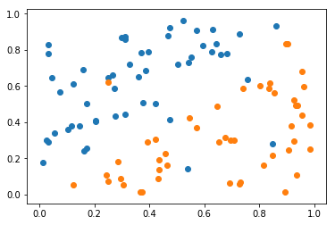
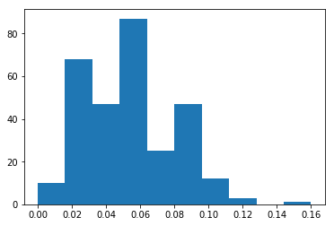
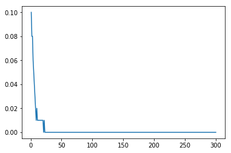
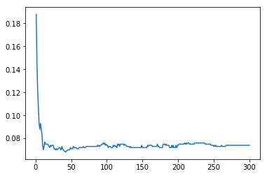
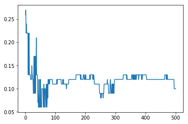

大家好，这篇是有关台大机器学习课程作业七的详解。

我的github地址：  
https://github.com/Doraemonzzz

个人主页：  
http://doraemonzzz.com/

作业地址:  
https://www.csie.ntu.edu.tw/~htlin/course/ml15fall/

参考资料:  
https://blog.csdn.net/a1015553840/article/details/51085129  
http://www.vynguyen.net/category/study/machine-learning/page/6/  
http://book.caltech.edu/bookforum/index.php  
http://beader.me/mlnotebook/   
https://blog.csdn.net/qian1122221/article/details/50130093   
https://acecoooool.github.io/blog/


#### Problem 1

$$
\begin{aligned}
1- \mu_+^2-\mu_-^2
&=1- \mu_+^2-(1-\mu_+)^2\\
&=1- \mu_+^2- \mu_+^2+2 \mu_+-1\\
&=-2\mu_+^2+2 \mu_+\\
&=-2(\mu_+-\frac 1 2)^2+\frac 1 2
\end{aligned}
$$

因为$\mu_+\in [0,1]$，所以$1- \mu_+^2-\mu_-^2 \in [0,\frac 1 2]$，最大值为$\frac 1 2 $。


#### Problem 2

$$
\begin{aligned}
\mu_+(1 − (\mu_+ − \mu_−))^2 + \mu_−(−1 − (\mu_+ − \mu_−))^2
&=\mu_+[1-2(\mu_+ − \mu_−)+(\mu_+ − \mu_−)^2]+
\mu_−[1+2(\mu_+ − \mu_−)+(\mu_+ − \mu_−)^2]\\
&=\mu_+ +\mu_-+(\mu_+ + \mu_−)(\mu_+ − \mu_−)^2-2(\mu_+ − \mu_−)(\mu_+ − \mu_−)\\
&=1+(\mu_+ − \mu_−)^2-2(\mu_+ − \mu_−)^2\\
&=1-(\mu_+ − \mu_−)^2\\
&=1-(2\mu_+-1)^2\\
&=4\mu_+-4\mu_+^2
\end{aligned}
$$

根据Problem 1以及正规化错误的定义可知
$$
\text{normalized Gini index}=(-2\mu_+^2+2 \mu_+)/(\frac 1 2)=4\mu_+-4\mu_+^2
$$
所以
$$
\text{normalized Gini index}=\text{normalized squared regression 
error}
$$


#### Problem 3

回顾课件可知，一个数据不被选择的概率为
$$
(1-\frac{1}{N})^{N^{'}}=(1-\frac{1}{N})^{pN}=[(1-\frac{1}{N})^{N}]^p\approx e^{-p}
$$
因为一共有$N$组数据，所以没有被选择的数据数量大概为
$$
e^{-p}N
$$


#### Problem 4

根据下一题可知
$$
E_{\text{out}}(G)\le \frac 2{3+1}( 0.15+0.25+0.35)=0.375
$$
显然
$$
E_{\text{out}}(G)\ge0
$$
所以
$$
E_{\text{out}}(G)\in [0,0.375)
$$


#### Problem 5

根据Random Forest的算法，我们知道如果要把一个点误分，那么$K​$个$\text{binary classification trees}​$中必然至少要$\frac{K+1}{2}​$个分类器犯错，假设一共有$N​$个点，那么一共有$(\sum_{k=1} ^Ke_k)N​$个分类错误，所以被Random Forest算法分类错误的点最多为
$$
(\sum_{k=1} ^Ke_k)N /\frac{K+1}{2}
$$
因此$E_{\text{out}}(G)$最多为
$$
(\sum_{k=1} ^Ke_k)N /(\frac{K+1}{2}N)=\frac{2}{K+1}\sum_{k=1} ^Ke_k
$$


#### Problem 6

计算公式为
$$
U_{t+1}=2U_t\sqrt{\epsilon_t(1-\epsilon_t)}
$$
具体的推导过程可以看作业6的22题，这里直接带入
$$
U_3=2U_2\sqrt{\epsilon_2(1-\epsilon_2)}=4U_1\sqrt{\epsilon_2(1-\epsilon_2)}\sqrt{\epsilon_1(1-\epsilon_1)}
$$
注意$(u_1,...,u_N)=(\frac 1N,...,\frac 1N)$，所以$U_1=1$
$$
U_3=2U_2\sqrt{\epsilon_2(1-\epsilon_2)}=4U_1\sqrt{\epsilon_2(1-\epsilon_2)}\sqrt{\epsilon_1(1-\epsilon_1)}=4\sqrt{\epsilon_2(1-\epsilon_2)}\sqrt{\epsilon_1(1-\epsilon_1)}
$$


#### Problem 7

结合题目以及课件17页可知
$$
\eta为使得\frac1N \sum_{n=1}^N\Big((y_n − s_n) − ηg_1(x_n)\Big)^2最小的值
$$
对上式关于$\eta​$求偏导可得
$$
-\frac{2}N \sum_{n=1}^Ng_1(x_n)\Big((y_n − s_n) − ηg_1(x_n)\Big)=0
$$
此处$g_1(x_n)=2,s_n=0$带入可得
$$
\sum_{n=1}^{N}2\Big((y_n − 0) − 2η\Big)=0\\
\eta =\frac{1}{2N}\sum_{n=1}^Ny_n
$$
由于更新规则为$\alpha_1=\eta$，$s_n=\alpha_1g_1(x_n)$，所以
$$
s_n=\alpha_1g_1(x_n)=\frac{1}{2N}\sum_{n=1}^Ny_n\times 2=\sum_{n=1}^Ny_n
$$


#### Problem 8

回顾课件19页可知
$$
\alpha_t =\eta =\frac{\sum_{n=1}^N g_t(x_n)(y_n − s_n)} { \sum_{n=1}^N g_t^2(x_n)}\\
{\sum_{n=1}^N g_t(x_n)(y_n − s_n)} =\alpha_t { \sum_{n=1}^N g_t^2(x_n)}\\
{\sum_{n=1}^N g_t(x_n)s_n}={\sum_{n=1}^N g_t(x_n)y_n}-\alpha_t { \sum_{n=1}^N g_t^2(x_n)}
$$


#### Problem 9

OR运算的特点是只有当每个值都为False，结果才为False，结合这个特点可以取
$$
w_0=d-\frac 1 2,w_i=1(i=1,...,d)
$$


#### Problem 10

由Problem 21，$D$的最小值为$5$，具体过程见Problem 21


#### Problem 11

初始的$w_{ij}^{(l)}$都为$0$，所以前向传播之后$s_j^{(l)}=0,(l=1,...,L)$

回顾反向传播的更新规则
$$
\frac{\partial e_n}{\partial w_{ij}^{(l)}}=\delta_j^{(l)}\Big(x_i^{(l-1)}\Big)\\ 
\delta_j^{(L)}=-2\Big(y_n-s_j^{(L)}\Big)\\ 
\delta_j^{(l)}=\sum_k\Big(\delta_k^{(\mathcal l+1)}\Big)\Big(w_{jk}^{(l+1)}\Big)\text{tanh}^\prime(s_j^{(l)})(l=0,...,L-1)
$$
所以根据上式，
$$
\delta_j^{(l)}=0,(l=0,...,L-1)
$$
因为原始的$w_{ij}^{(l)}​$都为0，所以根据更新规则
$$
w_{ij}^{(l)} =w_{ij}^{(l)}− η\delta_j^{(l)}x_i^{(l-1)}
$$
可知
$$
w_{ij}^{(l)}=0(l=0,...,L-1)
$$


#### Problem 12

初始的$w_{ij}^{(l)}$都为$1$，假设输入为$x_1,...,x_d$，偏置项为$x_0=1$，那么
$$
s_i^{(1)}=\sum_{i=0}^{d}w_{ij}^{(l)}x_i=\sum_{i=0}^dx_i
$$
说明第一个隐藏层的$s_i^{(1)}$都相等，根据递推公式
$$
x_i^{(l-1)}=\text{tanh}(s_i^{(l)})\\
s_i^{(l)}=\sum_{i=0}^{d^{(l-1)}}w_{ij}^{(l)}x_i^{(l-1)}
$$
我们知道每个隐藏层的$s_i^{(l)},x_i^{(l)}$都相等，从而$\delta_j^{(L)}=-2\Big(y_n-s_j^{(L)}\Big)$都相等，根据反向传播的更新公式
$$
\delta_j^{(l)}=\sum_k\Big(\delta_k^{(\mathcal l+1)}\Big)\Big(w_{jk}^{(l+1)}\Big)\Big(\text{tanh}^\prime(s_j^{(l)})\Big)
$$
可得，对于固定的$l$，$\delta_j^{(l)}$都相等，特别的，第一层的$\delta_j^{(1)}$都相等，根据更新规则
$$
w_{ij}^{(1)} =w_{ij}^{(1)}− η\delta_j^{(1)}x_i^{(0)}
$$
以及初始的$w_{ij}^{(l)}$都为$1$可得
$$
w_{ij}^{(1)}=w_{i(j+1)}^{(1)}
$$


#### Problem 13

略过


#### Problem 14

读取数据并作图。


```python
import numpy as np
import matplotlib.pyplot as plt

#读取数据并作图
train = np.genfromtxt('hw7_train.dat')
X_train, y_train = train[:, :-1], train[:, -1]
test = np.genfromtxt('hw7_test.dat')
X_test, y_test = test[:, :-1], test[:, -1]

#作图
plt.scatter(train[:, 0][train[:, 2] == -1], train[:, 1][train[:, 2] == -1])
plt.scatter(train[:, 0][train[:, 2] == 1], train[:, 1][train[:, 2] == 1])
plt.show()
```





定义Gini index


```python
#Gini index
def Gini(y):
    '''
    二分类gini系数
    '''
    if(len(y) == 0):
        return 1
    t = np.mean(y == -1)
    return 1 - t**2 - (1 - t)**2
```

定义impurty


```python
#定义impurty
def lossfunc(theta, X, y):
    '''
    d为数据的维度，theta为decision stump的阈值
    '''
    y1 = y[X < theta]
    y2 = y[X >= theta]
    Gini1 = Gini(y1)
    Gini2 = Gini(y2)
    #print(len(y1), len(y2))
    return len(y1) * Gini1 + len(y2) * Gini2
```

在$d$个维度上分别利用decision stump计算，找到损失函数的最小值，返回维度以及阈值


```python
def Generate_theta(X):
    """
    生成阈值
    """
    X = np.sort(X)
    theta = (X[1:] + X[:-1]) / 2
    theta = np.r_[[X[0] - 1], theta]
    theta = np.r_[theta, [X[-1] + 1]]
    
    return theta

#在d个维度上分别利用decision stump计算，找到损失函数的最小值，返回维度以及阈值
def Decision_stump(X, y):
    """
    对d个维度使用Decision_stump
    """
    #获得数据维度
    n, d = X.shape
    #最终结果
    Theta = 0
    D = 0
    Score = n
    for i in range(d):
        #取第d维的数据
        x = X[:, i]
        #计算阈值
        theta = Generate_theta(x)
        #遍历
        for theta_ in theta:
            #计算损失函数
            score = lossfunc(theta_, x, y)
            if score < Score:
                Score = score
                Theta = theta_
                D = i
    
    return D, Theta, Score
```

构造学习函数


```python
def isstop(X, y):
    '''
    判断是否停止，有两种情形，X全相同，另一种是所有数据都为一类
    '''
    n = X.shape[0]
    #n1 = np.sum(y==-1)
    n1 = np.sum(y!=y[0])
    n2 = np.sum(X!=X[0, :])
    return n1 == 0 or n2 == 0

#构造树类
class DTree:
    def __init__(self, theta, d, value=None):
        #阈值
        self.theta = theta
        #维度
        self.d = d
        #当前节点对应的值
        self.value = value
        #左右节点
        self.left = None
        self.right = None

NUM = 0
#构造学习函数
def learntree(X, y):
    global NUM
    NUM += 1
    if isstop(X, y):
        #print(X.shape, y)
        return DTree(None, None, y[0])
    else:
        d, theta, score = Decision_stump(X, y)
        #print(d, theta, score)
        tree = DTree(theta, d)
        #划分数据
        i1 = X[:, d] < theta
        X1 = X[i1]
        #print("X1", X1.shape)
        y1 = y[i1]
        i2 = X[:, d] >= theta
        X2 = X[i2]
        y2 = y[i2]
        #学习左树
        leftTree = learntree(X1, y1)
        #学习右树
        rightTree = learntree(X2, y2)
        #返回
        tree.left = leftTree
        tree.right = rightTree
        
        return tree
```

预测函数


```python
#预测函数
def pred(tree, x):
    #if tree.left == None and tree.right == None:
    if tree.value != None:
        return tree.value
    if x[tree.d] < tree.theta:
        return pred(tree.left, x)
    else:
        return pred(tree.right, x)
```

计算误差


```python
#计算误差
def error(tree, X, y):
    ypred = [pred(tree, x) for x in X]
    return np.mean(ypred!=y)
```

训练数据


```python
dtree = learntree(X_train, y_train)
#14
print(error(dtree, X_train, y_train))
```


```
0.0
```


​    


#### Problem 15

```python
#15
print(error(dtree, X_test, y_test))
```


    0.126


#### Problem 16

求出30000棵树对应的$E_{\text{in}}(g_t)$，为了减少运算量，这里取300棵。


```python
#16
N = 300
Ein = np.array([])
tree = []
m, n = train.shape
for i in range(N):
    index = np.random.randint(0, m, (m))
    X1 = X_train[index, :]
    y1 = y_train[index]
    dtree = learntree(X1, y1)
    tree.append(dtree)
    Ein = np.append(Ein, error(dtree, X_train, y_train))
    
plt.hist(Ein)
plt.show()
```




```python
print("Ein = {}".format(np.mean(Ein)))
```

```
Ein = 0.05319999999999999
```


#### Problem 17

每次取前$t$棵数构成随机森林，计算结果并作图。

```python
#17
def random_forest_error(tree, X, y):
    """
    利用前k个树计算结果
    """
    Error = np.array([])
    N = len(tree)
    for i in range(N):
        E = []
        for j in range(1+i):
            E.append([pred(tree[j], x) for x in X])
        E = np.array(E)
        #0视为1
        ypred = np.sign(E.sum(axis=0) + 0.5)
        error = np.mean(ypred!=y)
        Error = np.append(Error, error)
    return Error

Ein_G = random_forest_error(tree, X_train, y_train)

plt.plot(np.arange(1, N+1), Ein_G)
plt.show()
```




```python
print("Ein = {}".format(np.mean(Ein_G)))
```

```
Ein = 0.002
```


#### Problem 18

```python
#18
Eout_G = random_forest_error(tree, X_test, y_test)

plt.plot(np.arange(1, N+1), Eout_G)
plt.show()
```




```python
print("Eout = {}".format(np.mean(Eout_G)))
```

```
Eout = 0.07453666666666665
```


#### Problem 19

依旧取前$t$棵数构成随机森林，但是没棵树只有一个branch，即每棵树对应了二元分类。

```python
#19
def learntree_new(X, y):
    d, theta, score = Decision_stump(X, y)
    tree = DTree(theta, d)
    #划分数据
    i1 = X[:, d] < theta
    X1 = X[i1]
    y1 = y[i1]
    i2 = X[:, d] >= theta
    X2 = X[i2]
    y2 = y[i2]
    #学习左树
    leftTree = learntree(X1, y1)
    #学习右树
    rightTree = learntree(X2, y2)
    
    #左树
    k1 = np.sign(np.sum(y1) + 0.5)#+0.5是为了防止出现0
    leftTree = DTree(None, None, k1)
    #右树
    k2 = np.sign(np.sum(y2) + 0.5)
    rightTree = DTree(None, None, k2)
    #返回
    tree.left = leftTree
    tree.right = rightTree
    return tree

N = 500
newtree = []
m, n = train.shape
for i in range(N):
    index = np.random.randint(0, m, (m))
    X1 = X_train[index, :]
    y1 = y_train[index]
    dtree = learntree_new(X1, y1)
    newtree.append(dtree)
    
newEin_G = random_forest_error(newtree, X_train, y_train)

plt.plot(np.arange(1, N+1), newEin_G)
plt.show()
```




```python
print("Ein = {}".format(np.mean(newEin_G)))
```

```
Ein = 0.11872000000000002
```


#### Problem 20

```python
#20
newEout_G = random_forest_error(newtree, X_test, y_test)

plt.plot(np.arange(1, N+1), newEout_G)
plt.show()
```


```python
print("Eout = {}".format(np.mean(newEout_G)))
```

```
Eout = 0.15301599999999999
```


#### Problem 21

由之前讨论可以知道，我们可以利用$\text{sign}(s)$表示$\text{NOT,AND}$逻辑，从而第一层可以表示如下逻辑关系
$$
\prod _{i=d_1}^{d_n} x_i^{t},x_i^{t}\in \{x_i,\overline x_i\}(1\le d_1\le ...\le d_n \le d)\\
$$
第二层我们利用这种逻辑关系来表达$\text{XOR}\Big(x_1, x_2,...,x_d\Big)$，给出以下命题：

$$
记x_1,...,x_d为d个逻辑单元，\\
z_j =\prod _{i=a_1}^{{a_{s_j}}} x_i^{t},x_i^{t}\in \{x_i,\overline x_i\}(1\le a_1\le ...\le {a_{s_j}} \le d)\\
f_{m}=\sum_{j=1}^{m}z_j^t,其中z_j^t \in \{z_j ,\overline z_j\} \\
那么存在f_{d}=\text{XOR}\Big(x_1, x_2,...,x_d\Big)，且d为表达异或逻辑的神经元数量的最小值\\
$$
证明：

关于$d​$利用数学归纳法。

这里的基础情况为$d=2$，因为$1$个逻辑单元无法表示异或逻辑，回顾课件可知
$$
f_2=\overline x_{1}x_2+ x_{1}\overline x_2
$$
可以表示异或逻辑，所以$d=2$时结论成立。

假设$d=k$时结论，现在证$d=k+1$时结论也成立。假设逻辑单元为$x_1,...,x_k,x_{k+1}$，根据归纳假设，存在
$$
f_{k}=\sum_{j=1}^{k}z_j^t,其中z_j^t \in \{z_j ,\overline z_j\}\\
z_j =\prod _{i=a_1}^{a_{s_j}} x_i^{t},x_i^{t}\in \{x_i,\overline x_i\}(1\le a_1\le ...\le a_{s_j} \le k)\\
f_{k}=\text{XOR}\Big(x_1,...,x_k\Big)\\
k表达异或逻辑的神经元数量的最小值
$$
根据异或的定义，有如下关系
$$
\text{XOR}\Big(x_1, x_2,...,x_k,x_{k+1}\Big)=\text{XOR}\Big(\text{XOR}\Big(x_1, ...,x_{d}\Big) ,x_{k+1}\Big)=\text{XOR}\Big(f_k,x_{k+1}\Big)
$$
因为$f_k$也为逻辑单元，所以表示$\text{XOR}\Big(f_k,x_{k+1}\Big)$至少需要关于$f_k,x_{k+1}$的$2$个逻辑单元，可以表示如下
$$
\text{XOR}\Big(f_k,x_{k+1}\Big)=\overline f_{k}x_{k+1}+ f_{k}\overline x_{k+1}
$$
根据逻辑运算规则，
$$
\overline {f_{k}}=\prod_{j=1}^{k}\overline z_j^t\\
z_j =\prod _{i=a_1}^{a_{s_j}} x_i^{t},x_i^{t}\in \{x_i,\overline x_i\}(1\le a_1\le ...\le a_{s_j} \le k)
$$
从而$\overline {f_{k}}​$为一个逻辑单元，将$f_{k}=\sum_{j=1}^{k}z_j^t​$一起带入可得
$$
\begin{aligned}
\text{XOR}\Big(x_1, x_2,...,x_k,x_{k+1}\Big)
&=\text{XOR}\Big(f_k,x_{k+1}\Big)\\
&=\overline f_{k}x_{k+1}+ f_{k}\overline x_{k+1}\\
&=x_{k+1}\prod_{j=1}^{k}\overline z_j^t +\left(\sum_{j=1}^{k}z_j^t\right)\overline x_{k+1}\\
\end{aligned}
$$
由逻辑学知识可知，$\text{NOT,AND}​$逻辑可以表达所有的逻辑，从而$x_{k+1}\prod_{j=1}^{k}\overline z_j^t,z_j^t\overline x_{k+1}​$可以表达为
$$
\prod_{i=1}^{a_{s_{j+1}}}\overline x_{i}^t 或\overline{\prod_{i=1}^{a_{s_{j+1}}}\overline x_{i}^t },其中x_i^{t}\in \{x_i,\overline x_i\}
$$
记$z_j ^{'}=\prod _{i=1}^{a_{s_{j+1}}} x_i^{t},x_i^{t}\in \{x_i,\overline x_i\}(1\le a_1\le ...\le a_{s_{j+1}}\ \le k+1)$，那么
$$
\text{XOR}\Big(x_1, x_2,...,x_k,x_{k+1}\Big)=\sum_{j=1}^{k+1}z_j ^{'t} 
\\其中z_j ^{'t} \in \{z_j ^{'},\overline z_j ^{'} \}
$$
所以结论对于$d=k+1 ​$也成立，从而结论得证。


#### Problem 22

直接给出结论，最小值为
$$
1+[\log_2 n]
$$
方法很巧妙，可以参考以下两篇文献，主要是文献2，文献已经下载在文件夹中。

[Neural network computation with DNA strand displacement cascades ](https://www.nature.com/articles/nature10262.pdf)

[The Realization of Symmetric Switching Functions with Linear-Input Logical Elements](http://xueshu.baidu.com/s?wd=paperuri%3A%280f626625bff6ef7e45f42f92061ff9ca%29&filter=sc_long_sign&tn=SE_xueshusource_2kduw22v&sc_vurl=http%3A%2F%2Fieeexplore.ieee.org%2Fxpls%2Fabs_all.jsp%3Farnumber%3D5219224&ie=utf-8&sc_us=13123849583975524837)

