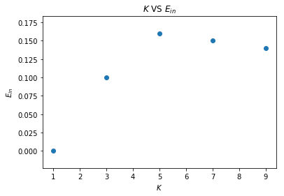
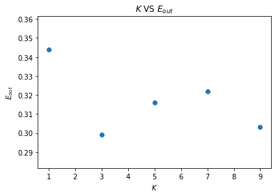
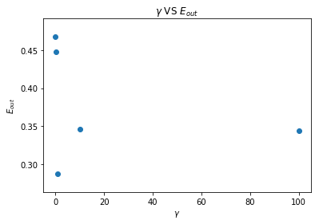
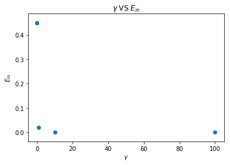

大家好，这篇是有关台大机器学习课程作业八的详解。

我的github地址：  
https://github.com/Doraemonzzz

个人主页：  
http://doraemonzzz.com/

作业地址:  
https://www.csie.ntu.edu.tw/~htlin/course/ml15fall/

参考资料:  
https://blog.csdn.net/a1015553840/article/details/51085129  
http://www.vynguyen.net/category/study/machine-learning/page/6/  
http://book.caltech.edu/bookforum/index.php  
http://beader.me/mlnotebook/   
https://blog.csdn.net/qian1122221/article/details/50130093   
https://acecoooool.github.io/blog/


#### Problem 1

考虑一般情形，假设一共有$L$层，第$l$层有$d^{(ℓ)}$个节点，激活函数为$\theta(x)$，损失函数为$J(x,y)$。

首先要进行前向传播，那么第$ℓ-1$层到第$l$层一共需要的计算次数为
$$
(d^{(ℓ-1)} +1)\times d^{(ℓ)}
$$
所以前向传播需要的计算次数为
$$
\sum_{ℓ=1} ^{L}(d^{(ℓ-1)} +1)\times d^{(ℓ)}
$$
对于此题来说，前向传播需要的计算次数为
$$
(A+1)\times B + (B+1)\times 1
$$
接着进行反向传播，先看计算图


接着回顾公式
$$
\begin{aligned}
\frac{∂ e}{ ∂  w_{ij}^{(ℓ)}}&=x_i^{^{(ℓ-1)}}\delta _j^{{(ℓ)}}\\
\delta _j^{{(ℓ)}}&=\theta^{'}(s_j^{(ℓ)})\sum_{k=1}^{d^{(ℓ+1)}}w_{jk}^{(ℓ+1)}\delta _k^{{(ℓ+1)}}
\end{aligned}
$$
从上述递推式可以看到，计算$\delta _j^{{(ℓ)}}$需要的总计算次数和前向传播是一样的，计算$\frac{∂ e}{ ∂  w_{ij}^{(ℓ)}}$总共需要的次数为第$1$层到第$L-1$层的节点总数（注意$\delta _j^{{(L)}}$是直接利用求导计算出来的，在这题中计算次数不计算在内），所以总共需要计算的次数为
$$
\sum_{ℓ=0} ^L(d^{(ℓ-1)} +1)\times d^{(ℓ)}  + \sum_{ℓ=1}^{L-1} d^{(ℓ)}
$$
对于此题来说，反向传播需要的计算次数为
$$
(A+1)\times B + (B+1)\times 1 + B
$$
所以进行一轮随机梯度下降法总共需要的次数为
$$
(A+1)\times B + (B+1)\times 1+(A+1)\times B + (B+1)\times 1 + B = 2AB+5B +2
$$


#### Problem 2

假设一共有$L$层，第$\ell $层有$d^{(ℓ)}$个节点（包括偏置项）。

注意此题每一层的节点数量算上了偏置项$1$，但是偏置项只有输出，没有输入，所以第$ℓ$层到第$ℓ+1$层的权重数量为
$$
d^{(ℓ)} \times (d^{(ℓ+1)}-1 )
$$
此题$d^{(0)} = 10,d^{(L)} =1​$（注意这里我和题目中的$d^{(0)} ​$不一致，我的$d^{(0)} ​$是包括偏置项的），所以我们需要计算的量为
$$
S = \sum_{ℓ =0}^{L-2} d^{(ℓ)}\times ( d^{(ℓ+1)}-1) + d^{(L-1)}
$$
如果我们将$d^{(L)}​$改为$2​$，那么上述求和式就更整齐
$$
S = \sum_{ℓ =0}^{L-1} d^{(ℓ)}\times ( d^{(ℓ+1)}-1) =\sum_{ℓ =0}^{L-1} d^{(ℓ)} d^{(ℓ+1)} - \sum_{ℓ =0}^{L-1} d^{(ℓ)}
$$
现在的约束条件为
$$
d^{(0)} = 10, d^{(L)}=2 ,\sum_{ℓ =1}^{L-1} d^{(ℓ)} = 36 , d^{(ℓ)} \ge 2
$$
所以我们只要考虑
$$
S_1=\sum_{ℓ =0}^{L-1} d^{(ℓ)} d^{(ℓ+1)}
$$
这里要解释一下最后一个约束条件$d^{(ℓ)} \ge 2$：假设有$L​$层就要求每一层至少有一个神经元，加上偏置项每一层就至少有两个神经元。

这个问题很难，没法用穷举法，因为数量太多了，一定要注意，这里$(10, 2,34,2)$和$(10, 34,2,2)​$是两种结构，之前网上参考的答案就没有考虑次序问题，所以答案是不对的。这里直接给出最小值的答案，来自Learning from data[作业6](http://work.caltech.edu/homeworks.html)的习题9,10。

最小值发生在一共$19$层，第$1$层到$18$层都是$2$个节点，所以权重的数量为
$$
10 + 2 \times 18 = 46
$$


#### Problem 3 

最大值发生在一共$4$层，设第$1$层有$x$个节点，第$2$层有$y$个节点，$x+y=36$，由上一题的讨论，我们要求下式的最大值
$$
\begin{aligned}
T&= 10x + xy + 2y \\
&= 10x + x(36-x) +2(36-x) \\
&= 10x + 36x -x^2 + 72 -2x\\
&=-x^2 +44x +72
\end{aligned}
$$
所以当$x=22$时，上式取最大值，所以神经网络的结构为$(10,22,14,1)$，权重的数量为
$$
10\times(22-1) +22\times (14-1) + 14=510
$$


#### Problem 4

先对$ \text{err}(w)$进行化简
$$
\begin{aligned}
\text{err}(w) &=  ||x_n -ww^T x_n||^2 \\
&=(x_n - ww^T x_n)^T(x_n - ww^T x_n)\\
&= x_n^Tx_n -2(w^T x_n )^Tw^T x_n  +x_n^T w w^T ww^T x_n\\
&=x_n^Tx_n -2(w^T x_n )^2 +(x_n^T w) (w^T w)(w^T x_n)  (注意w^Tx_n = x_n^Tw，并且都为一个数) \\
&=x_n^Tx_n -2(w^T x_n )^2  +(x_n^T w)^2 (w^T w)
\end{aligned}
$$
接着求梯度
$$
\begin{aligned}
\nabla _w \text{err}(w) &= \nabla _w\Big (x_n^Tx_n -2(w^T x_n )^2  +(x_n^T w)^2 (w^T w)\Big ) \\
&=  -4  w^T x_n \nabla _w (w^T x_n) +  2x_n^T w (w^T w)   \nabla _w  (x_n^T w) + (x_n^T w)^2  \nabla (w^T w) \\
&=-4  w^T x_n x_n + 2x_n^T w (w^T w)  x_n +2 (x_n^T w)^2w
\end{aligned}
$$


#### Problem 5

$$
\begin{aligned}
E_{\text{in}}(w) & = \frac 1 N\sum_{n=1}^N \| x_n -ww^T(x_n+\epsilon_n)\|^2 \\
&= \frac 1 N\sum_{n=1}^N \left(x_n -ww^T(x_n+\epsilon_n)\right)^T 
\left(x_n -ww^T(x_n+\epsilon_n)\right)\\
&= \frac 1 N\sum_{n=1}^N \Big( x_n^Tx_n  -2(x_n+\epsilon_n)^T ww^T x_n +  (x_n+\epsilon_n)^T ww^Tww^T(x_n+\epsilon_n) \Big) \\
&= \frac 1 N\sum_{n=1}^N\Big( x_n^Tx_n  -2x_n^Tww^T x_n  -2\epsilon_n^T ww^T x_n +  x_n^T ww^Tww^Tx_n
+ \epsilon_n^T  ww^Tww^T  \epsilon_n +2  \epsilon_n^T ww^Tww^Tx_n \Big)  \\
&=\frac 1 N\sum_{n=1}^N\Big(x_n^Tx_n-2x_n^Tww^T x_n+ x_n^T ww^Tww^Tx_n \Big)  +\frac 1 N\sum_{n=1}^N\Big(  -2\epsilon_n^T ww^T x_n +  \epsilon_n^T  ww^Tww^T  \epsilon_n +2  \epsilon_n^T ww^Tww^Tx_n \Big) \\
&=\frac 1 N\sum_{n=1}^N  \| x_n -ww^Tx_n\|^2 +\frac 1 N\sum_{n=1}^N\Big(  -2\epsilon_n^T ww^T x_n +  \epsilon_n^T  ww^Tww^T  \epsilon_n +2  \epsilon_n^T ww^Tww^Tx_n \Big) 
\end{aligned}
$$

由于$\epsilon_n$服从标准正态分布，所以
$$
 \mathbb E  \Big[\epsilon_n\epsilon_n^T\Big] =I_n
$$
对上式取期望可得
$$
\begin{aligned}
\mathbb E[E_{\text{in}}(w) ]& =  \frac 1 N\sum_{n=1}^N  || x_n -ww^Tx_n||^2 
+ \frac 1 N\sum_{n=1}^N  \mathbb E\left[   \epsilon_n^T  ww^Tww^T  \epsilon_n \right]\\
&= \frac 1 N\sum_{n=1}^N  || x_n -ww^Tx_n||^2 
+ \frac 1 N\sum_{n=1}^N  \text{trace}  \Big(\mathbb E\left[  \epsilon_n^T  ww^Tww^T  \epsilon_n \right] \Big)\\
&= \frac 1 N\sum_{n=1}^N  || x_n -ww^Tx_n||^2 
+ \frac 1 N\sum_{n=1}^N  \mathbb E \Big[ \text{trace} \Big(  \epsilon_n^T  ww^Tww^T  \epsilon_n \Big) \Big]   \\
&= \frac 1 N\sum_{n=1}^N  || x_n -ww^Tx_n||^2 + \frac 1 N\sum_{n=1}^N    \mathbb E\Big[ \text{trace} \Big(  ww^T  \epsilon_n\epsilon_n^T  ww^T \Big)\Big]  \\
&=  \frac 1 N\sum_{n=1}^N  || x_n -ww^Tx_n||^2 + \frac 1 N\sum_{n=1}^N  \text{trace} \Big(   \mathbb E  \Big[  ww^T  \epsilon_n\epsilon_n^T  ww^T \Big]\Big) \\
&=\frac 1 N\sum_{n=1}^N  || x_n -ww^Tx_n||^2 + \frac 1 N\sum_{n=1}^N  \text{trace} \Big(     ww^T  \mathbb E  \Big[\epsilon_n\epsilon_n^T\Big]  ww^T \Big) \\
&= \frac 1 N\sum_{n=1}^N  || x_n -ww^Tx_n||^2 + \frac 1 N\sum_{n=1}^N  \text{trace}   \Big(  ww^T ww^T \Big) \\
&= \frac 1 N\sum_{n=1}^N  || x_n -ww^Tx_n||^2 + \frac 1 N\sum_{n=1}^N  \text{trace}  \Big(  w^T ww^Tw  \Big) \\
&= \frac 1 N\sum_{n=1}^N  || x_n -ww^Tx_n||^2  + (w^T w)^2
\end{aligned}
$$
因此
$$
\Omega(w) =  (w^T w)^2
$$


#### Problem 6

由几何意义可知，两个点的$1NN$算法推导出来的边界为过这两个点中点的中垂面，所以可得超平面方程为：
$$
\begin{aligned}
(x^+ - x^-)^T  (x -  \frac{x^+ + x^-}{2})&=0 \\
(x^+ - x^-)^T   x -\frac { (x^+ - x^-)^T(x^+ + x^-)} {2}& =0 \\
(x^+ - x^-)^T   x -\frac { \|x^+\|^2 - \|x^-\|^2} {2}& =0
\end{aligned}
$$
从而分类器为
$$
g_{\text{LIN}} (x) = \text{sign}\left((x^+ - x^-)^T   x -\frac { ||x^+||^2 - ||x^-||^2} {2}\right)
$$


#### Problem 7

由$\text{sign}(x) = \text{sign}(ax)(a>0)$可得：
$$
\begin{aligned}
g_\text{RBFNET}(x) 
&= \text{sign} \left( β_+ \exp(−\| x − \mu_+\| ^2) + β_-\exp(−\| x − \mu_-\| ^2) \right) \\
&= \text{sign} \left(\exp(−\| x − \mu_-\| ^2) \left( β_+ \exp(\| x − \mu_-\| ^2−\| x − \mu_+\| ^2) + β_- \right)\right) \\
&= \text{sign} \left( β_+ \exp(\| x − \mu_-\| ^2−\| x − \mu_+\| ^2) + β_- \right)
\end{aligned}
$$
我们来计算$||x − \mu_-||^2−||x − \mu_+||^2​$
$$
\begin{aligned}
||x − \mu_-||^2−||x − \mu_+||^2
&=  (x − \mu_-)^T(x − \mu_-) - (x − \mu_+)^T(x − \mu_+) \\
&= x^Tx - 2 \mu_-^T x + \mu_-^T \mu_- - (x^Tx - 2 \mu_+^T x + \mu_+^T\mu_+ ) \\
&= 2(\mu_+ - \mu_-)^T  x + \mu_-^T \mu_- -\mu_+^T\mu_+ 
\end{aligned}
$$
所以
$$
\begin{aligned}
g_\text{RBFNET}(x) 
&= \text{sign} \left( β_+ \exp(2(\mu_+ - \mu_-)^T  x + \mu_-^T \mu_- -\mu_+^T\mu_+ ) + β_- \right)
\end{aligned}
$$
我们来求解$β_+ \exp(2(\mu_+ - \mu_-)^T  x + \mu_-^T \mu_- -\mu_+^T\mu_+ ) + β_- >0$
$$
\begin{aligned}
β_+ \exp(2(\mu_+ - \mu_-)^T  x + \mu_-^T \mu_- -\mu_+^T\mu_+ ) + β_- >0 &\Leftrightarrow \\
\exp(2(\mu_+ - \mu_-)^T  x + \mu_-^T \mu_- -\mu_+^T\mu_+ )  > -  \frac{ β_-}{β_+}   &\Leftrightarrow \\
2(\mu_+ - \mu_-)^T  x + \mu_-^T \mu_- -\mu_+^T\mu_+ >\ln (-  \frac{ β_-}{β_+} )  &\Leftrightarrow \\
2(\mu_+ - \mu_-)^T  x + \mu_-^T \mu_- -\mu_+^T\mu_+ -\ln (-  \frac{ β_-}{β_+} )  > 0
\end{aligned}
$$
同理可得
$$
β_+ \exp(2(\mu_+ - \mu_-)^T  x + \mu_-^T \mu_- -\mu_+^T\mu_+ ) + β_- <0 \Leftrightarrow \\ 
2(\mu_+ - \mu_-)^T  x + \mu_-^T \mu_- -\mu_+^T\mu_+ -\ln (-  \frac{ β_-}{β_+} )  < 0
$$
从而
$$
\begin{aligned}
g_\text{RBFNET}(x) 
&= \text{sign} \left( 2(\mu_+ - \mu_-)^T  x + \mu_-^T \mu_- -\mu_+^T\mu_+ -\ln (-  \frac{ β_-}{β_+} ) \right)
\end{aligned}
$$


#### Problem 8

回顾定义：
$$
z_n = [\text{RBF}(x_n, x_1), \text{RBF}(x_n, x_2), . . . , \text{RBF}(x_n, x_N)]
$$
由于
$$
\text{RBF}(x,\mu) = [[x = \mu]]
$$
所以$z_n$为第$n$个元素为$1$，其余元素均为$0$的向量，从而$Z =I$，回顾$\beta$的计算公式
$$
\beta = (Z^TZ) ^{-1} Z^T y = y
$$


#### Problem 9

回顾我们的计算式：
$$
\begin{aligned}
\min_{W,V} E_{in}({w_m}, {v_n}) 
&∝ \sum_{\text{user n rated movie m}} \Big(r_{nm} − w^T_mv_n\Big)^2\\
&= \sum_{m=1}^M \Big( \sum_{(x_n,r_{nm})∈\mathcal D_m}\Big(r_{nm} − w^T_mv_n\Big)^2\Big)
\end{aligned}
$$
现在固定了$v_n$，我们要对每个$m$，求$ \sum_{(x_n,r_{nm})∈\mathcal D_m}\Big(r_{nm} − w^T_mv_n\Big)^2$的最小值，计算其梯度：
$$
\begin{aligned}
\nabla _{w_m}  \sum_{(x_n,r_{nm})∈\mathcal D_m}\Big (r_{nm} − w^T_mv_n\Big)^2
=  \sum_{(x_n,r_{nm})∈\mathcal D_m} -2\Big (r_{nm} − w^T_mv_n\Big)v_n 
\end{aligned}
$$
令式为$0$可得
$$
\begin{aligned}
  \sum_{(x_n,r_{nm})∈\mathcal D_m} \Big (r_{nm} − w^T_mv_n\Big)v_n&=0\\

  \sum_{(x_n,r_{nm})∈\mathcal D_m}  r_{nm}  v_n&= \sum_{(x_n,r_{nm})∈\mathcal D_m}  (w_m^Tv_n)v_n
  \end{aligned}
$$
注意此处$\tilde d = 1$，从而$w_m,v_n$都为实数，并且由题意，$v_n=1$，从而
$$
\sum_{(x_n,r_{nm})∈\mathcal D_m}  r_{nm} = \sum_{(x_n,r_{nm})∈\mathcal D_m}  w_m \\
  w_m = \frac{  \sum_{(x_n,r_{nm})∈\mathcal D_m}  r_{nm} }{\sum_{(x_n,r_{nm})∈\mathcal D_m} 1}
$$
这个量即为电影的平均分数。


#### Problem 10

根据定义计算$v_{N+1}^T$
$$
v_{N+1}^T  w_m = \frac1 N  \sum_{n=1}^N v_n^T w_m = \frac1 N  \sum_{n=1}^N  r_{nm}
$$
所以我们要找使得$\frac1 N  \sum_{n=1}^N  r_{nm}$最大的电影，即评分最高的电影。


#### Problem 11-12

注意KNN中我们需要计算每个$||x^{(i)} - x^{(j)} ||^2$，这就涉及到计算效率的问题，下面介绍如何使用向量化的方法来实现knn。

我们假设
$$
X = \left[
 \begin{matrix}
  — (x^{(1)})^T— \\
— (x^{(2)})^T— \\
\vdots\\
— (x^{(m)})^T— 
  \end{matrix}
  \right] \in \mathbb R^{m \times d}, Y =  \left[
 \begin{matrix}
  — (y^{(1)})^T— \\
— (y^{(2)})^T— \\
\vdots\\
— (y^{(n)})^T— 
  \end{matrix}
  \right] \in \mathbb R^{n \times d}
$$
其中$x^{(i)} ,y^{(i)} \in \mathbb R^d$，现在的问题是如何高效计算矩阵$D \in \mathbb R^{m\times n}$，其中
$$
D_{i,j} = ||x^{(i)} -y^{(j)} ||^2
$$
首先对$D_{i,j}​$进行处理
$$
\begin{aligned}
D_{i,j} &= ||x^{(i)} -y^{(j)} ||^2 \\
&= (x^{(i)} -y^{(j)})^T (x^{(i)} -y^{(j)})\\
&=(x^{(i)})^T x^{(i)} -2(x^{(i)})^Ty^{(j)} +(y^{(j)})^T y^{(j)}
\end{aligned}
$$
那么
$$
\begin{aligned}
D &=  \left[
 \begin{matrix}
   D_{1,1} & ... & D_{1,n} \\
  ... &  ... &  ... \\
   D_{m,1} &  ... & D_{m,n} 
  \end{matrix}
  \right]  \\
  &= \left[
 \begin{matrix}
   (x^{(1)})^T x^{(1)} -2(x^{(1)})^Ty^{(1)} +(y^{(1)})^T y^{(1)} & ... & 
     (x^{(1)})^T x^{(1)} -2(x^{(1)})^Ty^{(n)} +(y^{(n)})^T y^{(n)}\\
  ... &  ... &  ... \\
   (x^{(m)})^T x^{(m)} -2(x^{(m)})^Ty^{(1)} +(y^{(1)})^T y^{(1)}  &  ... & 
    (x^{(m)})^T x^{(m)} -2(x^{(m)})^Ty^{(n)} +(y^{(n)})^T y^{(n)} 
  \end{matrix}
  \right] \\
  &= \left[
 \begin{matrix}
   (x^{(1)})^T x^{(1)} & ... & 
     (x^{(1)})^T x^{(1)} \\
  ... &  ... &  ... \\
   (x^{(m)})^T x^{(m)}  &  ... & 
    (x^{(m)})^T x^{(m)} 
  \end{matrix}
  \right] +\left[
 \begin{matrix}
   (y^{(1)})^T y^{(1)} & ... & 
     (y^{(n)})^T y^{(n)} \\
  ... &  ... &  ... \\
  (y^{(1)})^T y^{(1)} & ... & 
     (y^{(n)})^T y^{(n)}
  \end{matrix}
  \right]-
  2\left[
 \begin{matrix}
   (x^{(1)})^T y^{(1)} & ... & 
     (x^{(1)})^T y^{(n)} \\
  ... &  ... &  ... \\
  (x^{(m)})^T y^{(1)} & ... & 
     (x^{(m)})^T y^{(n)}
  \end{matrix}
  \right]\\
  &=\left[
 \begin{matrix}
   (x^{(1)})^T x^{(1)} \\
  ...  \\
   (x^{(m)})^T x^{(m)}  
  \end{matrix}
  \right]\underbrace{\left[
 \begin{matrix}
1&...&1
  \end{matrix}
  \right]}_{1\times n矩阵}  +\underbrace{\left[
 \begin{matrix}
1\\ 
\vdots \\
1
  \end{matrix}
  \right]}_{m\times 1矩阵} \left[
 \begin{matrix}
   (y^{(1)})^T y^{(1)}  &
  \ldots  &
  (y^{(n)})^T y^{(n)} 
  \end{matrix}
  \right] -2XY^T
\end{aligned}
$$
利用numpy的广播机制上式可以简写如下：

```python
#计算距离矩阵
d1 = np.sum(X ** 2, axis=1).reshape(-1, 1)
d2 = np.sum(cluster_centers ** 2, axis=1).reshape(1, -1)
dist = d1 + d2 - 2 * X.dot(cluster_centers.T)
```

完整代码如下：

```python
import numpy as np
import matplotlib.pyplot as plt

#读取数据
train = np.loadtxt("hw8_train.dat")
test = np.loadtxt("hw8_test.dat")
X_train, y_train = train[:, :-1], train[:, -1]
X_test, y_test = test[:, :-1], test[:, -1]

class KNeighborsClassifier_():
    def __init__(self, n_neighbors):
        self.n_neighbors = n_neighbors
        
        
    def fit(self, X, y):
        self.X = X
        self.y = y
        
    def predict(self, X):
        #计算距离矩阵
        d1 = np.sum(X ** 2, axis=1).reshape(-1, 1)
        d2 = np.sum(self.X ** 2, axis=1).reshape(1, -1)
        dist = d1 + d2 - 2 * X.dot(self.X.T)
        
        #找到最近的k个点的索引
        index = np.argsort(dist, axis=1)[:, :self.n_neighbors]
        #计算预测结果
        y = np.sign(np.sum(self.y[index], axis=1))
        
        return y

# Q11-12
K = [1, 3, 5, 7, 9]
Ein = []
for k in K:
    #训练模型
    knn = KNeighborsClassifier_(n_neighbors=k)
    knn.fit(X_train, y_train)
    #预测结果
    y = knn.predict(X_train)
    ein = np.mean(y != y_train)
    Ein.append(ein)

plt.scatter(K, Ein)
plt.title("$K$ VS $E_{in}$")
plt.xlabel("$K$")
plt.ylabel("$E_{in}$")
plt.show()
```




#### Problem 13-14

```python
# Q13-14
K = [1, 3, 5, 7, 9]
Eout = []
for k in K:
    #训练模型
    knn = KNeighborsClassifier_(n_neighbors=k)
    knn.fit(X_train, y_train)
    #预测结果
    y = knn.predict(X_test)
    eout = np.mean(y != y_test)
    Eout.append(eout)

plt.scatter(K, Eout)
plt.title("$K$ VS $E_{out}$")
plt.xlabel("$K$")
plt.ylabel("$E_{out}$")
plt.show()
```


#### Problem 15-16

回顾计算公式：
$$
g_{\text {uniform}}(\mathbf{x})=\operatorname{sign}\left(\sum_{m=1}^{N} y_{m} \exp \left(-\gamma\left\|\mathbf{x}-\mathbf{x}_{m}\right\|^{2}\right)\right)
$$
这里依旧可以使用之前介绍的向量化方法：

```python
class RBFNetworkClassifier():
    def __init__(self, gamma):
        self.gamma = gamma
        self.beta = None

    def fit(self, X, y):
        self.X = X
        self.y = y
        
    def predict(self, X):
        #计算距离矩阵
        d1 = np.sum(X ** 2, axis=1).reshape(-1, 1)
        d2 = np.sum(self.X ** 2, axis=1).reshape(1, -1)
        dist = d1 + d2 - 2 * X.dot(self.X.T)
        
        #计算exp(-gamma*dist)
        d = np.exp(-self.gamma * dist)
        
        #计算预测结果
        y = np.sign(np.sum(d * self.y, axis=1))
        
        return y

# Q15-16
Gamma = [0.001, 0.1, 1, 10, 100]
Ein_rbf = []
for gamma in Gamma:
    #训练模型
    knn = RBFNetworkClassifier(gamma=gamma)
    knn.fit(X_train, y_train)
    #预测结果
    y = knn.predict(X_train)
    ein = np.mean(y != y_train)
    Ein_rbf.append(ein)

plt.scatter(Gamma, Ein_rbf)
plt.title("$\gamma$ VS $E_{in}$")
plt.xlabel("$\gamma$")
plt.ylabel("$E_{in}$")
plt.show()
```




#### Problem 17-18

```python
# Q17-18
Gamma = [0.001, 0.1, 1, 10, 100]
Eout_rbf = []
for gamma in Gamma:
    #训练模型
    knn = RBFNetworkClassifier(gamma=gamma)
    knn.fit(X_train, y_train)
    #预测结果
    y = knn.predict(X_test)
    eout = np.mean(y != y_test)
    Eout_rbf.append(eout)

plt.scatter(Gamma, Eout_rbf)
plt.title("$\gamma$ VS $E_{out}$")
plt.xlabel("$\gamma$")
plt.ylabel("$E_{out}$")
plt.show()
```




#### Problem 19-20

均值聚类算法如下：

- 1.随机初始化几个聚类中心$\mu_1,...,\mu_k \in \mathbb R^n$

- 2.重复如下操作直到收敛：{

  - 对每个$i$，令
    $$
    c^{(i)}:=\arg\min_j ||x^{(i)} - \mu_j||^2
    $$

  - 对每个$j$，令
    $$
    \mu_j := \frac{\sum_{i=1}^m 1\{c^{(i)}=j\}x^{(i)}}{\sum_{i=1}^m 1\{c^{(i)}=j\}}
    $$
    }

算法的内层循环重复两个步骤：

1. 把每个训练样本$x^{(i)}$“分配”给距离最近的聚类中心。
2. 将聚类中心$\mu_j$移动到所分配的样本点的中心。

上述算法中的距离是欧式距离，实际中别的距离也可以使用，但欧式距离应用的较多。

（备注，$k$是人为选择的参数。）


这里使用之前介绍的向量化方法，完整代码如下：

```python
# -*- coding: utf-8 -*-
"""
Created on Fri Apr 19 16:24:00 2019

@author: qinzhen
"""

import numpy as np
import matplotlib.pyplot as plt
X = np.genfromtxt("hw8_nolabel_train.dat")

class KMeans_():
    def __init__(self, k, D=1e-5):
        #聚类数量
        self.k = k
        #聚类中心
        self.cluster_centers_ = []
        #聚类结果
        self.labels_ = []
        #设置阈值
        self.D = D
        
    def fit(self, X):
        #数据维度
        n, d = X.shape
        #聚类标签
        labels = np.zeros(n, dtype=int)
        #初始中心点
        index = np.random.randint(0, n, self.k)
        cluster_centers = X[index]
        #记录上一轮迭代的聚类中心
        cluster_centers_pre = np.copy(cluster_centers)
        
        while True:
            #计算距离矩阵
            d1 = np.sum(X ** 2, axis=1).reshape(-1, 1)
            d2 = np.sum(cluster_centers ** 2, axis=1).reshape(1, -1)
            dist = d1 + d2 - 2 * X.dot(cluster_centers.T)
            
            #STEP1:找到最近的中心
            labels = np.argmin(dist, axis=1)
            #STEP2:重新计算中心
            for i in range(self.k):
                #第i类的索引
                index = (labels==i)
                #第i类的数据
                x = X[index]
                #判断是否有点和某聚类中心在一类
                if len(x) != 0:
                    cluster_centers[i] = np.mean(x, axis=0)
                
            #计算误差
            delta = np.linalg.norm(cluster_centers - cluster_centers_pre)
            
            if delta < self.D:
                break
            
            cluster_centers_pre = np.copy(cluster_centers)
            
        self.cluster_centers_ = np.copy(cluster_centers)
        self.labels_ = labels
        
        
    def predict(self, X):
        #计算距离矩阵
        d1 = np.sum(X ** 2, axis=1).reshape(-1, 1)
        d2 = np.sum(self.cluster_centers_ ** 2, axis=1).reshape(1, -1)
        dist = d1 + d2 - 2 * X.dot(self.cluster_centers_.T)
        
        #找到最近的中心
        self.cluster_centers_ = np.argmin(dist, axis=1)
        
        return self.cluster_centers_

n = X.shape[0]
K = [2, 4, 6, 8, 10]
Ein = []
for k in K:
    #训练模型
    kmeans = KMeans_(k)
    kmeans.fit(X)
    #获得标签
    label = kmeans.labels_
    #获得聚类中心
    center = kmeans.cluster_centers_
    #计算Ein
    ein = 0
    for i in range(k):
        #计算每一类的误差
        ein += np.sum((X[label==i] - center[i]) ** 2)
    #计算均值
    ein /= n
    Ein.append(ein)
    
plt.scatter(K, Ein)
plt.title("$K$ VS $E_{in}$")
plt.xlabel("$K$")
plt.ylabel("$E_{in}$")
plt.show()
```




#### Problem 21

这题一开始没思路，做了下面一题反推了一些思路，但是我证明不出来原命题，只能证明如下更弱的命题：
$$
\Delta \ge 2,如果N \ge 3\Delta  \log_2 \Delta ，那么N^{\Delta} +1 \le 2^N ,\\
其中\Delta,N均为整数
$$
证明：

我们先证明如下结论：
$$
当N = 3\Delta  \log_2 \Delta时， N^{\Delta} <2^N
$$

事实上：
$$
\begin{aligned}
N^{\Delta} <2^N& \Leftrightarrow \\
N^\Delta   < 2 ^{ 3\Delta  \log_2  \Delta} &\Leftrightarrow \\
N^\Delta   < \Delta^{3\Delta}  & \Leftrightarrow \\
N < \Delta^3   &\Leftrightarrow \\
3\Delta  \log_2 \Delta <  \Delta^3  & \Leftrightarrow \\
3 \log_2 \Delta  <  \Delta^2
\end{aligned}
$$
当$\Delta \ge 2​$时，上式成立。

接着证明
$$
当N \ge 3\Delta  \log_2 \Delta 时， N^{\Delta}< 2^N
$$
上式等价于取对数之后的情形
$$
{\Delta} \ln  N<N \ln 2
$$
设$f(x) = {\Delta} \ln  x-x \ln 2$，那么
$$
f( 3\Delta  \log_2 \Delta)<0 \tag 1
$$
以及
$$
\begin{aligned}
 &f'(x)=\frac{\Delta}{x} - \ln 2 =0 \Rightarrow x=  \frac{\Delta}{\ln 2} \\
 &所以当  x\ge  \frac{\Delta}{\ln 2} ,f'(x) \le 0 ；当  x<  \frac{\Delta}{\ln 2} ,f'(x) > 0
\end{aligned}
$$
因此
$$
f(x)在\left[ \frac{\Delta}{\ln 2}, \infty \right)  \downarrow,在\left(-\infty , \frac{\Delta}{\ln 2}\right]   \uparrow \tag 2
$$
注意
$$
3\Delta  \log_2 \Delta =\frac{3\Delta  \ln \Delta }{\ln 2},\Delta  \ge 2
$$
所以
$$
3\Delta  \log_2 \Delta =\frac{3\Delta  \ln \Delta }{\ln 2} \ge \frac{\Delta }{\ln 2}
$$
因此由(1)(2)可得当$x\ge 3\Delta  \log_2 \Delta$时：
$$
f(x) \le f(3\Delta  \log_2 \Delta) <0 , 
$$
即
$$
N \ge 3\Delta  \log_2 \Delta 时， N^{\Delta}< 2^N
$$
又因为这里假定$\Delta ,N$都为整数，所以
$$
 N^{\Delta} +1\le  2^N
$$


#### Problem 22

因为第$1$层到第$2$层的变换是固定的，所以至少考虑第$1$层能产生多少个$0,1$的组合就行。

回顾机器学习基石第6讲的函数$B(N,k)$
$$
B(N,k)表示\text{break point}为k时，N个点能表示的最多组合数量。
$$
我们知道$d$维感知机（不包括偏置项）的break point为$d+1$，所以如果有$N$组数据，那么最多能够表示的组合数量小于等于
$$
B(N,d+1)
$$
对于$d-3-1​$架构的神经网络，第$0​$层到第$1​$层的每个节点相当于感知机，表示的组合数量最多为$B(N,d+1)​$，所以$3​$个节点能够表示的组合数量小于等于
$$
B(N,d+1)^3
$$
回顾机器学习基石第6讲，有如下不等式估计
$$
B(N,k) \le \sum_{i=0}^{k-1}\binom N i
$$
Learning from data第二章Problem 2.5（可以参考我的解答，[传送门](https://github.com/Doraemonzzz/Learning-from-data/tree/master/Chapter2)）给出如下结论
$$
\sum_{i=0}^{D}\binom N i \le N^D +1
$$
所以
$$
B(N,d+1) \le  \sum_{i=0}^{d}\binom N i \le N^d +1 \le N^{d+1} +1
$$
从而$3$个节点能够表示的组合数量小于等于
$$
( N^{d+1} +1)^3  =  N^{3(d+1)}  +3 N^{2(d+1)}  + 3 N^{d+1}  +1
$$
令$\Delta = 3(d+1) +1 \ge 4$，取$N\ge \Delta \ge 4$，那么
$$
\begin{aligned}
( N^{d+1} +1)^3  
&=  N^{3(d+1)}  +3 N^{2(d+1)}  + 3 N^{d+1}  +1\\
&<  N^{3(d+1)}+ N^{3(d+1)}+ N^{3(d+1)} +1  \\
&= 3  N^{3(d+1)} +1 \\
&<  N^{3(d+1)+1} +1
\end{aligned}
$$
如果$N\ge 3\Delta \log_2 \Delta​$，那么满足Problem 21的条件，所以
$$
( N^{d+1} +1)^3  <  N^{3(d+1)+1} +1 \le 2^N
$$
从而无法shatter大于等于$3\Delta \log_2 \Delta$个点，所以
$$
VC<3\Delta \log_2 \Delta  =  3(3(d+1) +1) \log_2 (3(d+1) +1)
$$
所以命题成立。